# Solforest Card Collection

## 마법 캐릭터들

Solforest 카드 컬렉션에서 각 캐릭터는 전투와 전략에서 도움이 되는 독특한 마법 능력을 가지고 있습니다. 이 매혹적인 존재들의 신비한 힘과 역할을 탐험해 보세요.

### 1. 바알 (Bael)

*변신 마법 전문가: 다양한 형태로 변신하여 적을 혼란시키는 능력이 있습니다.*

### 2. 아가레스 (Agares)

*소통과 언어의 마법사: 다양한 언어를 이해하고 소통하여 아군을 지원합니다.*

### 3. 바실 (Vassago)

*미래 예지자: 전투에서 유리한 정보를 얻기 위해 미래 예지 마법을 사용합니다.*

### 4. 사마이나 (Samigina)

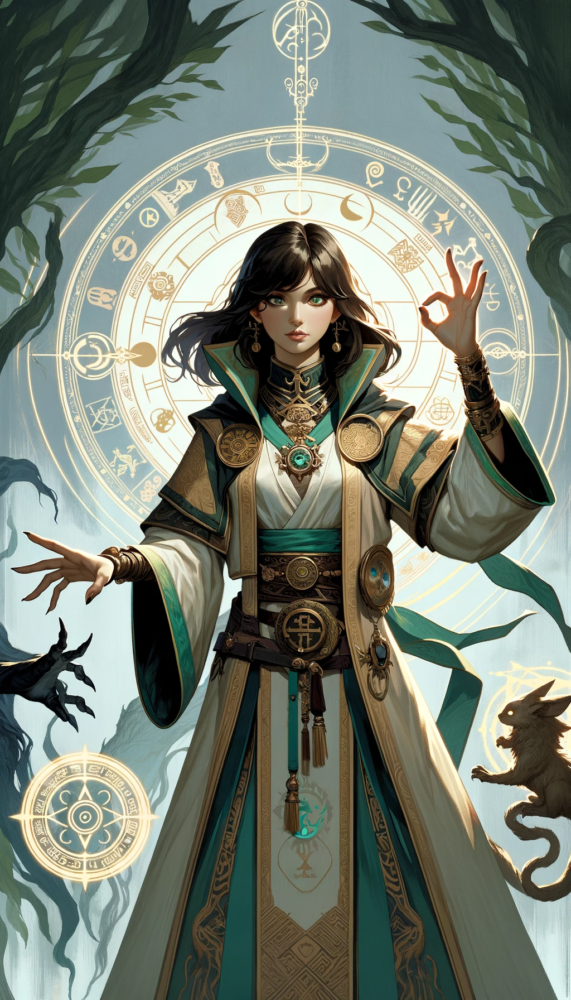
*신화 속 생물 소환사: 이야기 속의 강력한 생명체들을 전투에 소환합니다.*

### 5. 마르바스 (Marbas)

*치유와 회복의 마법사: 전투 중 아군을 치유하고 회복시키는 능력을 가지고 있습니다.*

### 6. 발레포르 (Valefor)

*정보 수집 및 해킹 전문가: 적의 전략을 이해하고 방해합니다.*

### 7. 아몬 (Amon)

*화학 변형 마법사: 적을 공격하고 전장의 상황을 변화시킵니다.*

### 8. 바라트 (Barbatos)

*자연의 힘을 사용하는 마법사: 자연의 힘을 빌려 적을 공격하고 아군을 보호합니다.*

### 9. 파이몬 (Paimon)

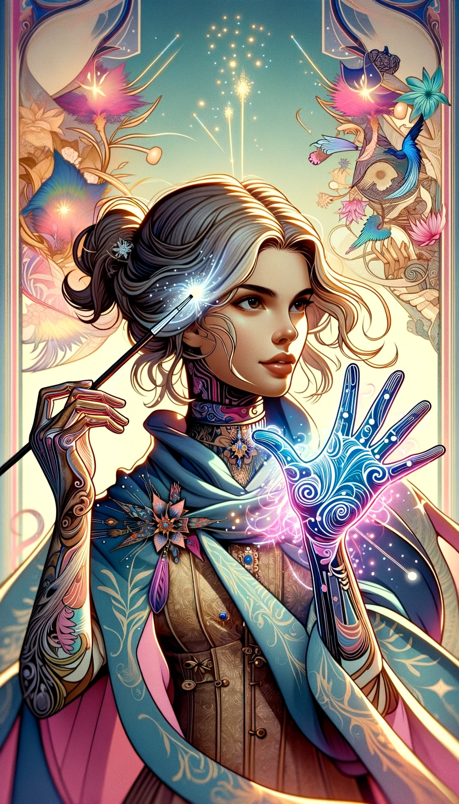
*예술과 마법의 결합자: 아름다운 환상을 창조하여 적을 혼란에 빠뜨립니다.*

### 10. 부에르 (Buer)

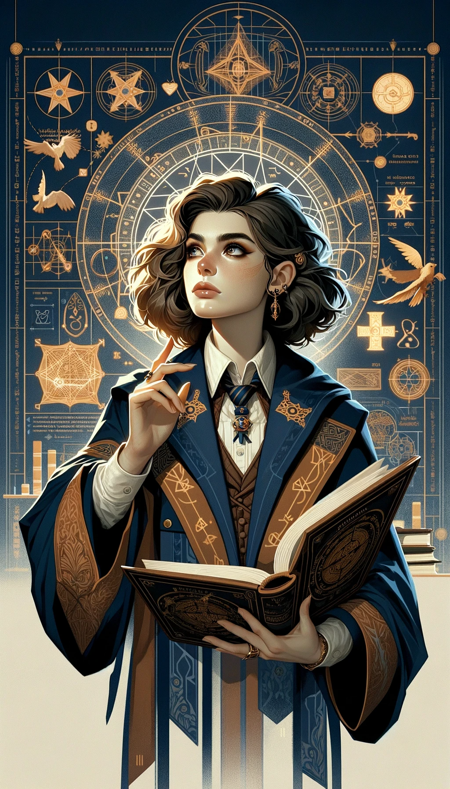
*철학적 통찰을 이용하는 마법사: 전략적 우위를 차지하고 아군을 지도합니다.*

### 11. 구시온 (Gusion)

*목표 지향적 마법사: 진취적인 마법으로 아군을 독려하고 강화합니다.*

### 12. 시트리 (Sitri)

*매혹과 유혹의 마법사: 적을 유혹하고 조종하는 마법을 사용합니다.*

### 13. 벨레스 (Beleth)

*음악과 마법의 조화자: 아군을 감동시키고 적을 매료시키는 멜로디를 사용합니다.*

### 14. 르라지 (Leraje)

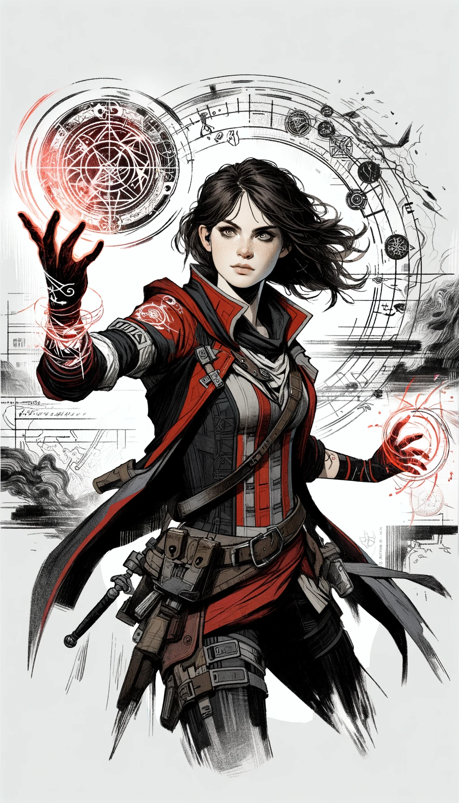
*전투의 마법사: 강력한 공격 마법과 전술적 기술을 구사합니다.*

### 15. 엘리고스 (Eligos)

*전략과 계획의 마법사: 전투에서 아군의 행동을 조율하고 지도합니다.*

### 16. 즈파르 (Zepar)

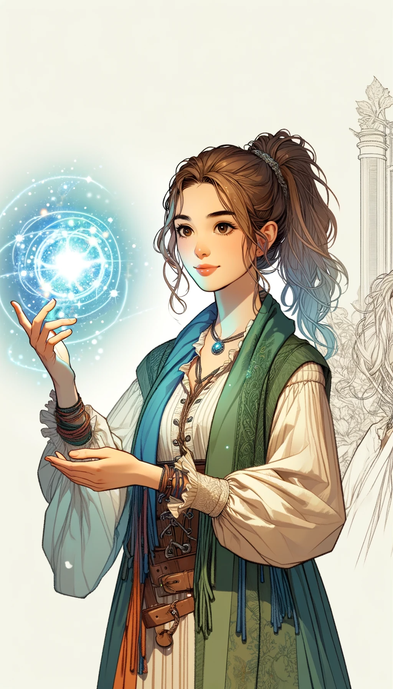
*관계와 감정 조종의 마법사: 적의 동맹을 약화시키고 아군의 결속을 강화합니다.*

### 17. 보투스 (Botis)

*화해와 평화의 마법사: 전투 중 갈등을 해결하고 조정합니다.*

### 18. 바투카베스 (Bathin)

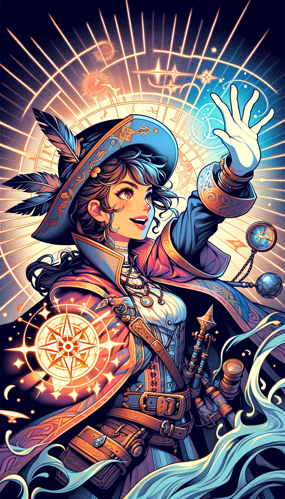
*여행과 탐험의 마법사: 순간 이동을 하거나 새로운 경로를 발견합니다.*

### 19. 살로스 (Sallos)

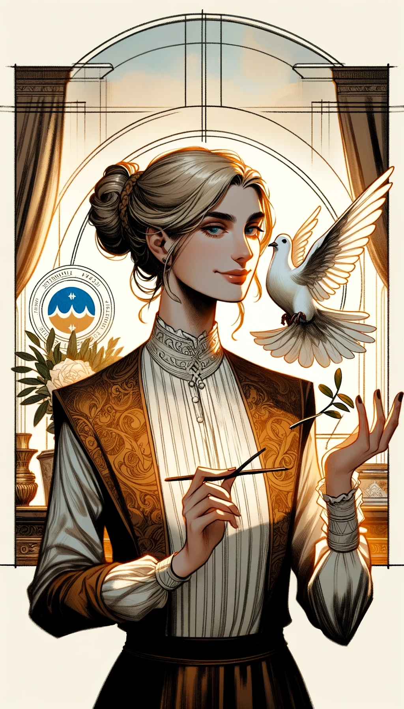
*사교와 외교의 마법사: 협상과 대화를 통해 적과의 갈등을 해결합니다.*

### 20. 푸르손 (Purson)

*신비한 지식과 역사의 마법사: 과거의 지혜를 현재의 전투에 활용합니다.*

### 21. 마린 (Marax)

*천문학과 마법의 결합자: 마린은 천문학과 마법을 결합하여 우주의 힘을 이용하고 별의 위치를 통해 전략을 세웁니다.*

### 22. 이포스 (Ipos)

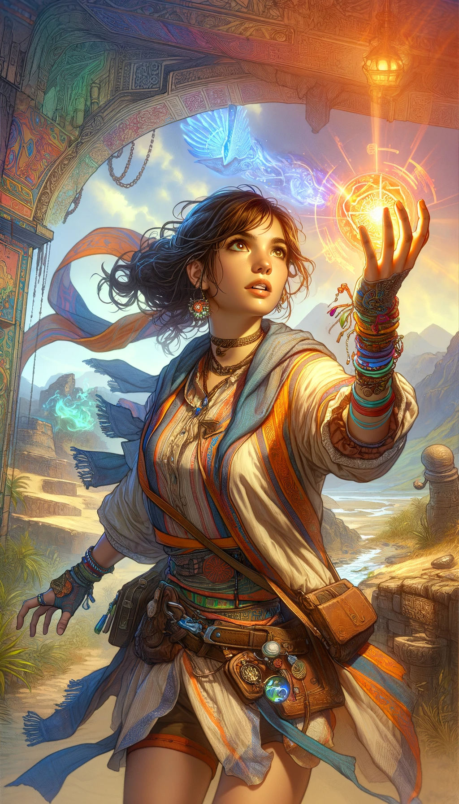
*모험과 발견의 마법사: 이포스는 새로운 마법과 전략을 탐색하고 개발합니다.*

### 23. 아임 (Aim)

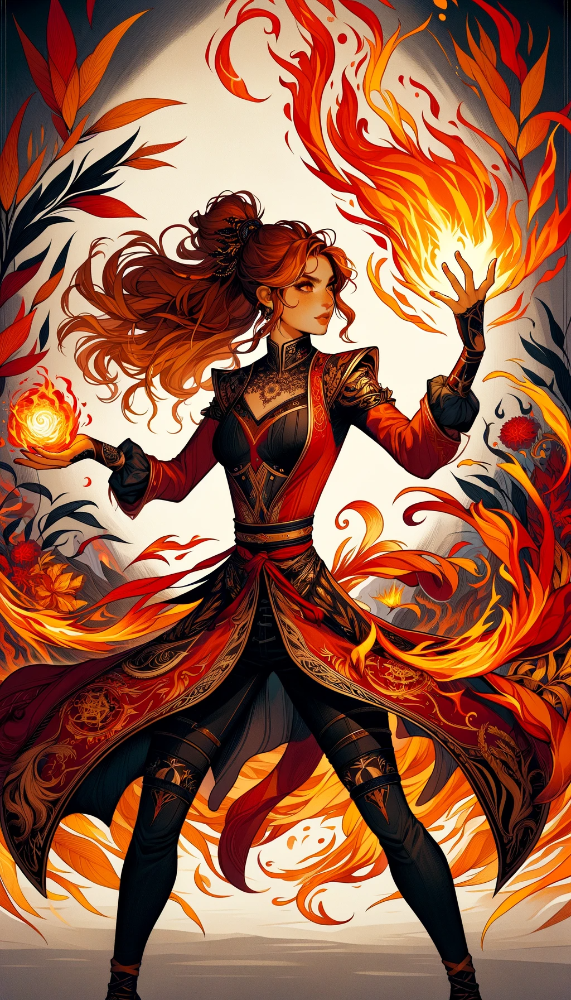
*불과 열기의 마법사: 아임은 강력한 화염 마법으로 적을 공격하고 방어합니다.*

### 24. 느바 (Naberius)

*변장과 환영의 마법사: 느바는 자신의 모습을 바꾸거나 적을 혼란에 빠뜨립니다.*

### 25. 글라시아라바스 (Glasya-Labolas)

*심리와 마음 조종의 마법사: 글라시아라바스는 적의 생각을 읽고 조종합니다.*

### 26. 분데스 (Bune)

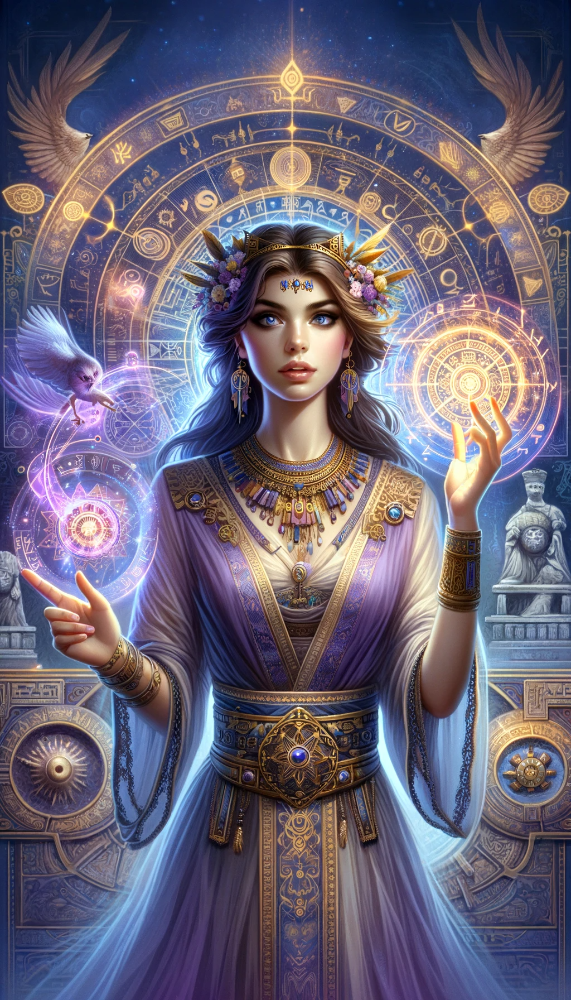
*과거의 영혼과 대화하는 마법사: 분데스는 고대의 지혜를 현대 전투에 활용합니다.*

### 27. 로노베 (Ronove)

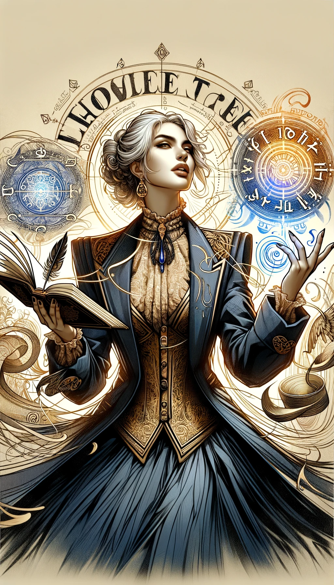
*언어와 마법의 전문가: 로노베는 말의 힘으로 아군을 강화하고 적을 약화시킵니다.*

### 28. 베리스 (Berith)

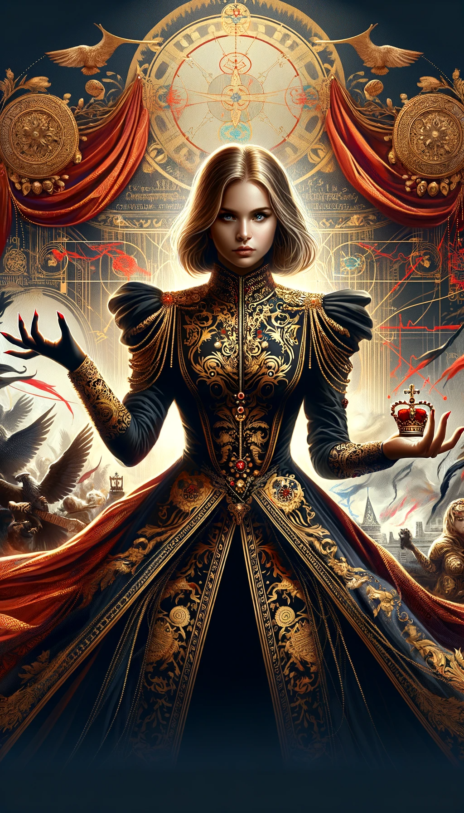
*정치와 조종의 마법사: 베리스는 전투 중 적의 동맹을 무너뜨리고 전략을 조율합니다.*

### 29. 아스타로트 (Astaroth)

*고대의 비밀과 마법 탐구자: 아스타로트는 잊혀진 마법을 전투에 활용합니다.*

### 30. 포르네우스 (Forneus)

*말과 설득의 마법사: 포르네우스는 상대를 설득하고 아군의 의사소통을 강화합니다.*

### 31. 포르카스 (Foras)

*지혜와 논리의 마법사: 포르카스는 철학적 통찰력을 통해 전략적 우위를 확보합니다.*

### 32. 아스모데우스 (Asmoday)

*상업과 협상의 마법사: 아스모데우스는 거래와 협상을 통해 아군을 지원하고 자원을 확보합니다.*

### 33. 가프 (Gaap)

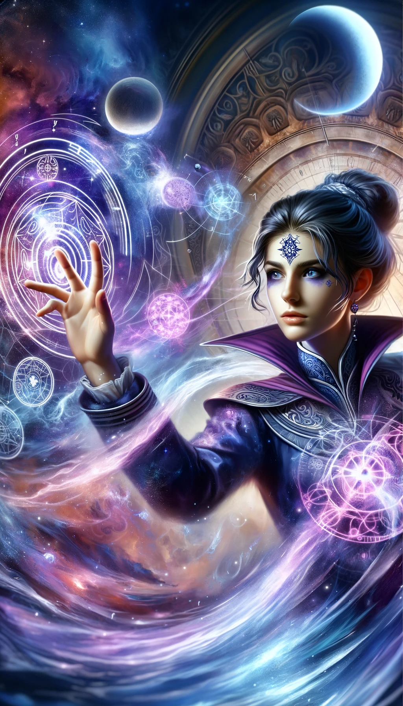
*천문과 차원 이동의 마법사: 가프는 공간을 넘나들며 전투를 유리하게 이끕니다.*

### 34. 푸르칼 (Furfur)

*폭풍과 자연의 마법사: 푸르칼은 자연의 힘을 불러와 적을 공격하고 아군을 보호합니다.*

### 35. 마르카시아스 (Marchosias)

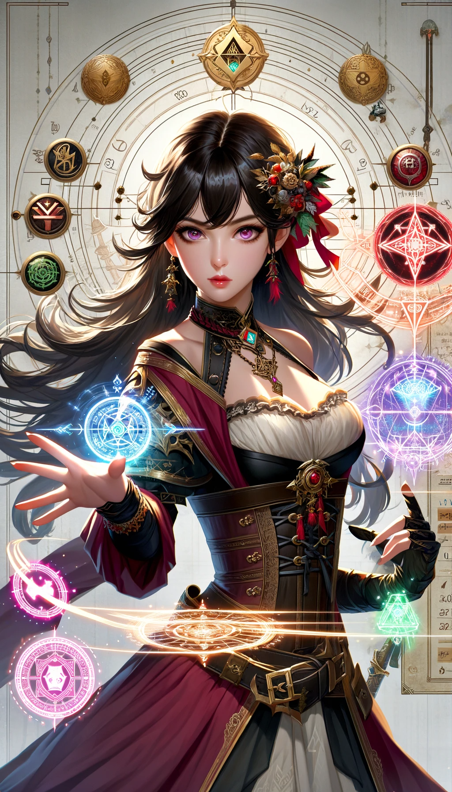
*전사와 전투의 마법사: 마르카시아스는 강력한 전투 마법과 전술적 능력을 가지고 있습니다.*

### 36. 스타라스 (Stolas)

*식물과 자연의 마법사: 스타라스는 식물을 조종하여 적을 공격하고 방어합니다.*

### 37. 피닉스 (Phenex)

*불사조의 힘을 가진 음악 마법사: 피닉스는 멜로디로 아군을 회복시키고 적을 현혹합니다.*

### 38. 할퍼스 (Halphas)

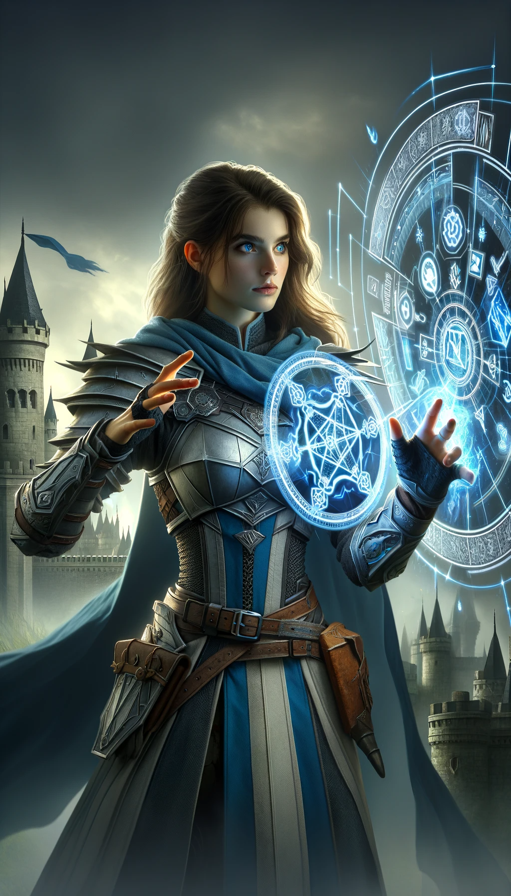
*요새와 방어구조를 소환하는 마법사: 할퍼스는 방어적 마법을 통해 아군을 보호합니다.*

### 39. 말파스 (Malphas)

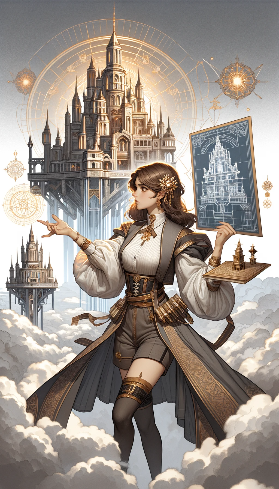
*강력한 요새와 탑을 소환하는 마법사: 말파스는 전장을 지배하며 아군을 강화합니다.*

### 40. 라우메 (Raum)

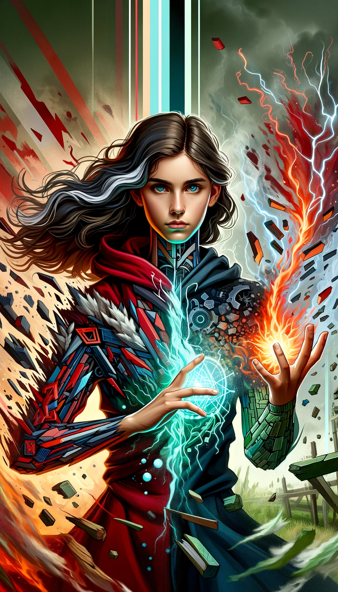
*파괴와 재생성의 마법사: 라우메는 적의 구조물을 파괴하고 자원을 회수합니다.*

### 41. 포카 (Focalor)

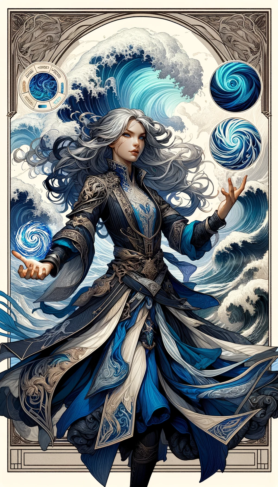
*폭풍과 바다의 지배자: 포카는 해양 전투에서 우위를 점하기 위해 바다를 활용합니다.*

### 42. 바발 (Vepar)

*수중 마법의 전문가: 바발은 바다를 통해 적을 기습하고 공격합니다.*

### 43. 사빌 (Sabnock)

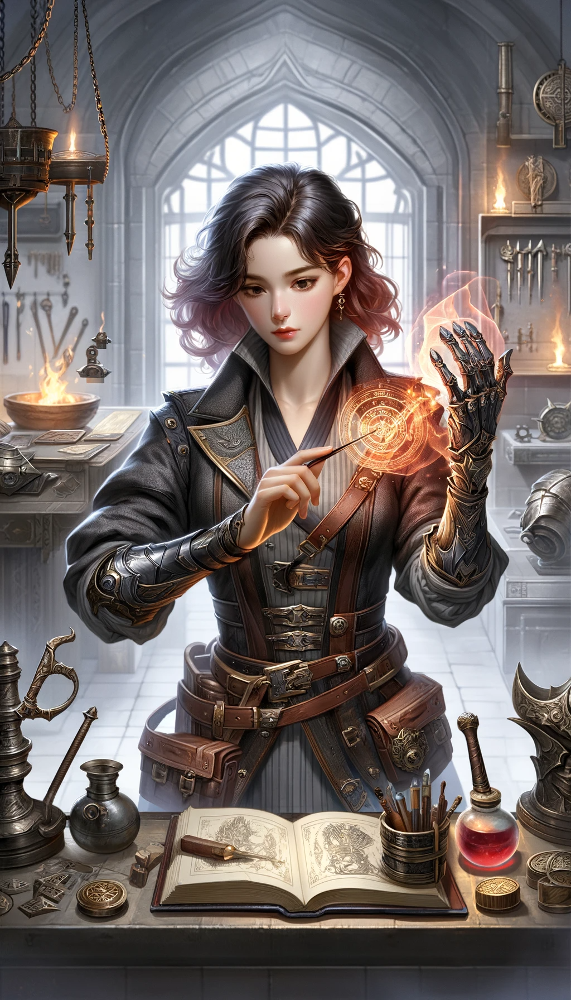
*강력한 방어구와 무기 제작자: 사빌은 아군의 방어력과 공격력을 강화합니다.*

### 44. 시머리스 (Shax)

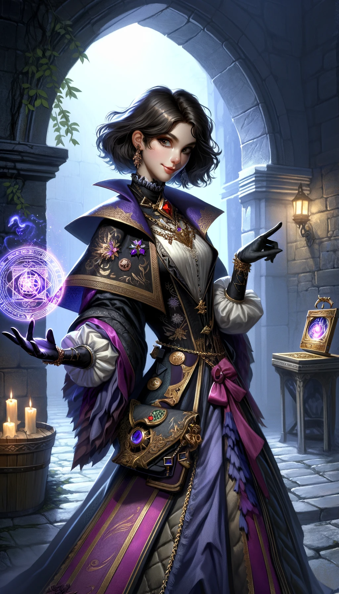
*은밀함과 속임수의 마법사: 시머리스는 적을 교란하고 정보를 수집합니다.*

### 45. 비네 (Vine)

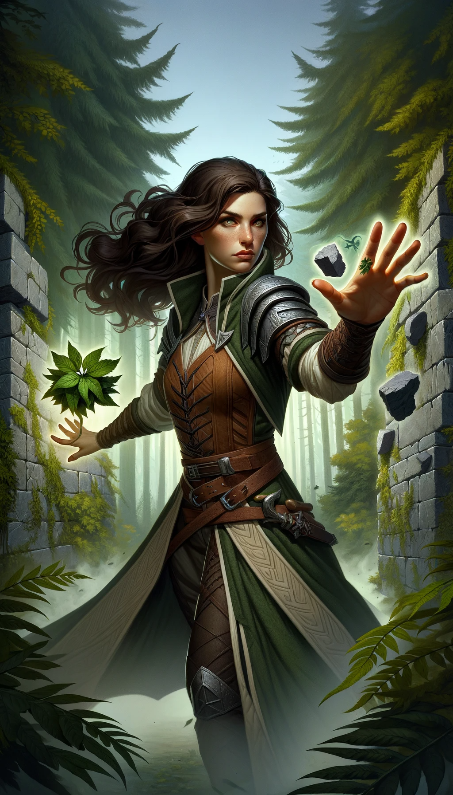
*자연과 벽의 지배자: 비네는 장애물을 만들어 적의 이동을 방해합니다.*

### 46. 비프론스 (Bifrons)

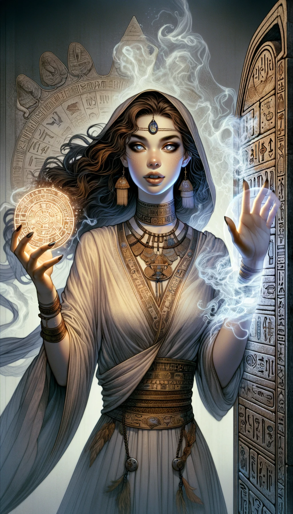
*죽은 자들을 소환하는 마법사: 비프론스는 고대의 영혼을 전투에 활용합니다.*

### 47. 우발 (Uvall)

*감정과 우정의 마법사: 우발은 아군의 결속력을 강화하고 적의 의지를 약화시킵니다.*

### 48. 하아젠트 (Haagenti)

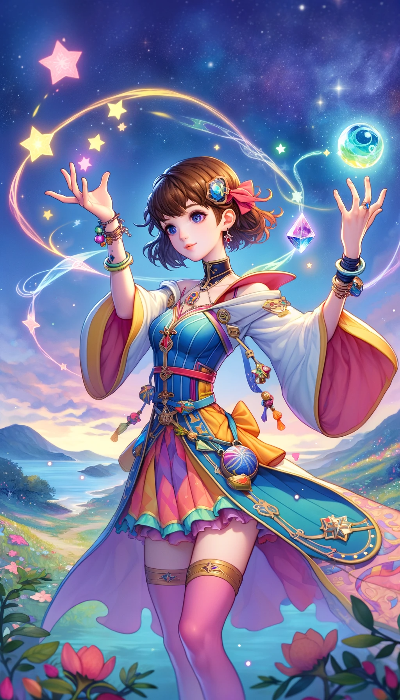
*변신과 변화의 마법사: 하아젠트는 형태를 바꾸어 전투를 유리하게 이끕니다.*

### 49. 크로셀 (Crocell)

*물과 온도 조절의 마법사: 크로셀은 환경을 변화시켜 적을 방해합니다.*

### 50. 후랑스 (Furcas)

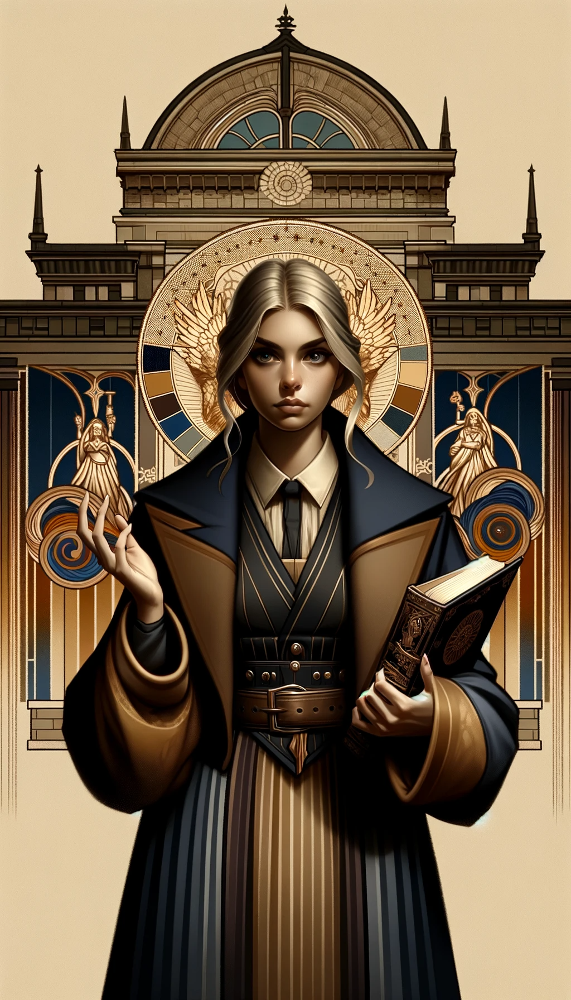
*지식과 지혜의 마법사: 후랑스는 정보를 제공하고 전략적 조언을 합니다.*

### 51. 발락 (Balam)

*예언과 통찰의 마법사: 발락은 미래를 예측하고 전략적 가이드를 제공합니다.*

### 52. 알록 (Alloces)

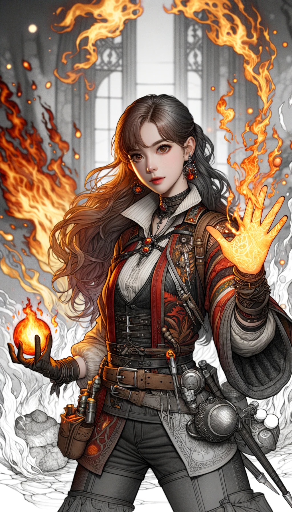
*불과 전투의 마법사: 알록은 강력한 화염 마법을 사용하여 적을 공격합니다.*

### 53. 카임 (Caim)

*동물과의 소통 마법사: 카임은 동물들을 소환하고 전투에 활용합니다.*

### 54. 뮈르뮈르 (Murmur)

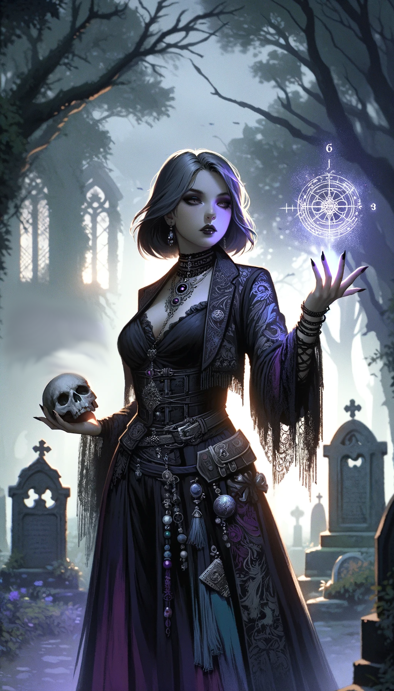
*영혼과 죽음의 마법사: 뮈르뮈르는 죽음의 마법을 사용하여 적을 제압합니다.*

### 55. 오로바스 (Orobas)

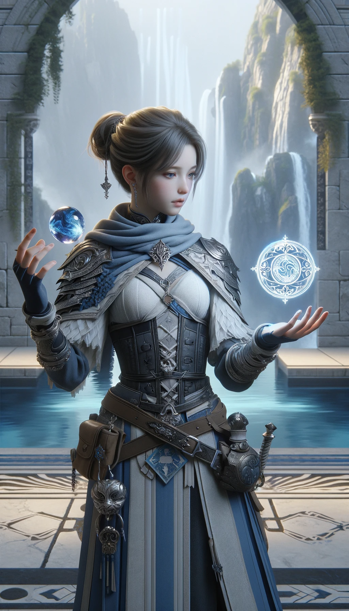
*진실과 보호의 마법사: 오로바스는 아군을 보호하고 적의 거짓을 폭로합니다.*

### 56. 그레모리 (Gremory)

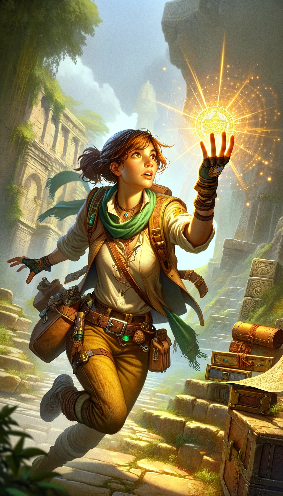
*보물 탐색과 발견의 마법사: 그레모리는 귀중한 자원을 발견하고 확보합니다.*

### 57. 오세 (Ose)

*마음과 환상의 마법사: 오세는 환상을 생성하여 적을 혼란에 빠뜨립니다.*

### 58. 아미 (Amy)

*천문과 점성술의 마법사: 아미는 별의 위치를 이용해 전략을 세웁니다.*

### 59. 오리아스 (Orias)

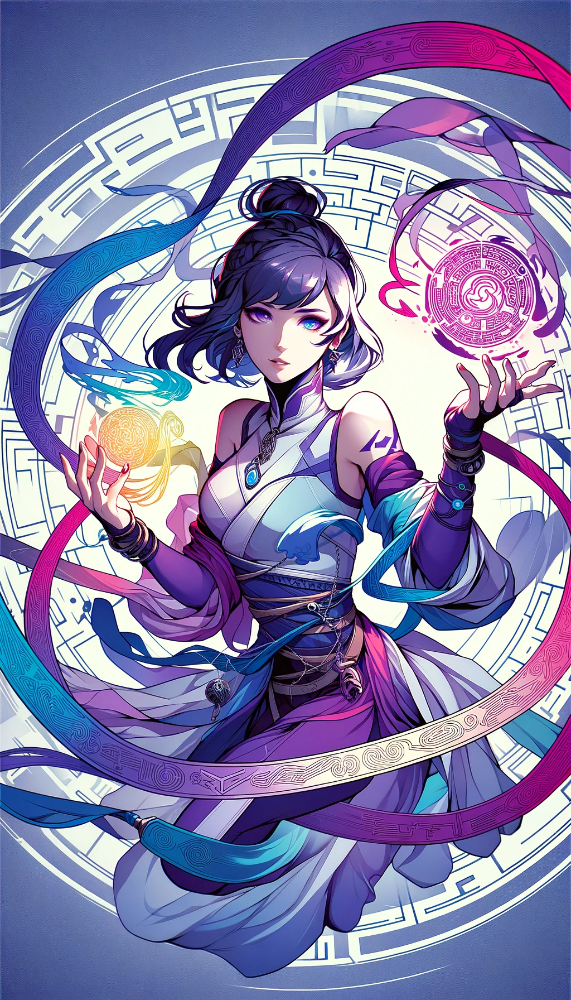
*변신과 운명의 마법사: 오리아스는 운명을 조종하고 형태를 변화시킵니다.*

### 60. 바페 (Vapula)

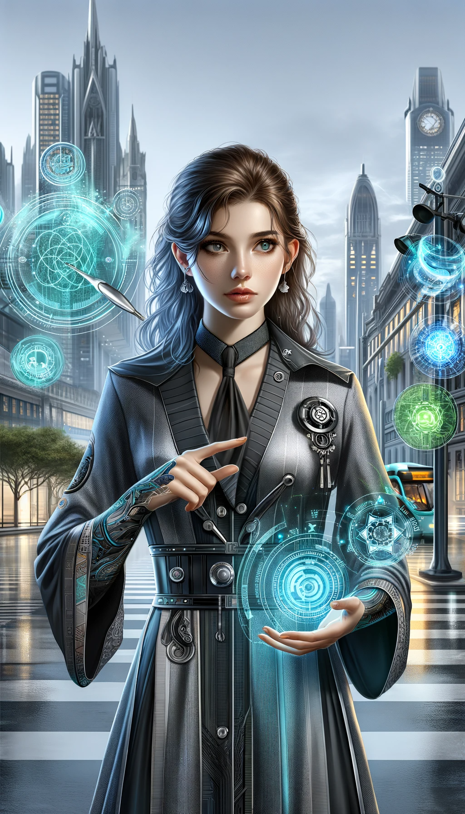
*지식과 기술의 마법사: 바페는 혁신적인 마법 기술로 아군을 지원합니다.*

### 61. 자갈 (Zagan)

*변환과 창조의 마법사: 자갈은 아이템과 자원을 변환하고 새롭게 창조합니다.*

### 62. 볼락 (Valac)

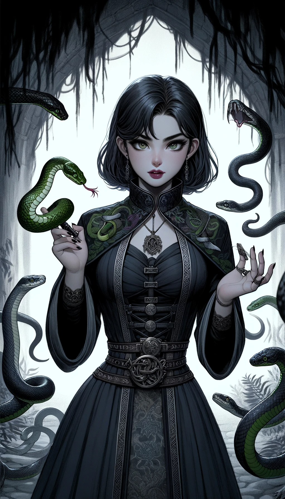
*뱀과 비밀의 마법사: 볼락은 뱀을 소환하고 적의 비밀을 밝힙니다.*

### 63. 안드라스 (Andras)

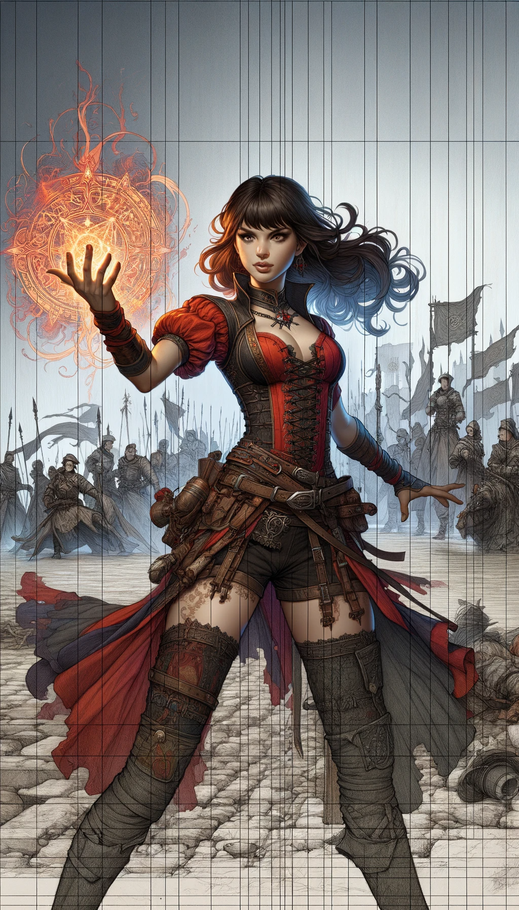
*분쟁과 전투의 마법사: 안드라스는 적을 도발하고 전투를 유도합니다.*

### 64. 하우레스 (Haures)

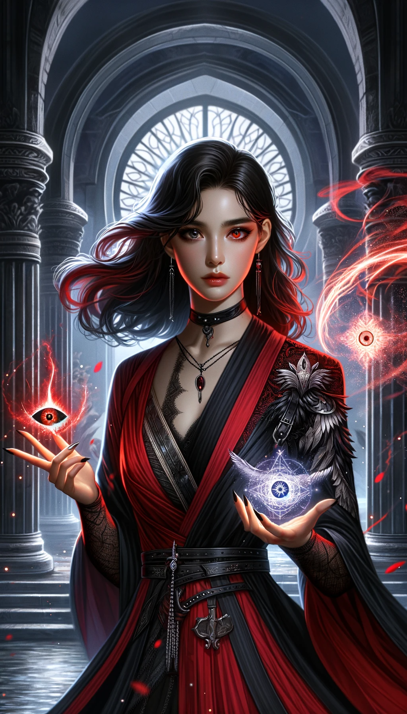
*진실과 파괴의 마법사: 하우레스는 진실을 밝히고 적의 방어를 파괴합니다.*

### 65. 안드레알퍼스 (Andrealphus)

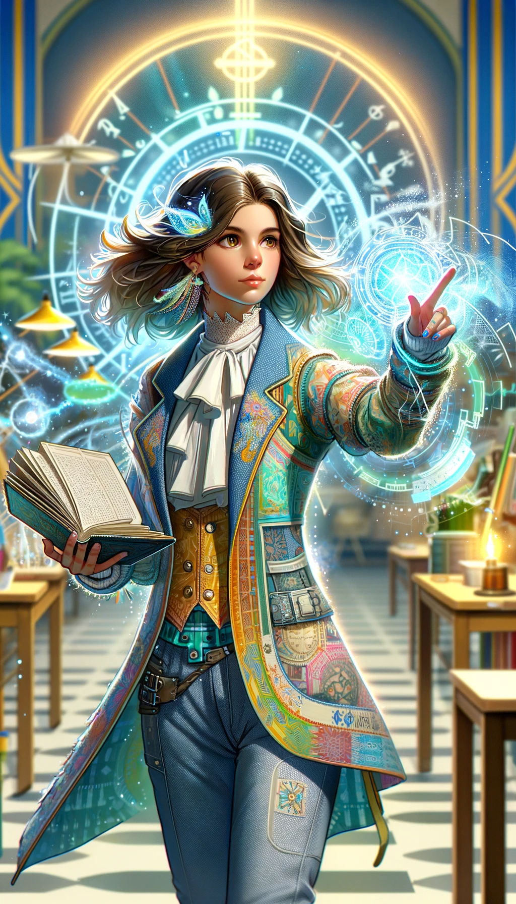
*지식과 변형의 마법사: 안드레알퍼스는 현실을 변형하고 새로운 지식을 창출합니다.*

### 66. 쿠네 (Cimejes)

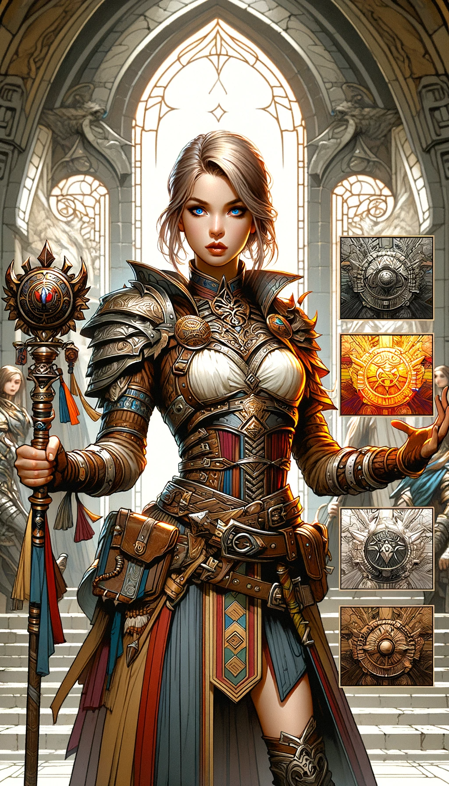
*강력한 전사 마법사: 쿠네는 무적의 전사를 소환하고 전투를 이끕니다.*

### 67. 아메드 (Amdusias)

*음악과 폭풍의 마법사: 아메드는 음악으로 자연을 조종하고 적을 공격합니다.*

### 68. 벨리알 (Belial)

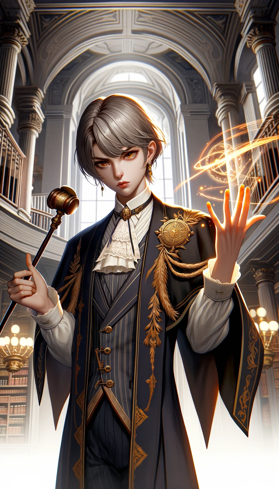
*법과 권력의 마법사: 벨리알은 법적 마법을 사용하여 적을 제압하고 권력을 행사합니다.*

### 69. 드카르압 (Decarabia)

*조류와 환영의 마법사: 드카르압은 새들을 소환하고 환영을 생성합니다.*

### 70. 세에르 (Seere)

*속도와 이동의 마법사: 세에르는 빠른 이동과 적의 움직임을 방해합니다.*

### 71. 두카인 (Dantalion)

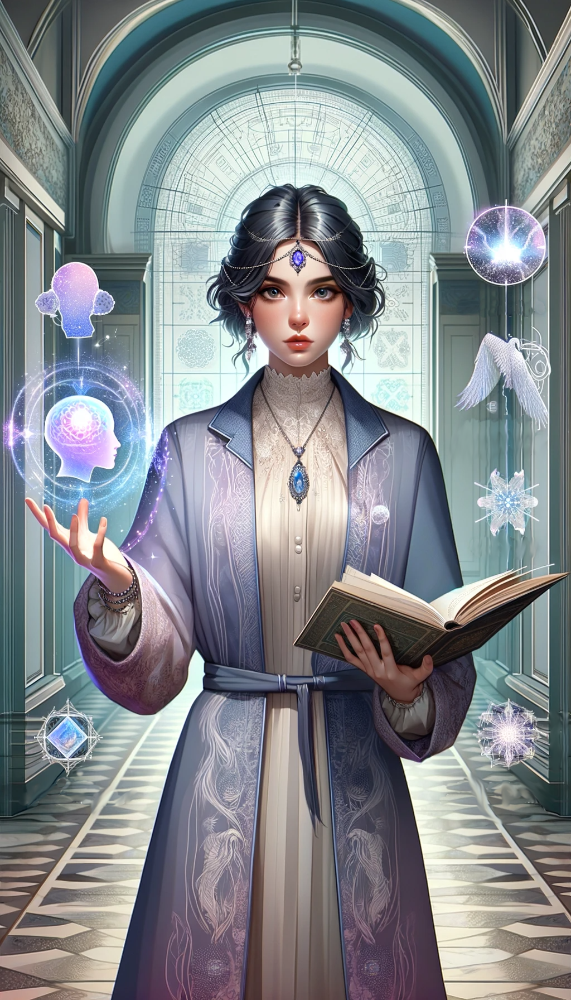
*마음과 생각의 마법사: 두카인은 적의 생각을 읽고 조종합니다.*

### 72. 안드로말리우스 (Andromalius)

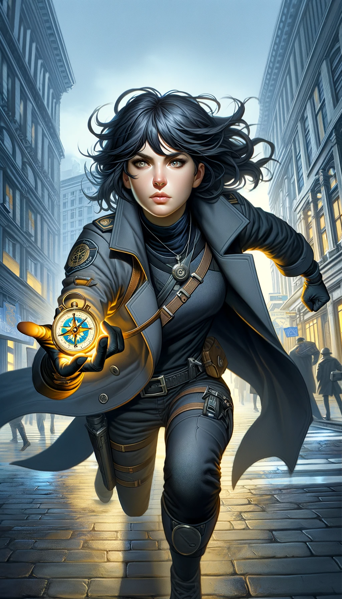
*추적과 정의의 마법사: 안드로말리우스는 적을 추적하고 범죄를 폭로합니다.*

