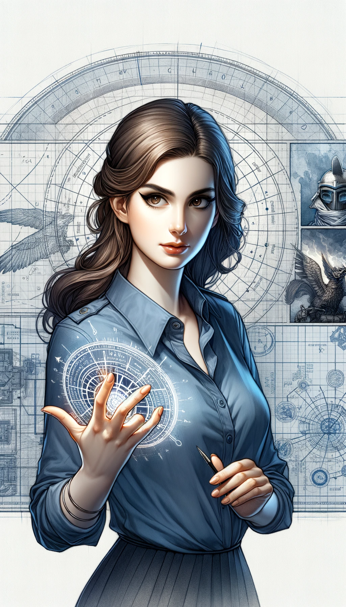
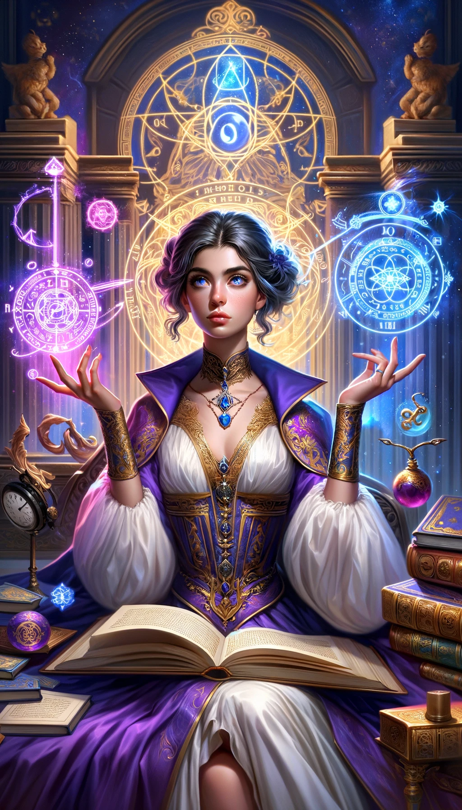
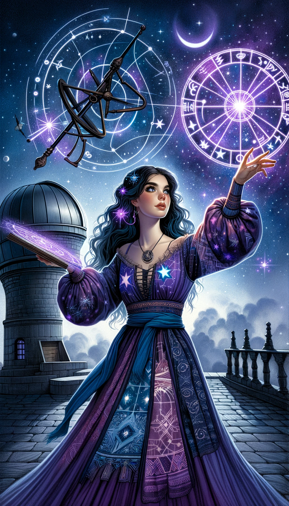

# Solforest Card Collection

## Magical Characters

Explore the mystical powers and roles of these enchanting entities from the Solforest Card Collection. Each character possesses unique magical abilities, aiding in various aspects of combat and strategy.

### 1. 바알 (Bael)

*Transformation Magic Expert: Bael has the ability to shift into various forms, causing confusion among enemies.*

### 2. 아가레스 (Agares)

*Master of Communication and Languages: Agares understands and communicates in various languages, supporting allies effectively.*

### 3. 바실 (Vassago)

*Future Seer: Vassago uses future prediction magic to gain advantageous information in battle, securing strategic superiority.*

### 4. 사마이나 (Samigina)

*Summoner of Mythical Creatures: Samigina can summon powerful entities from stories into battle.*

### 5. 마르바스 (Marbas)

*Healer and Restorer: Marbas possesses the ability to heal and rejuvenate allies during combat.*

### 6. 발레포르 (Valefor)

*Information Gathering and Hacking Expert: Valefor excels in understanding and disrupting enemy strategies.*

### 7. 아몬 (Amon)

*Chemical Transformation Magician: Amon uses his powers to attack enemies and alter battlefield conditions.*

### 8. 바라트 (Barbatos)

*Nature's Ally: Barbatos wields the power of nature to assault enemies and protect allies.*

### 9. 파이몬 (Paimon)

*Artist of Illusions: Paimon combines art and magic to create beautiful illusions that confound opponents.*

### 10. 부에르 (Buer)

*Philosophical Insight: Buer uses his wisdom for strategic advantages and guides his allies.*

### 11. 구시온 (Gusion)

*Goal-Oriented Magician: Gusion inspires and strengthens allies with proactive and progressive magic.*

### 12. 시트리 (Sitri)

*Master of Seduction and Allure: Sitri uses magic to attract and manipulate enemies.*

### 13. 벨레스 (Beleth)

*Harmonizer of Music and Magic: Beleth captivates friends and foes alike with enchanting melodies.*

### 14. 르라지 (Leraje)

*Warrior Magician: Leraje employs powerful attack spells and tactical skills in battle.*

### 15. 엘리고스 (Eligos)

*Strategist and Planner: Eligos orchestrates and guides the actions of allies in combat.*

### 16. 즈파르 (Zepar)

*Manipulator of Relationships and Emotions: Zepar weakens enemy alliances and bolsters the bonds of allies.*

### 17. 보투스 (Botis)

*Peacemaker and Diplomat: Botis resolves conflicts and mediates during battles.*

### 18. 바투카베스 (Bathin)

*Explorer and Pathfinder: Bathin masters teleportation and discovers new routes for strategic advantage.*

### 19. 살로스 (Sallos)

*Diplomat and Social Expert: Sallos resolves conflicts with dialogue and negotiation.*

### 20. 푸르손 (Purson)

*Sage of Mystical Knowledge and History: Purson applies ancient wisdom to modern battles.*

### 21. 마린 (Marax)

*Astronomer and Mage: Marax combines astronomy and magic, harnessing cosmic powers and strategizing based on stellar positions.*

### 22. 이포스 (Ipos)

*Adventurer and Discoverer: Ipos explores and develops new magic and strategies, always seeking novel approaches.*

### 23. 아임 (Aim)

*Fire and Heat Magician: Aim wields powerful flame magic for both offense and defense.*

### 24. 느바 (Naberius)

*Master of Disguise and Illusion: Naberius changes appearances and confuses enemies with deceptive tactics.*

### 25. 글라시아라바스 (Glasya-Labolas)

*Psychologist and Mind Manipulator: Glasya-Labolas reads and controls the thoughts of foes.*

### 26. 분데스 (Bune)

*Converser with Ancient Souls: Bune brings the wisdom of past spirits to aid in current conflicts.*

### 27. 로노베 (Ronove)

*Expert in Language and Magic: Ronove empowers allies and weakens enemies with the power of words.*

### 28. 베리스 (Berith)

*Politician and Manipulator: Berith undermines enemy alliances and coordinates strategies during battles.*

### 29. 아스타로트 (Astaroth)

*Seeker of Ancient Secrets: Astaroth uncovers and utilizes forgotten magics in battle.*

### 30. 포르네우스 (Forneus)

*Orator and Persuader: Forneus excels in persuasion, enhancing communication among allies.*

### 31. 포르카스 (Foras)

*Wisdom and Logic Sage: Foras uses philosophical insights to gain strategic advantages in battle.*

### 32. 아스모데우스 (Asmoday)

*Merchant and Negotiator: Asmoday supports allies through trade and negotiation, securing resources.*

### 33. 가프 (Gaap)

*Astronomer and Dimensional Traveler: Gaap maneuvers through space, guiding battles to favorable outcomes.*

### 34. 푸르칼 (Furfur)

*Storm and Nature Magician: Furfur calls upon natural forces to attack enemies and protect allies.*

### 35. 마르카시아스 (Marchosias)

*Warrior and Battle Mage: Marchosias possesses strong combat magic and tactical abilities.*

### 36. 스타라스 (Stolas)

*Plant and Nature Magician: Stolas controls plants to attack and defend against enemies.*

### 37. 피닉스 (Phenex)

*Phoenix Power Musician: Phenex uses melodies to heal allies and enchant enemies.*

### 38. 할퍼스 (Halphas)

*Summoner of Fortresses and Defensive Structures: Halphas uses defensive magic to protect allies.*

### 39. 말파스 (Malphas)

*Summoner of Powerful Fortresses and Towers: Malphas dominates battlefields and strengthens allies.*

### 40. 라우메 (Raum)

*Master of Destruction and Regeneration: Raum destroys enemy structures and recycles resources.*

### 41. 포카 (Focalor)

*Lord of Storms and Seas: Focalor excels in naval battles, leveraging the ocean to gain the upper hand.*

### 42. 바발 (Vepar)

*Underwater Magic Specialist: Vepar utilizes the sea for stealth attacks and offensive maneuvers.*

### 43. 사빌 (Sabnock)

*Artisan of Armor and Weapons: Sabnock enhances the defense and attack capabilities of allies.*

### 44. 시머리스 (Shax)

*Expert in Stealth and Deception: Shax disrupts enemies and gathers critical intelligence.*

### 45. 비네 (Vine)

*Ruler of Nature and Walls: Vine creates obstacles to hinder enemy movement.*

### 46. 비프론스 (Bifrons)

*Necromancer: Bifrons summons the spirits of the dead for battle assistance.*

### 47. 우발 (Uvall)

*Emotion and Friendship Magician: Uvall strengthens the unity of allies and weakens the will of enemies.*

### 48. 하아젠트 (Haagenti)

*Transformation and Change Magician: Haagenti alters forms to lead battles advantageously.*

### 49. 크로셀 (Crocell)

*Controller of Water and Temperature: Crocell manipulates the environment to hinder enemies.*

### 50. 후랑스 (Furcas)

*Sage of Knowledge and Wisdom: Furcas provides information and strategic counsel.*

### 51. 발락 (Balam)

*Prophet and Seer: Balam predicts the future and offers strategic guidance in battle.*

### 52. 알록 (Alloces)

*Fire and Battle Magician: Alloces wields powerful fire magic to aggressively attack enemies.*

### 53. 카임 (Caim)

*Communicator with Animals: Caim summons and utilizes animals for various battle purposes.*

### 54. 뮈르뮈르 (Murmur)

*Master of Souls and Death: Murmur wields death magic to overpower enemies.*

### 55. 오로바스 (Orobas)

*Protector and Truth Seeker: Orobas guards allies and exposes enemy falsehoods.*

### 56. 그레모리 (Gremory)

*Treasure Hunter and Discoverer: Gremory finds and secures valuable resources.*

### 57. 오세 (Ose)

*Illusionist and Mind Manipulator: Ose creates illusions to confuse and disorient enemies.*

### 58. 아미 (Amy)

*Astronomer and Astrologer: Amy uses stellar positions for strategic planning.*

### 59. 오리아스 (Orias)

*Master of Transformation and Fate: Orias manipulates destiny and changes forms.*

### 60. 바페 (Vapula)

*Scholar of Knowledge and Technology: Vapula supports allies with innovative magical

### 61. 자갈 (Zagan)

*Alchemist and Creator: Zagan excels in transforming and creating new items and resources.*

### 62. 볼락 (Valac)

*Snake and Secret Magician: Valac summons snakes and unveils hidden secrets of enemies.*

### 63. 안드라스 (Andras)

*Instigator of Conflict and Battle: Andras provokes enemies and incites combat.*

### 64. 하우레스 (Haures)

*Revealer of Truth and Destroyer of Defenses: Haures exposes truths and shatters enemy defenses.*

### 65. 안드레알퍼스 (Andrealphus)

*Master of Knowledge and Transformation: Andrealphus alters reality and generates new knowledge.*

### 66. 쿠네 (Cimejes)

*Warrior Mage: Cimejes summons invincible warriors and leads them in battle.*

### 67. 아메드 (Amdusias)

*Musician and Storm Magician: Amdusias controls nature with music and attacks enemies.*

### 68. 벨리알 (Belial)

*Master of Law and Power: Belial wields legal magic to subdue enemies and exert authority.*

### 69. 드카르압 (Decarabia)

*Bird and Illusion Magician: Decarabia summons birds and creates illusions.*

### 70. 세에르 (Seere)

*Speed and Movement Magician: Seere hastens movement and disrupts enemy mobility.*

### 71. 두카인 (Dantalion)

*Master of Minds and Thoughts: Dantalion reads and manipulates the thoughts of adversaries.*

### 72. 안드로말리우스 (Andromalius)

*Tracker and Enforcer of Justice: Andromalius specializes in tracking enemies and exposing crimes.*

