# Solforest Card Collection

## Magical Characters

Explore the mystical powers and roles of these enchanting entities from the Solforest Card Collection. Each character possesses unique magical abilities, aiding in various aspects of combat and strategy.

### 1. Bael

*Transformation Magic Expert: Bael has the ability to shift into various forms, causing confusion among enemies.*

### 2. Agares

*Master of Communication and Languages: Agares understands and communicates in various languages, supporting allies effectively.*

### 3. Vassago

*Future Seer: Vassago uses future prediction magic to gain advantageous information in battle, securing strategic superiority.*

### 4. Samigina

*Summoner of Mythical Creatures: Samigina can summon powerful entities from stories into battle.*

### 5. Marbas

*Healer and Restorer: Marbas possesses the ability to heal and rejuvenate allies during combat.*

### 6. Valefor

*Information Gathering and Hacking Expert: Valefor excels in understanding and disrupting enemy strategies.*

### 7. Amon

*Chemical Transformation Magician: Amon uses his powers to attack enemies and alter battlefield conditions.*

### 8. Barbatos
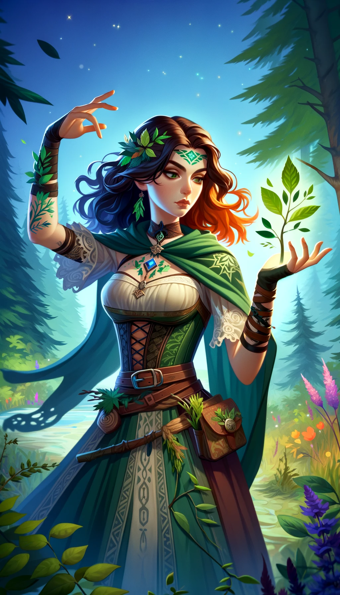
*Nature's Ally: Barbatos wields the power of nature to assault enemies and protect allies.*

### 9. Paimon

*Artist of Illusions: Paimon combines art and magic to create beautiful illusions that confound opponents.*

### 10. Buer
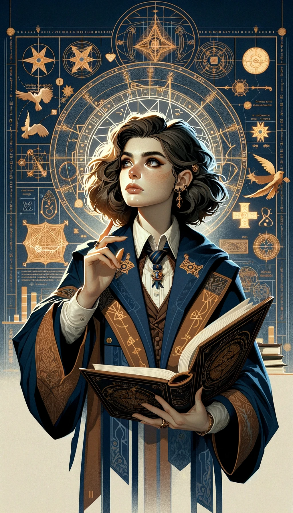
*Philosophical Insight: Buer uses his wisdom for strategic advantages and guides his allies.*

### 11. Gusion

*Goal-Oriented Magician: Gusion inspires and strengthens allies with proactive and progressive magic.*

### 12. Sitri

*Master of Seduction and Allure: Sitri uses magic to attract and manipulate enemies.*

### 13. Beleth

*Harmonizer of Music and Magic: Beleth captivates friends and foes alike with enchanting melodies.*

### 14. Leraje

*Warrior Magician: Leraje employs powerful attack spells and tactical skills in battle.*

### 15. Eligos

*Strategist and Planner: Eligos orchestrates and guides the actions of allies in combat.*

### 16. Zepar
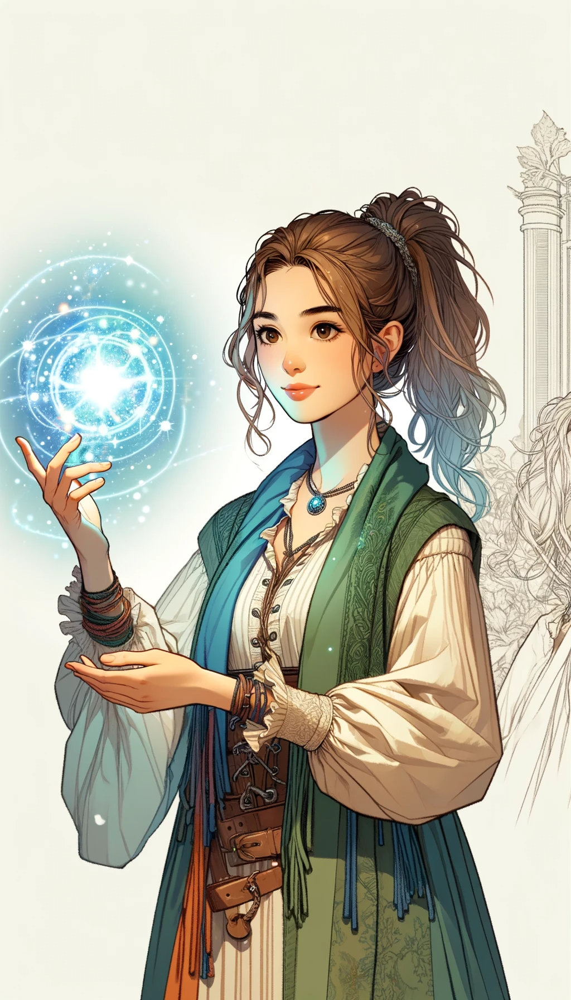
*Manipulator of Relationships and Emotions: Zepar weakens enemy alliances and bolsters the bonds of allies.*

### 17. Botis

*Peacemaker and Diplomat: Botis resolves conflicts and mediates during battles.*

### 18. Bathin

*Explorer and Pathfinder: Bathin masters teleportation and discovers new routes for strategic advantage.*

### 19. Sallos

*Diplomat and Social Expert: Sallos resolves conflicts with dialogue and negotiation.*

### 20. Purson

*Sage of Mystical Knowledge and History: Purson applies ancient wisdom to modern battles.*

### 21. Marax
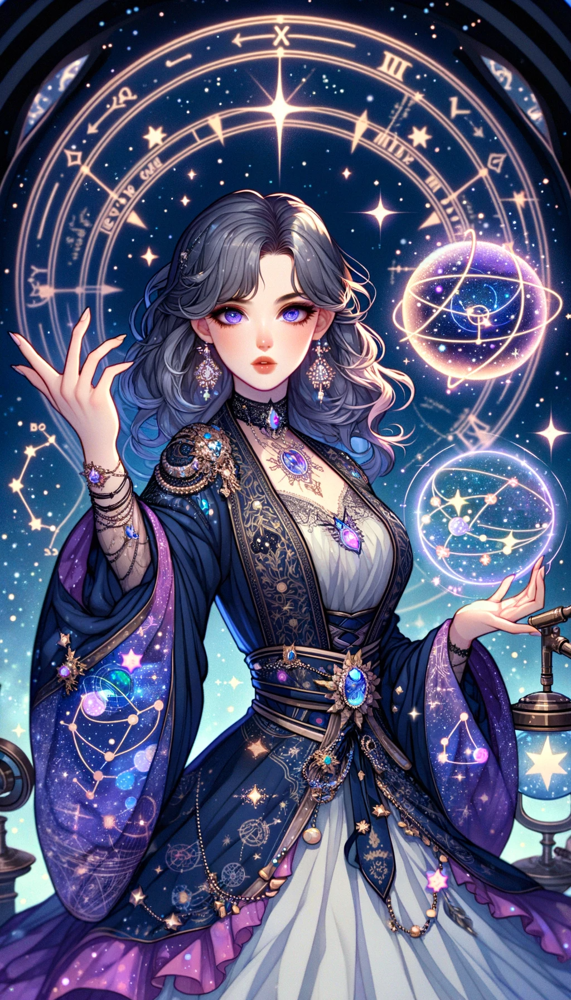
*Astronomer and Mage: Marax combines astronomy and magic, harnessing cosmic powers and strategizing based on stellar positions.*

### 22. Ipos

*Adventurer and Discoverer: Ipos explores and develops new magic and strategies, always seeking novel approaches.*

### 23. Aim

*Fire and Heat Magician: Aim wields powerful flame magic for both offense and defense.*

### 24. Naberius

*Master of Disguise and Illusion: Naberius changes appearances and confuses enemies with deceptive tactics.*

### 25. Glasya-Labolas
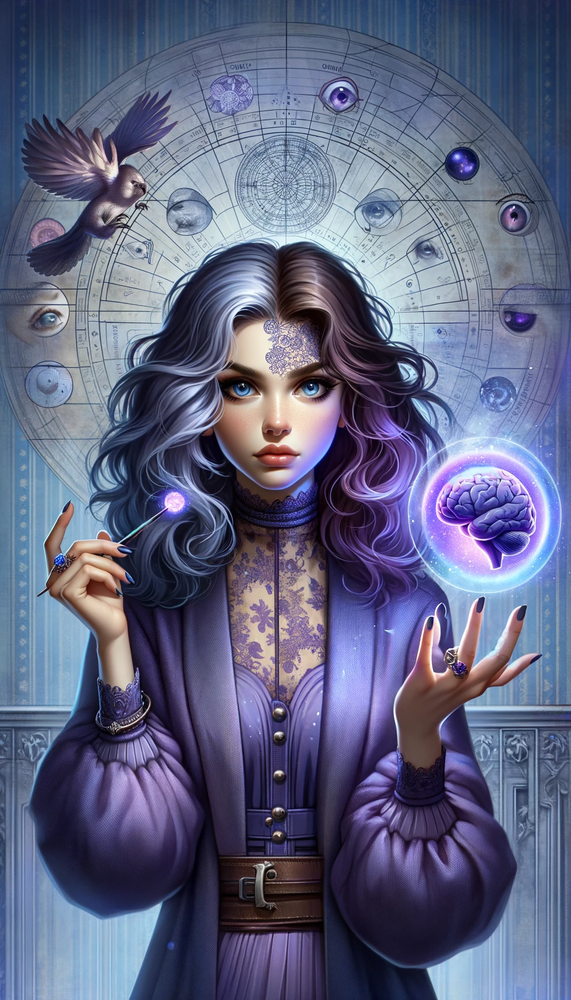
*Psychologist and Mind Manipulator: Glasya-Labolas reads and controls the thoughts of foes.*

### 26. Bune

*Converser with Ancient Souls: Bune brings the wisdom of past spirits to aid in current conflicts.*

### 27. Ronove
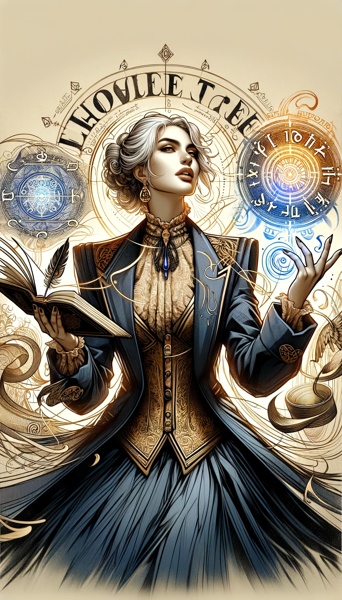
*Expert in Language and Magic: Ronove empowers allies and weakens enemies with the power of words.*

### 28. Berith
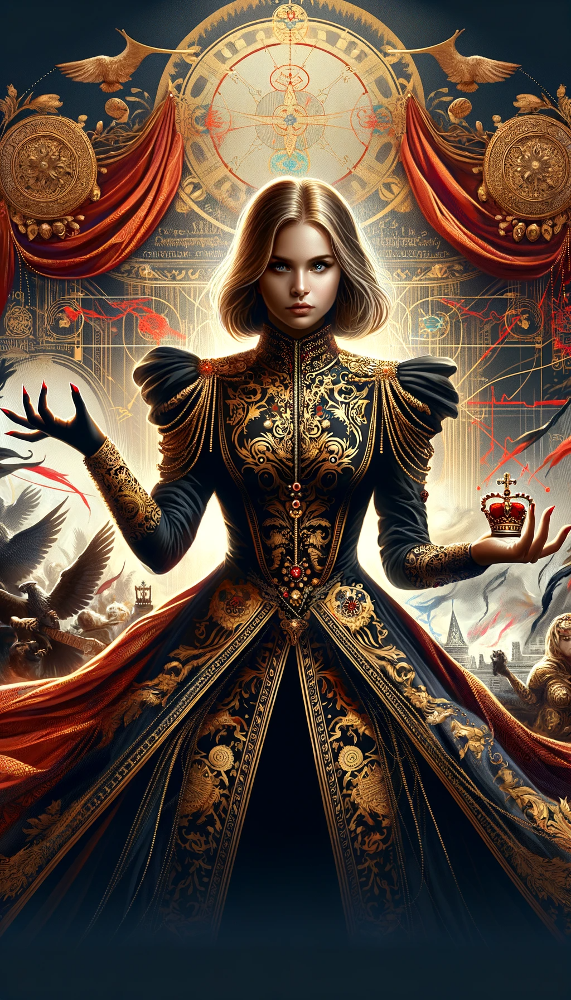
*Politician and Manipulator: Berith undermines enemy alliances and coordinates strategies during battles.*

### 29. Astaroth

*Seeker of Ancient Secrets: Astaroth uncovers and utilizes forgotten magics in battle.*

### 30. Forneus

*Orator and Persuader: Forneus excels in persuasion, enhancing communication among allies.*

### 31. Foras

*Wisdom and Logic Sage: Foras uses philosophical insights to gain strategic advantages in battle.*

### 32. Asmoday

*Merchant and Negotiator: Asmoday supports allies through trade and negotiation, securing resources.*

### 33. Gaap

*Astronomer and Dimensional Traveler: Gaap maneuvers through space, guiding battles to favorable outcomes.*

### 34. Furfur

*Storm and Nature Magician: Furfur calls upon natural forces to attack enemies and protect allies.*

### 35. Marchosias

*Warrior and Battle Mage: Marchosias possesses strong combat magic and tactical abilities.*

### 36. Stolas

*Plant and Nature Magician: Stolas controls plants to attack and defend against enemies.*

### 37. Phenex

*Phoenix Power Musician: Phenex uses melodies to heal allies and enchant enemies.*

### 38. Halphas

*Summoner of Fortresses and Defensive Structures: Halphas uses defensive magic to protect allies.*

### 39. Malphas
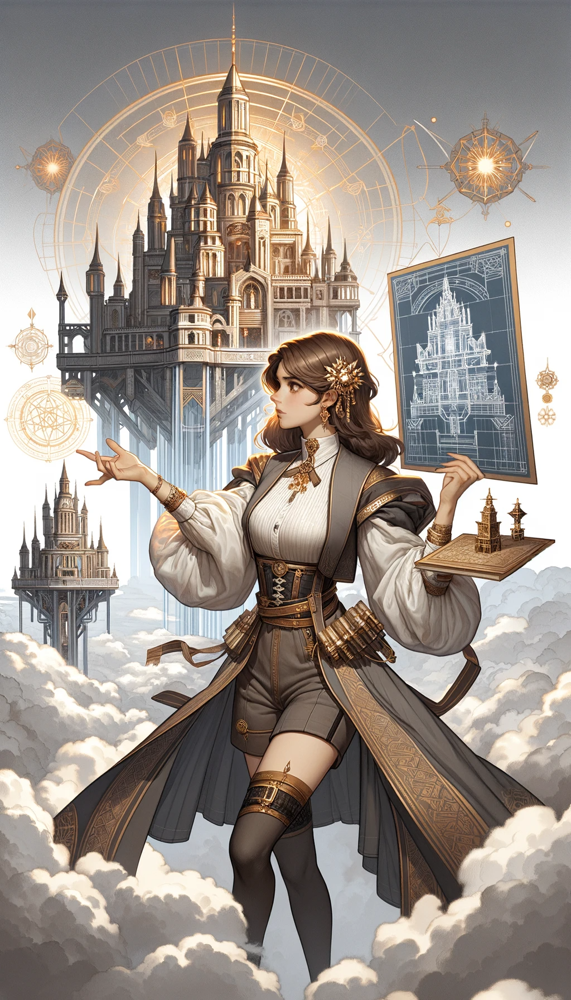
*Summoner of Powerful Fortresses and Towers: Malphas dominates battlefields and strengthens allies.*

### 40. Raum
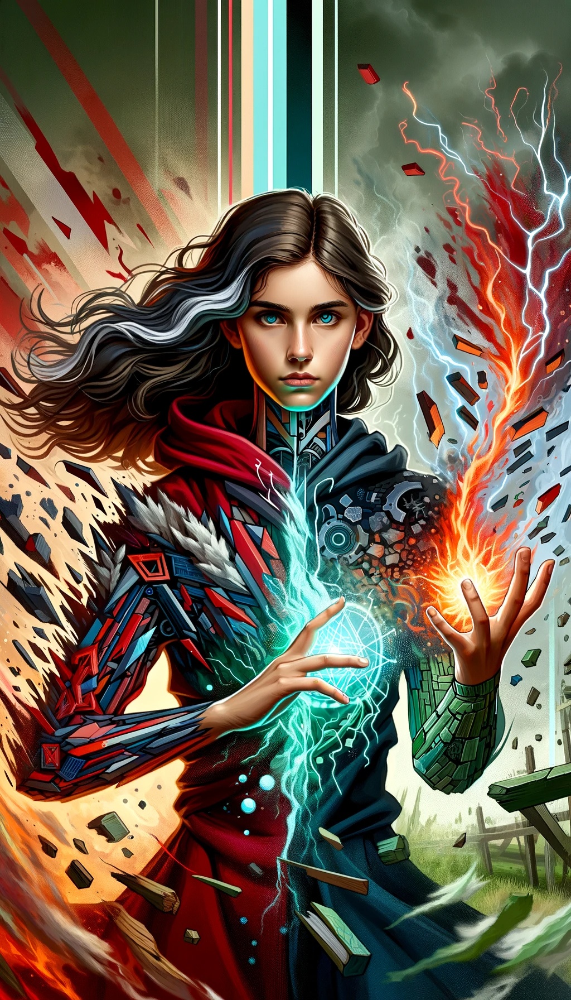
*Master of Destruction and Regeneration: Raum destroys enemy structures and recycles resources.*

### 41. Focalor

*Lord of Storms and Seas: Focalor excels in naval battles, leveraging the ocean to gain the upper hand.*

### 42. Vepar

*Underwater Magic Specialist: Vepar utilizes the sea for stealth attacks and offensive maneuvers.*

### 43. Sabnock

*Artisan of Armor and Weapons: Sabnock enhances the defense and attack capabilities of allies.*

### 44. Shax

*Expert in Stealth and Deception: Shax disrupts enemies and gathers critical intelligence.*

### 45. Vine
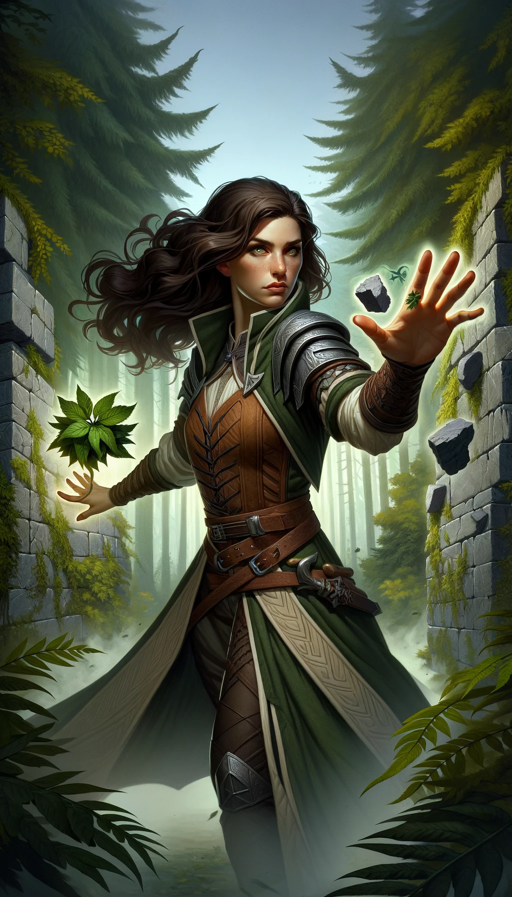
*Ruler of Nature and Walls: Vine creates obstacles to hinder enemy movement.*

### 46. Bifrons

*Necromancer: Bifrons summons the spirits of the dead for battle assistance.*

### 47. Uvall

*Emotion and Friendship Magician: Uvall strengthens the unity of allies and weakens the will of enemies.*

### 48. Haagenti

*Transformation and Change Magician: Haagenti alters forms to lead battles advantageously.*

### 49. Crocell

*Controller of Water and Temperature: Crocell manipulates the environment to hinder enemies.*

### 50. Furcas

*Sage of Knowledge and Wisdom: Furcas provides information and strategic counsel.*

### 51. Balam

*Prophet and Seer: Balam predicts the future and offers strategic guidance in battle.*

### 52. Alloces

*Fire and Battle Magician: Alloces wields powerful fire magic to aggressively attack enemies.*

### 53. Caim

*Communicator with Animals: Caim summons and utilizes animals for various battle purposes.*

### 54. Murmur

*Master of Souls and Death: Murmur wields death magic to overpower enemies.*

### 55. Orobas

*Protector and Truth Seeker: Orobas guards allies and exposes enemy falsehoods.*

### 56. Gremory

*Treasure Hunter and Discoverer: Gremory finds and secures valuable resources.*

### 57. Ose

*Illusionist and Mind Manipulator: Ose creates illusions to confuse and disorient enemies.*

### 58. Amy

*Astronomer and Astrologer: Amy uses stellar positions for strategic planning.*

### 59. Orias

*Master of Transformation and Fate: Orias manipulates destiny and changes forms.*

### 60. Vapula

*Scholar of Knowledge and Technology: Vapula supports allies with innovative magical

### 61. Zagan

*Alchemist and Creator: Zagan excels in transforming and creating new items and resources.*

### 62. Valac

*Snake and Secret Magician: Valac summons snakes and unveils hidden secrets of enemies.*

### 63. Andras

*Instigator of Conflict and Battle: Andras provokes enemies and incites combat.*

### 64. Haures

*Revealer of Truth and Destroyer of Defenses: Haures exposes truths and shatters enemy defenses.*

### 65. Andrealphus

*Master of Knowledge and Transformation: Andrealphus alters reality and generates new knowledge.*

### 66. Cimejes

*Warrior Mage: Cimejes summons invincible warriors and leads them in battle.*

### 67. Amdusias

*Musician and Storm Magician: Amdusias controls nature with music and attacks enemies.*

### 68. Belial
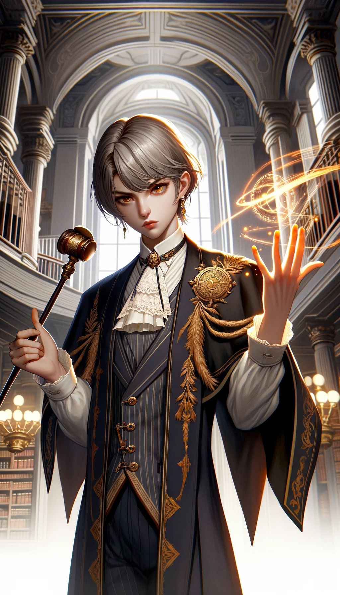
*Master of Law and Power: Belial wields legal magic to subdue enemies and exert authority.*

### 69. Decarabia
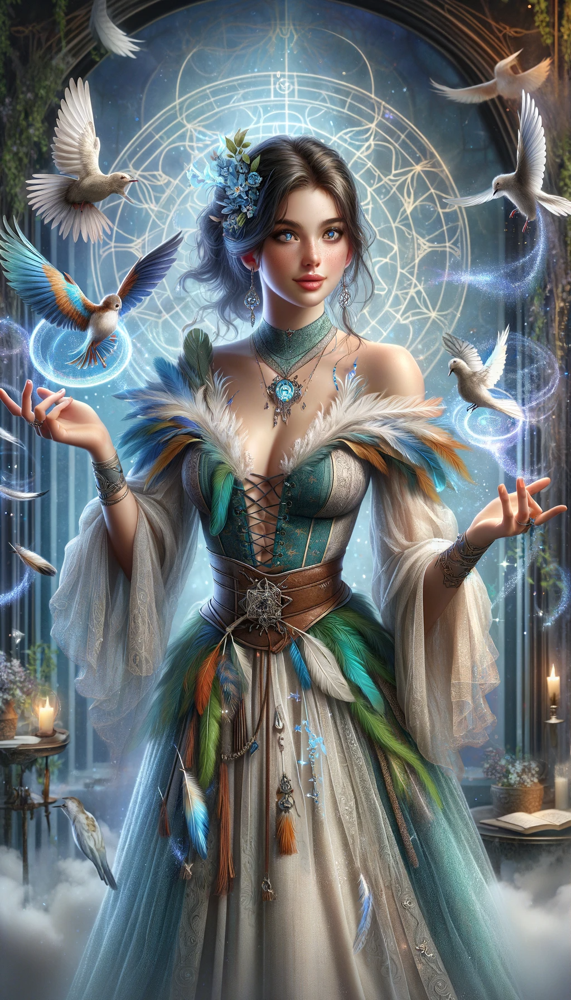
*Bird and Illusion Magician: Decarabia summons birds and creates illusions.*

### 70. Seere

*Speed and Movement Magician: Seere hastens movement and disrupts enemy mobility.*

### 71. Dantalion
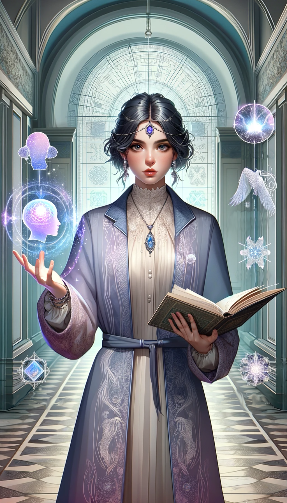
*Master of Minds and Thoughts: Dantalion reads and manipulates the thoughts of adversaries.*

### 72. Andromalius
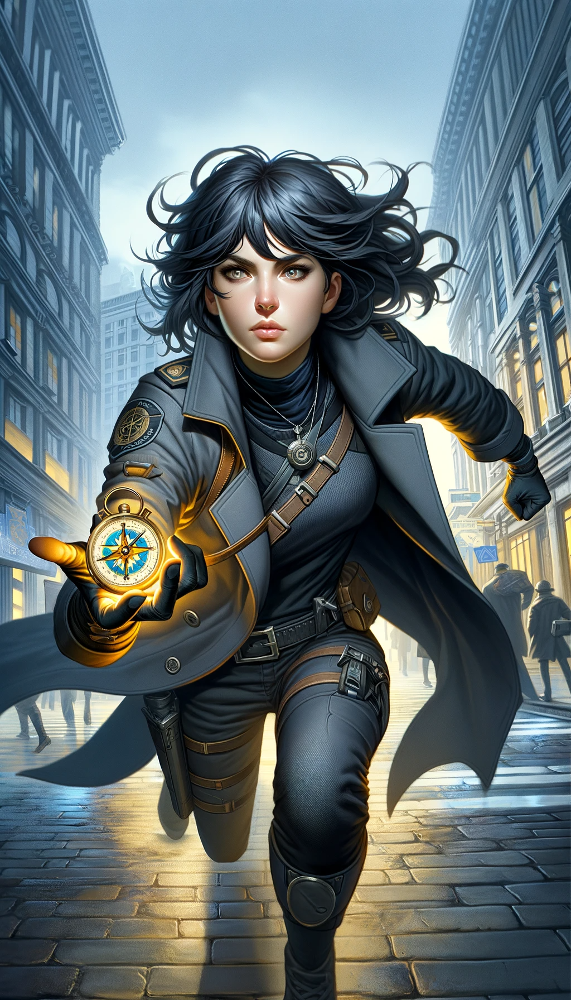
*Tracker and Enforcer of Justice: Andromalius specializes in tracking enemies and exposing crimes.*

