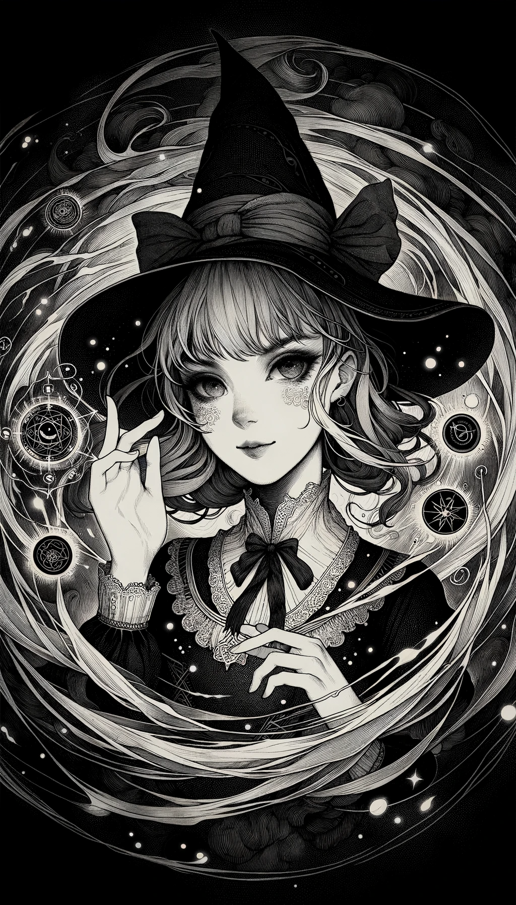
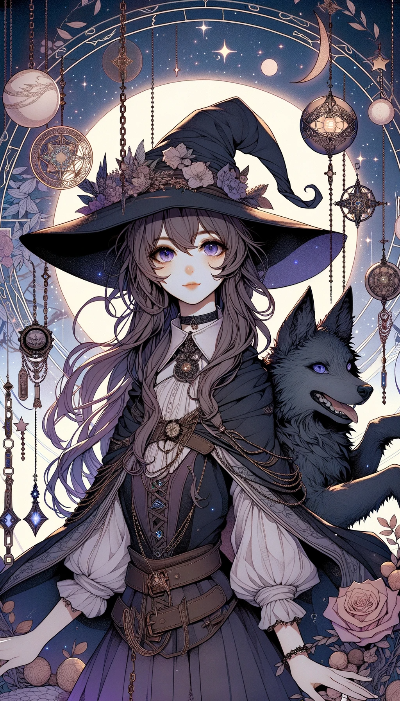

### Shadow Magic Cards

#### 1. Umbramancy Card
  </img>

- **Attack Power**: 7
- **Defense Power**: 3
- **Health**: 5
- **Mana Cost**: 4
- **Duration**: 2 turns
- **Range**: 3 tiles
- **Strong Against**: Shadow Conjuring
- **Story**: Known as the "Shadowmaster," this girl commands the darkness itself. She can obscure vision, create illusions, or even solidify shadows into physical attacks. Her mysterious and elusive nature makes her a tricky opponent to deal with. She's secretive and cunning, adept at turning the tide of battle in her favor.

#### 2. Shadow Conjuring Card
  </img>

- **Attack Power**: 5
- **Defense Power**: 5
- **Health**: 6
- **Mana Cost**: 3
- **Duration**: 3 turns
- **Range**: 4 tiles
- **Strong Against**: Umbramancy
- **Story**: Often called the "Shadowcrafter," this girl specializes in summoning shadowy creatures and objects. Whether it's a shadow wolf to aid her in battle or shadow chains to bind her enemies, her conjurations are versatile and adaptive. She's imaginative and resourceful, able to think on her feet in any situation.

---

Both of these Shadow Magic cards are equally matched in their strengths and weaknesses, offering a balanced yet intricate dynamic in the game's magical ecosystem.