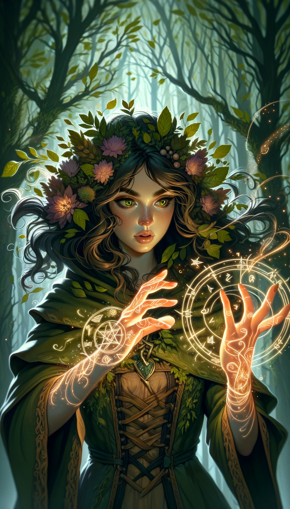

### Nature Magic Cards

#### 1. Phytomancy Card (Plant Magic)
 

- **Attack Power**: 4
- **Defense Power**: 5
- **Health**: 6
- **Mana Cost**: 3
- **Duration**: 2 turns
- **Range**: 2 tiles
- **Strong Against**: Zoomancy
- **Story**: Known as the "Guardian of the Forest," this girl has the power to control plants. She uses vines and leaves to entrap and defeat her enemies. Her calm demeanor and wisdom make her a formidable protector of nature.

#### 2. Zoomancy Card (Animal Magic)
 

- **Attack Power**: 6
- **Defense Power**: 4
- **Health**: 5
- **Mana Cost**: 4
- **Duration**: 3 turns
- **Range**: 3 tiles
- **Strong Against**: Meteoromancy
- **Story**: Called the "Beast Whisperer," this girl can control animals and use them to her advantage in battle. She is adventurous and untamed, finding kinship in the animal kingdom which she represents.

#### 3. Meteoromancy Card (Meteor Magic)
 

- **Attack Power**: 7
- **Defense Power**: 3
- **Health**: 4
- **Mana Cost**: 5
- **Duration**: 1 turn
- **Range**: 4 tiles
- **Strong Against**: Phytomancy
- **Story**: Known as the "Star Sorceress," this girl draws power from celestial bodies to unleash devastating attacks. With a mysterious aura, she embodies the infinite potential and volatility of the cosmos.

---

These cards also have specific strengths and weaknesses against each other, forming a part of the larger elemental and magical ecosystem.