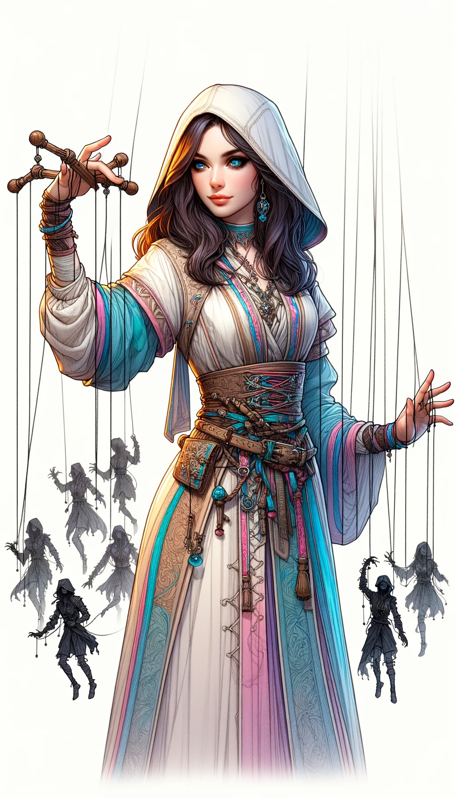

### Psionics Magic Cards

#### 1. Telepathy Card
 

- **Attack Power**: 2
- **Defense Power**: 5
- **Health**: 6
- **Mana Cost**: 3
- **Duration**: 2 turns
- **Range**: 4 tiles
- **Strong Against**: Divination
- **Story**: Known as the "Mind Whisperer," this girl has the ability to read minds and predict enemy moves. Though she lacks in physical attack, her strategic advantage on the battlefield is second to none. She's perceptive and empathetic, often knowing what others are thinking before they do.

#### 2. Divination Card
 

- **Attack Power**: 6
- **Defense Power**: 4
- **Health**: 5
- **Mana Cost**: 4
- **Duration**: 3 turns
- **Range**: 3 tiles
- **Strong Against**: Mind Control
- **Story**: Dubbed the "Oracle," this girl can foresee future events and manipulate probabilities. Her foresight allows her and her allies to dodge attacks or land critical hits, making her a dangerous foe. She is wise beyond her years and deeply spiritual.

#### 3. Mind Control Card
 

- **Attack Power**: 5
- **Defense Power**: 2
- **Health**: 4
- **Mana Cost**: 5
- **Duration**: 1 turn
- **Range**: 2 tiles
- **Strong Against**: Telepathy
- **Story**: Often called the "Puppeteer," this girl can take control of her enemies, making them turn against each other. Her eerie ability can change the course of a battle, but it requires great concentration. She is cunning and manipulative, always several steps ahead of her enemies.

---

Each of these Psionics Magic cards carries its own unique abilities and characteristics, contributing to a diverse and complex magical ecosystem.