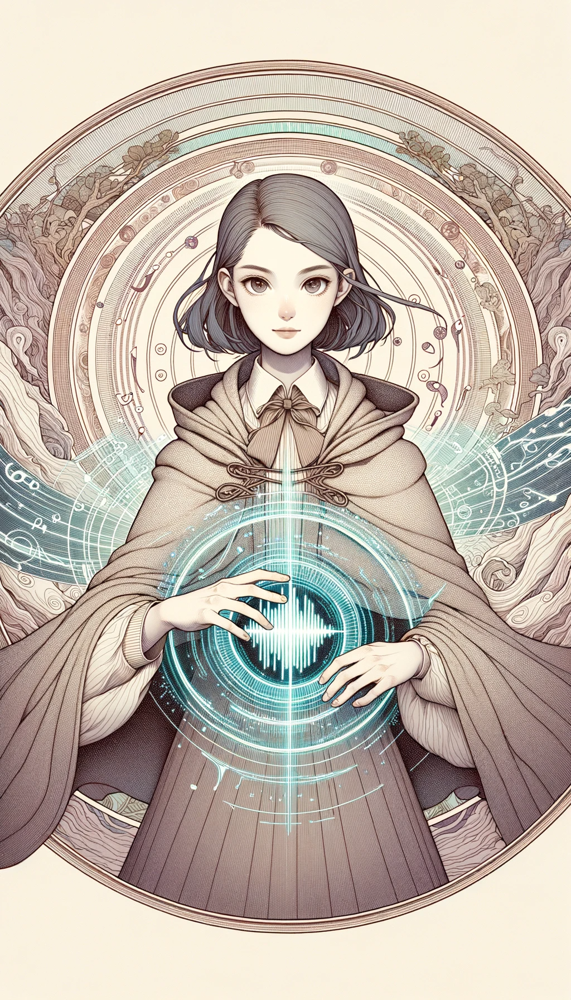

### Mystic Magic Cards

#### 1. Illusion Card
 

- **Attack Power**: 5
- **Defense Power**: 4
- **Health**: 6
- **Mana Cost**: 4
- **Duration**: 3 turns
- **Range**: 3 tiles
- **Strong Against**: Gravimancy
- **Story**: Known as the "Illusionist," this girl can manipulate what others perceive, creating false realities or making herself invisible. She uses her skills to deceive enemies and create opportunities for her allies. Her nature is as elusive as her magic.

#### 2. Gravimancy Card
 

- **Attack Power**: 3
- **Defense Power**: 6
- **Health**: 5
- **Mana Cost**: 5
- **Duration**: 2 turns
- **Range**: 4 tiles
- **Strong Against**: Sonimancy
- **Story**: The "Gravimancer" witch girl manipulates gravitational forces, making it difficult for enemies to move or attack. She can also lighten the force around her allies, aiding their mobility. She is a ponderous thinker, always contemplating the weight of her actions.

#### 3. Sonimancy Card
 

- **Attack Power**: 6
- **Defense Power**: 3
- **Health**: 4
- **Mana Cost**: 3
- **Duration**: 1 turn
- **Range**: 5 tiles
- **Strong Against**: Illusion
- **Story**: The "Sonimancer" witch girl can manipulate sound waves, disorienting enemies and shattering obstacles. Her magic is as versatile as it is disarming, capable of both healing and harm. She is a vivacious and energetic individual, never missing a beat in battle or life.

---

Mystic Magic encompasses a range of unconventional and unpredictable forms of magic. From illusion to gravimancy and sonimancy, this category provides a wide array of tactics, making it strong against more focused or specialized types of magic.