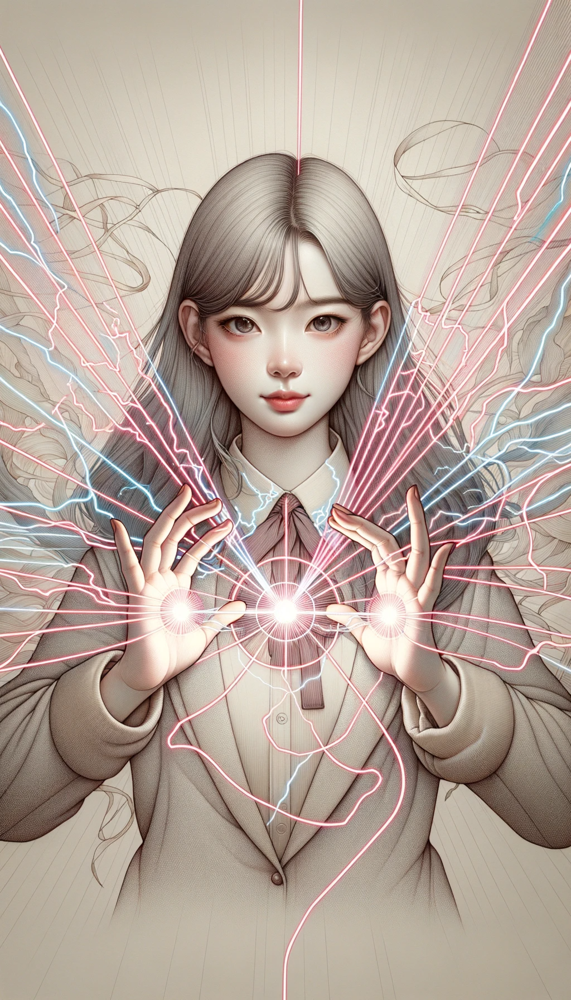

### 레벨 2 빛의 마법 합성 마법 카드

---

#### 1. 레이저 마법 (전기마법 + 광학마법)
 

- **공격력**: 11
- **방어력**: 9
- **체력**: 9
- **마나 비용**: 8
- **지속 시간**: 2 턴
- **범위**: 4 타일
- **강점**: 전기마법과 광학마법에 모두 강함
- **스토리**: "펄스 마법사"로 알려진 이 소녀는 전기의 원시 에너지와 빛의 정밀함을 결합하여 강력한 레이저 광선을 만들어냅니다. 이 레이저는 적을 혼란시키거나 고에너지 빔으로 집중하여 거의 모든 것을 관통할 수 있습니다. 그녀는 번개폭풍의 전기적 속도와 순수한 빛의 명확한 집중력을 모두 가지고 있어 전장에서 강력한 힘을 발휘합니다.

---

레이저 마법 카드는 빛의 마법 컬렉션에 새로운 전술적 깊이를 더합니다. 전기마법과 광학마법의 결합된 강점을 통해 다양한 상황에서 상대를 도전하고 교란시킬 수 있는 독특한 능력을 제공합니다.