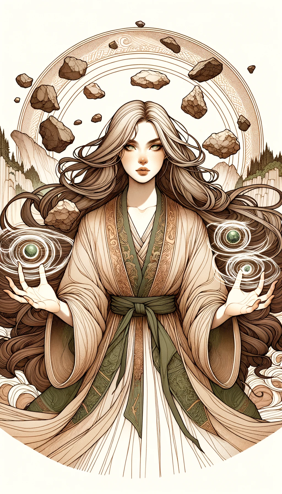

### 레벨 1 원소 복합 마법 카드

---

#### 1. 파이로매직 카드

- **공격력**: 8
- **방어력**: 2
- **체력**: 4
- **마나 비용**: 5
- **지속 시간**: 1 턴
- **범위**: 타일 3개
- **강력한 상대**: 하이드로맨시
- **스토리**: "불꽃의 용접공"으로 알려진 이 소녀는 불을 다루는 데 능숙합니다. 불덩이를 던지고, 화염의 벽을 만들고, 심지어 불로 몸을 감쌀 수도 있습니다. 화끈하고 열정적인 그녀는 항상 전투에서 열기를 더하기 위해 노력합니다.

#### 2. 하이드로맨시 카드

- **공격력**: 3
- **방어력**: 7
- **건강**: 5
- **마나 비용**: 4
- **지속 시간**: 2턴
- **범위**: 타일 4개
- **강력한 상대**: 에어로맨시
- **스토리**: "물의 현자"라고 불리는 이 소녀는 모든 형태의 물을 조종할 수 있습니다. 비를 소환하고, 해일을 일으키고, 심지어 얼음을 조작할 수도 있습니다. 그녀는 침착하고 유동적이며 변화하는 전투 상황에 쉽게 적응합니다.

#### 3. 에어로맨시 카드

- **공격력**: 5
- **방어력**: 5
- **체력**: 6
- **마나 비용**: 3
- **지속 시간**: 3 턴
- **범위**: 5 타일
- **강력한 상대**: 지오매시
- **스토리**: "바람의 속삭임"이라고도 불리는 이 소녀는 기류와 바람을 조종할 수 있는 힘을 가지고 있습니다. 강력한 돌풍을 일으키고 바람 장벽을 만들며 폭풍을 소환할 수도 있습니다. 발이 가볍고 반응이 빨라 전장에서 역동적인 힘을 발휘합니다.

#### 4. 지오맨시 카드

- **공격력**: 6
- **방어력**: 6
- **체력**: 4
- **마나 비용**: 2
- **지속 시간**: 1 턴
- **범위**: 타일 2개
- **력한 상대**: 화염 마법
- **스토리**: "어스쉐이커"로 알려진 이 소녀는 땅과 돌을 조종할 수 있습니다. 암벽을 만들고, 지진을 소환하고, 산사태를 일으킬 수도 있습니다. 그녀는 흔들리지 않고 변함없는 모습으로 아군이든 적이든 든든한 지원군이 될 수 있습니다.

---

### 레벨 2 원소 복합 마법 카드

---

#### 1. 스팀 마법 (화염 마법 + 수계 마법)

- **공격력**: 11
- **방어력**: 9
- **체력**: 9
- **마나 비용**: 9
- **지속 시간**: 1 턴
- **범위**: 3 타일
- **강력한 상대**: 풍마법에
- **스토리**: "안개의 여주인"으로 알려진 그녀는 불과 물의 원소를 결합하여 적에게 끓는 증기를 내뿜습니다. 이 증기는 불만 태우는 것이 아니라 방어적인 안개를 만들어 적을 혼란에 빠트립니다. 그녀의 성격은 불같은 열정과 유동적인 적응성의 혼합체로, 그녀를 예측할 수 없는 강력한 상대로 만듭니다.

---

#### 2. 안개 마법 (수계 마법 + 풍마법)

- **공격력**: 8
- **방어력**: 12
- **체력**: 11
- **마나 비용**: 7
- **지속 시간**: 3 턴
- **범위**: 5 타일
- **강력한 상대**: 지마법에
- **스토리**: "장막 짜는 자"로 불리는 그녀는 물과 공기를 결합하여 전장에 짙은 안개를 만들어냅니다. 이 안개는 시야를 가리고 소리를 감쇄시켜 전술적 이점을 제공합니다. 그녀의 태도는 물처럼 평온하지만 바람처럼 빠르게 변할 수 있어, 미끄러운 적으로 만듭니다.

---

#### 3. 모래폭풍 마법 (풍마법 + 지마법)

- **공격력**: 11
- **방어력**: 11
- **체력**: 10
- **마나 비용**: 5
- **지속 시간**: 2 턴
- **범위**: 4 타일
- **강력한 상대**: 화염 마법에
- **스토리**: "사막의 폭풍"으로 알려진 그녀는 공기와 대지를 융합하여 적을 해치고 움직임을 방해하는 강력한 모래폭풍을 소환합니다. 그녀는 바람의 빠름과 대지의 강인함을 내포하고 있어, 끈질기고 지속적인 힘을 가진 존재입니다.

---

#### 4. 화산 마법 (지마법 + 화염 마법)

- **공격력**: 14
- **방어력**: 8
- **체력**: 8
- **마나 비용**: 7
- **지속 시간**: 1 턴
- **범위**: 3 타일
- **강력한 상대**: 수계 마법에
- **스토리**: "용암의 여왕"으로도 알려진 그녀는 불과 대지를 결합하여 화산 분출을 일으키고, 용암과 재를 뿜어냅니다. 그녀의 기질은 화산처럼 변덕스럽지만 산처럼 단단합니다. 그녀의 주문은 공격과 방어 장벽을 모두 만들어내, 둥근 전략적 상대가 됩니다.

---

### 레벨 3 원소 합성 마법 카드

---

#### 1. 열 안개 (증기 마법 + 안개 마법)

- **공격력**: 13
- **방어력**: 15
- **체력**: 13
- **마나 비용**: 12
- **지속 시간**: 2턴
- **범위**: 타일 4개
- **강력한 상대**: 에어로맨시 및 지오맨시
- **스토리**: "신기루의 여제"로 알려진 그녀는 증기와 안개를 합쳐 피해를 입히면서도 시야를 가리는 열 안개를 만들어냅니다. 이 안개는 화상을 입힐 뿐만 아니라 은폐도 가능하기 때문에 상대에게 악몽과도 같습니다. 증기의 휘발성과 안개의 고요함을 모두 갖춘 그녀의 성격은 예측할 수 없지만 사려 깊은 전략가입니다.

---

#### 2. 용암 분출 (증기 마법 + 화산 마법)

- **공격력**: 16
- **방어력**: 11
- **체력**: 12 12
- **마나 비용**: 11
- **지속 시간**: 1턴
- **범위**: 타일 3개
- **강력한 상대**: 수력 마법과 공중 마법
- **스토리**: "해일의 술타나"라고 불리는 그녀는 증기와 용암을 결합하여 경로에 있는 거의 모든 것을 불태울 수 있는 과열 폭발을 일으킵니다. 이 강력한 원소의 융합으로 전장에서 폭발적인 힘을 발휘합니다. 불과 물의 거침없는 특성을 모두 지닌 맹렬한 전투원입니다.

---

#### 3. 사막의 바람 (안개 마법 + 모래폭풍 마법)

- **공격력**: 12
- **방어력**: 16
- **체력**: 15 15
- **마나 비용**: 10
- **지속 시간**: 3 턴
- **범위**: 5 타일
- **강력한 상대**: 화염 마법과 지마술
- **스토리**: "사막 바람 속삭이는 자"로 알려진 그녀는 안개와 모래 폭풍을 융합하여 미세한 연마 입자로 가득 찬 눈부시고 방향 감각을 잃게 하는 바람을 만들어냅니다. 그녀의 마법은 아군을 숨기기도 하고 적을 지치게 만들기도 합니다. 그녀의 캐릭터는 물처럼 유동적이고 사막의 바람처럼 변함없습니다.

---

#### 4. 마운틴 파이어 (모래폭풍 마법 + 화산 마법)

- **공격력**: 17
- **방어력**: 13
- **체력**: 11 11
- **마나 비용**: 10
- **지속 시간**: 1턴
- **범위**: 타일 4개
- **강력한 상대**: 에어로맨시 및 하이드로맨시
- **스토리**: "산의 분노"라고도 알려진 그녀는 모래 폭풍과 화산 마법을 결합하여 거친 바람을 동반한 대격변을 소환합니다. 산처럼 견고하지만 산불처럼 사나운 성격으로 공격과 방어가 모두 가능한 강력한 상대입니다.

---

### 레벨 4 원소 합성 마법 카드

---

#### 1. 천상의 지옥 (화산 안개 + 신비한 강풍 + 대지의 분노)

- **공격력**: 22
- **방어력**: 18 18
- **체력**: 191   
- **마나 비용**: 20
- **지속 시간**: 2턴
- **범위**: 5 타일
- **강력한 상대**: 파이로맨시, 에어로맨시, 지오맨시, 하이드로맨시
- **스토리**: "천상의 불꽃"으로 알려진 이 소녀는 화산 안개, 신비한 강풍, 대지의 분노의 혼돈 에너지를 방출하여 전장을 불과 마법으로 뒤덮는 천상의 지옥을 만들어냅니다. 이 화염은 신성한 성질을 지니고 있어 적에게 손댈 수 없는 재앙을 불러일으킵니다. 그녀는 길들여지지 않은 순수한 자연의 힘을 구현하고 천상의 권위로 그들을 지휘합니다.

---

#### 2. 테라 피르마 사이클론(화산 안개 + 신비한 강풍 + 모래 파이어 사이클론)

- **공격력**: 21
- **방어력**: 20
- **체력**: 18
- **마나 비용**: 19
- **지속 시간**: 3 턴
- **범위**: 6 타일
- **강력한 상대**: 에어로맨시, 지마술, 파이로맨시, 하이드로맨시
- **스토리**: "테라포머"라고 불리는 이 소녀는 화산 안개, 신비한 강풍, 모래폭풍 사이클론의 강력한 요소를 융합하여 경외감을 불러일으킬 만큼 파괴적인 지상의 폭풍을 만들어 냅니다. 사이클론은 지형을 파괴할 뿐만 아니라 지형을 변화시켜 전략적 이점을 제공합니다. 파괴와 창조를 모두 구현하는 원소의 힘이 조화롭게 어우러진 캐릭터입니다.

---

#### 3. 태초의 폭풍 (신비한 강풍 + 대지의 분노 + 모래 폭풍 사이클론)

- **공격력**: 23
- **방어력**: 17 17
- **체력**: 17
- **마나 비용**: 18
- **지속 시간**: 2턴
- **범위**: 5 타일
- **강력한 상대**: 에어로맨시, 지마술, 파이로맨시, 하이드로맨시
- **스토리**: "폭풍의 눈"으로 알려진 그녀는 신비한 강풍, 대지의 분노, 모래폭풍 사이클론을 결합하여 태초의 폭풍을 만들어냅니다. 이 고대 폭풍은 원소의 힘이 길들여지지 않고 무한했던 세계의 기원을 떠올리게 합니다. 그녀는 이 원초적인 에너지를 활용하여 폭풍을 일으켜 적을 혼란에 빠뜨리고 궤멸시킵니다. 그녀의 아우라는 헤아릴 수 없는 원소의 힘을 발산합니다.
