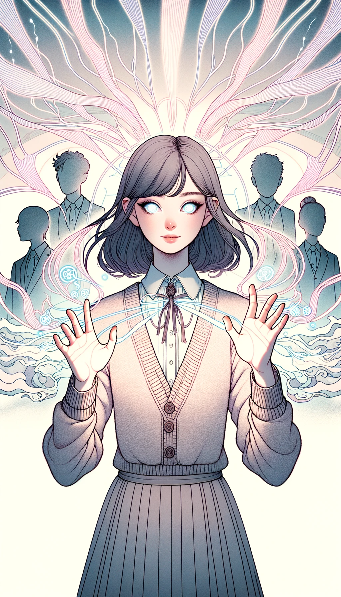

#

## Pyromancy
  

- **Level**: 1
- **Type**: Elemental
- **Composit**: null
- **Attack Power**: 8
- **Defense Power**: 2
- **Health**: 4
- **Mana Cost**: 5
- **Duration**: 1 turn
- **Range**: 3 tiles
- **Strong Against**: Hydromancy
- **Story**: Known as the "Flame Wielder," this girl has mastery over fire. She can cast fireballs, create walls of flame, and even cloak herself in fire. She's hot-headed and passionate, always looking to turn up the heat in battle.

## Hydromancy

- **Level**: 1
- **Type**: Elemental
- **Composit**: null
- **Attack Power**: 3
- **Defense Power**: 7
- **Health**: 5
- **Mana Cost**: 4
- **Duration**: 2 turns
- **Range**: 4 tiles
- **Strong Against**: Aeromancy
- **Story**: Referred to as the "Water Sage," this girl can control water in all its forms. She can summon rain, create tidal waves, and even manipulate ice. She's calm and fluid, adapting easily to changing battle conditions.

## Aeromancy
  

- **Level**: 1
- **Type**: Elemental
- **Composit**: null
- **Attack Power**: 5
- **Defense Power**: 5
- **Health**: 6
- **Mana Cost**: 3
- **Duration**: 3 turns
- **Range**: 5 tiles
- **Strong Against**: Geomancy
- **Story**: Often called the "Wind Whisperer," this girl has the power to control air currents and winds. She can generate powerful gusts, create wind barriers, and even summon storms. She's light on her feet and quick to react, making her a dynamic force on the battlefield.

## Geomancy
  

- **Level**: 1
- **Type**: Elemental
- **Composit**: null
- **Attack Power**: 6
- **Defense Power**: 6
- **Health**: 4
- **Mana Cost**: 2
- **Duration**: 1 turn
- **Range**: 2 tiles
- **Strong Against**: Pyromancy
- **Story**: Known as the "Earthshaker," this girl can manipulate the earth and stone. She can create rock walls, summon earthquakes, and even cause landslides. She's steady and unmovable, a rock-solid ally or foe.

## Steam (Pyromancy + Hydromancy)

- **Level**: 2
- **Type**: Elemental
- **Composit**: Pyromancy, Hydromancy
- **Attack Power**: 11
- **Defense Power**: 9
- **Health**: 9
- **Mana Cost**: 9
- **Duration**: 1 turn
- **Range**: 3 tiles
- **Strong Against**: Aeromancy
- **Story**: Known as the "Mistress of Mist," she combines the fire and water elements to unleash scalding steam on her enemies. The steam not only burns but also provides a defensive mist, disorienting the enemy. Her personality is a mix of fiery passion and fluid adaptability, making her a formidable and unpredictable opponent.

## Fog (Hydromancy + Aeromancy)

- **Level**: 2
- **Type**: Elemental
- **Composit**: Hydromancy, Aeromancy
- **Attack Power**: 8
- **Defense Power**: 12
- **Health**: 11
- **Mana Cost**: 7
- **Duration**: 3 turns
- **Range**: 5 tiles
- **Strong Against**: Geomancy
- **Story**: Dubbed the "Veilweaver," she combines water and air to create dense fog on the battlefield. The fog obscures vision and dampens sound, providing tactical advantages. Her demeanor is calm like water but can be as swiftly changing as the wind, making her a slippery foe.

## Sandstorm (Aeromancy + Geomancy)

- **Level**: 2
- **Type**: Elemental
- **Composit**: Aeromancy, Geomancy
- **Attack Power**: 11
- **Defense Power**: 11
- **Health**: 10
- **Mana Cost**: 5
- **Duration**: 2 turns
- **Range**: 4 tiles
- **Strong Against**: Pyromancy
- **Story**: Known as the "Desert Tempest," she fuses air and earth to summon fierce sandstorms that not only damage but also disrupt the movements of her enemies. She embodies the swiftness of the wind and the resilience of the earth, making her both a relentless and enduring force.

## Volcanic (Geomancy + Pyromancy)

- **Level**: 2
- **Type**: Elemental
- **Composit**: Geomancy, Pyromancy
- **Attack Power**: 14
- **Defense Power**: 8
- **Health**: 8
- **Mana Cost**: 7
- **Duration**: 1 turn
- **Range**: 3 tiles
- **Strong Against**: Hydromancy
- **Story**: Also known as the "Lava Queen," she blends fire and earth to call forth volcanic eruptions, spewing lava and ash. Her temperament is as volatile as a volcano yet as steadfast as a mountain. Her spells can create both offensive and defensive barriers, making her a well-rounded adversary.

## Thermal Mist (Steam + Fog)

- **Level**: 3
- **Type**: Elemental
- **Composit**: Steam, Fog
- **Attack Power**: 13
- **Defense Power**: 15
- **Health**: 13
- **Mana Cost**: 12
- **Duration**: 2 turns
- **Range**: 4 tiles
- **Strong Against**: Aeromancy and Geomancy
- **Story**: Known as the "Mistress of Mirage," she merges steam and fog to produce a thermal mist that's both damaging and obscuring. This fog not only burns but also conceals, making it a nightmare for any opponent. Her personality combines both the volatility of steam and the calmness of fog, making her an unpredictable yet thoughtful strategist.

## Lava Surge (Steam + Volcanic)

- **Level**: 3
- **Type**: Elemental
- **Composit**: Steam, Volcanic
- **Attack Power**: 16
- **Defense Power**: 11
- **Health**: 12
- **Mana Cost**: 11
- **Duration**: 1 turn
- **Range**: 3 tiles
- **Strong Against**: Hydromancy and Aeromancy
- **Story**: Dubbed the "Sultana of Surge," she combines steam and lava to produce superheated bursts that can incinerate almost anything in its path. This powerful fusion of elements makes her an explosive force on the battlefield. She's a fierce combatant, embodying the unrestrained qualities of both fire and water.

## Desert Wind (Fog + Sandstorm)

- **Level**: 3
- **Type**: Elemental
- **Composit**: Fog, Sandstorm
- **Attack Power**: 12
- **Defense Power**: 16
- **Health**: 15
- **Mana Cost**: 10
- **Duration**: 3 turns
- **Range**: 5 tiles
- **Strong Against**: Pyromancy and Geomancy
- **Story**: Known as the "Desert Wind Whisperer," she fuses fog and sandstorm to create a blinding, disorienting wind filled with micro-abrasive particles. Her magic is as elusive as it is relentless, capable of both hiding her team and wearing down the enemy. Her character is as fluid as water and as constant as a desert wind.

## Mountain Fire (Sandstorm + Volcanic)

- **Level**: 3
- **Type**: Elemental
- **Composit**: Sandstorm, Volcanic
- **Attack Power**: 17
- **Defense Power**: 13
- **Health**: 11
- **Mana Cost**: 10
- **Duration**: 1 turn
- **Range**: 4 tiles
- **Strong Against**: Aeromancy and Hydromancy
- **Story**: Also known as the "Mountain's Fury," she marries the elements of sandstorm and volcanic magic to summon cataclysmic eruptions accompanied by gritty, wind-driven sands. Her persona is as enduring as a mountain but as ferocious as wildfire, making her a formidable opponent capable of both offense and defense.

## Celestial Inferno (Thermal Mist + Lava Surge + Mountain Fire)

- **Level**: 4
- **Type**: Elemental
- **Composit**: Thermal Mist, Lava Surge, Mountain Fire
- **Attack Power**: 22
- **Defense Power**: 18
- **Health**: 19
- **Mana Cost**: 20
- **Duration**: 2 turns
- **Range**: 5 tiles
- **Strong Against**: Pyromancy, Aeromancy, Geomancy, and Hydromancy
- **Story**: Known as the "Celestial Blaze," this girl channels the chaotic energies of Thermal Mist, Lava Surge and Mountain Fire to create a heavenly inferno that engulfs the battlefield in fire and magic. This blaze has a divine quality, making it untouchable and catastrophic for her enemies. She embodies the pure, untamed forces of nature and commands them with a celestial authority.

## Terra Firma Cyclone (Thermal Mist + Lava Surge + Desert Wind)

- **Level**: 4
- **Type**: Elemental
- **Composit**: Thermal Mist, Lava Surge, Desert Wind
- **Attack Power**: 21
- **Defense Power**: 20
- **Health**: 18
- **Mana Cost**: 19
- **Duration**: 3 turns
- **Range**: 6 tiles
- **Strong Against**: Aeromancy, Geomancy, Pyromancy, and Hydromancy
- **Story**: Referred to as the "Terraformer," this girl fuses the powerful elements of Thermal Mist, Lava Surge and Desert Wind to create a ground-based storm that is as destructive as it is awe-inspiring. The cyclone not only devastates but also alters the terrain, providing strategic advantages. Her character is a harmonious blend of elemental forces, embodying both destruction and creation.

## Primordial Tempest (Lava Surge + Mountain Fire + Desert Wind)

- **Level**: 4
- **Type**: Elemental
- **Composit**: Lava Surge, Mountain Fire, Desert Wind
- **Attack Power**: 23
- **Defense Power**: 17
- **Health**: 17
- **Mana Cost**: 18
- **Duration**: 2 turns
- **Range**: 5 tiles
- **Strong Against**: Aeromancy, Geomancy, Pyromancy, and Hydromancy
- **Story**: Known as the "Eye of the Storm," she combines Lava Surge, Mountain Fire and Desert Wind to create a primordial tempest. This ancient storm harkens back to the origins of the world, where elemental forces were untamed and boundless. She taps into these raw energies to unleash a storm that disrupts, confuses, and decimates her enemies. Her aura radiates the unfathomable might of the elements.

---

## Phytomancy

- **Level**: 1
- **Type**: Nature
- **Composit**: null
- **Attack Power**: 4
- **Defense Power**: 5
- **Health**: 6
- **Mana Cost**: 3
- **Duration**: 2 turns
- **Range**: 2 tiles
- **Strong Against**: Zoomancy
- **Story**: Known as the "Guardian of the Forest," this girl has the power to control plants. She uses vines and leaves to entrap and defeat her enemies. Her calm demeanor and wisdom make her a formidable protector of nature.

## Zoomancy

- **Level**: 1
- **Type**: Nature
- **Composit**: null
- **Attack Power**: 6
- **Defense Power**: 4
- **Health**: 5
- **Mana Cost**: 4
- **Duration**: 3 turns
- **Range**: 3 tiles
- **Strong Against**: Meteoromancy
- **Story**: Called the "Beast Whisperer," this girl can control animals and use them to her advantage in battle. She is adventurous and untamed, finding kinship in the animal kingdom which she represents.

## Meteoromancy

- **Level**: 1
- **Type**: Nature
- **Composit**: null
- **Attack Power**: 7
- **Defense Power**: 3
- **Health**: 4
- **Mana Cost**: 5
- **Duration**: 1 turn
- **Range**: 4 tiles
- **Strong Against**: Phytomancy
- **Story**: Known as the "Star Sorceress," this girl draws power from celestial bodies to unleash devastating attacks. With a mysterious aura, she embodies the infinite potential and volatility of the cosmos.

## Ecosystem (Phytomancy + Zoomancy)

- **Level**: 2
- **Type**: Nature
- **Composit**: Phytomancy, Zoomancy
- **Attack Power**: 10
- **Defense Power**: 9
- **Health**: 11
- **Mana Cost**: 7
- **Duration**: 3 turns
- **Range**: 3 tiles
- **Strong Against**: Meteoromancy
- **Story**: Dubbed the "Warden of Life," she can control both plants and animals, creating a balanced and harmonious battlefield. Her personality is a blend of calm wisdom and untamed spirit, making her as versatile as the ecosystem she controls.

## Climate Control (Zoomancy + Meteoromancy)

- **Level**: 2
- **Type**: Nature
- **Composit**: Zoomancy, Meteoromancy
- **Attack Power**: 13
- **Defense Power**: 7
- **Health**: 9
- **Mana Cost**: 9
- **Duration**: 2 turns
- **Range**: 4 tiles
- **Strong Against**: Phytomancy
- **Story**: Known as the "Tempest Tamer," she has the power to control both weather and animals. With this dual mastery, she can summon storms while coordinating with animal allies. Her personality is a mixture of adventurousness and cosmic enigma, making her unpredictable and awe-inspiring.

## Seasonal (Meteoromancy + Phytomancy)

- **Level**: 2
- **Type**: Nature
- **Composit**: Meteoromancy, Phytomancy
- **Attack Power**: 11
- **Defense Power**: 8
- **Health**: 10
- **Mana Cost**: 8
- **Duration**: 2 turns
- **Range**: 3 tiles
- **Strong Against**: Zoomancy
- **Story**: Referred to as the "Seasonal Sage," she combines celestial power and plant control to alter the very seasons on the battlefield. Her temperament melds the mysterious aura of the cosmos with the grounded wisdom of the earth, making her a multi-faceted sorceress.

## Bio-Climate (Ecosystem + Climate Control)

- **Level**: 3
- **Type**: Nature
- **Composit**: Ecosystem, Climate Control
- **Attack Power**: 15
- **Defense Power**: 12
- **Health**: 14
- **Mana Cost**: 12
- **Duration**: 2 turns
- **Range**: 4 tiles
- **Strong Against**: Phytomancy and Meteoromancy
- **Story**: Known as the "Guardian of Balance," she masterfully integrates ecosystems and climate to create a dynamic, adaptive battlefield. Her ability to manipulate both flora, fauna, and weather make her an adaptable and strategic force. Her personality fuses the wisdom of an ancient forest with the unpredictability of a storm, making her a complex and challenging adversary.

## Nature's Seasons (Ecosystem + Seasonal)

- **Level**: 3
- **Type**: Nature
- **Composit**: Ecosystem, Seasonal
- **Attack Power**: 13
- **Defense Power**: 13
- **Health**: 16
- **Mana Cost**: 11
- **Duration**: 3 turns
- **Range**: 3 tiles
- **Strong Against**: Zoomancy and Meteoromancy
- **Story**: Dubbed the "Seer of Seasons," she combines the powers of ecosystems and celestial phenomena to create a harmonious yet ever-changing battlefield. Her character combines the nurturing aspects of an ecosystem with the cyclical wisdom of the seasons, making her a guardian of both time and life.

## Climate Seasons (Climate Control + Seasonal)

- **Level**: 3
- **Type**: Nature
- **Composit**: Climate Control, Seasonal
- **Attack Power**: 16
- **Defense Power**: 10
- **Health**: 12
- **Mana Cost**: 10
- **Duration**: 2 turns
- **Range**: 4 tiles
- **Strong Against**: Phytomancy and Zoomancy
- **Story**: Known as the "Tempest of Time," she fuses the control of weather and the changing seasons to manipulate the battlefield in both immediate and long-term ways. Her temperament is a balance between the fickle shifts of weather and the steady change of seasons, making her a mercurial yet reliable ally or foe.

## Gaia's Symphony (Bio-Climate + Nature's Seasons + Climate Seasons)

- **Level**: 4
- **Type**: Nature
- **Composit**: Bio-Climate, Nature's Seasons, Climate Seasons
- **Attack Power**: 24
- **Defense Power**: 21
- **Health**: 20
- **Mana Cost**: 22
- **Duration**: 4 turns
- **Range**: 6 tiles
- **Strong Against**: Phytomancy, Zoomancy, and Meteoromancy
- **Story**: Revered as the "Maestra of the Cosmos," she channels the profound elements of Bio-Climate, Nature's Seasons and Climate Seasons to create an orchestrated masterpiece on the battlefield. Her magic resonates with the very core of the planet, altering not just the climate and seasons but also accelerating or reversing life cycles. She epitomizes the interconnectedness of all things in nature and commands it with unparalleled mastery.

---

## Electromancy

- **Level**: 1
- **Type**: Luminomancy
- **Composit**: null
- **Attack Power**: 8
- **Defense Power**: 2
- **Health**: 4
- **Mana Cost**: 5
- **Duration**: 1 turn
- **Range**: 3 tiles
- **Strong Against**: Photomancy
- **Story**: Known as the "Thunder Mage," this girl wields the raw power of electricity. She can send shockwaves of electrical energy through her foes, making her an excellent disruptor on the battlefield. Quick-witted and electrifying, she lights up any fight she's in.

## Photomancy

- **Level**: 1
- **Type**: Luminomancy
- **Composit**: null
- **Attack Power**: 3
- **Defense Power**: 7
- **Health**: 5
- **Mana Cost**: 3
- **Duration**: 2 turns
- **Range**: 4 tiles
- **Strong Against**: Electromancy
- **Story**: Referred to as the "Lightbringer," this girl has the power to control light itself. She can create illusions, blind enemies, or even focus light into a laser-like beam. With a graceful and radiant presence, she brings hope and clarity to her allies.

## Laser (Electromancy + Photomancy)

- **Level**: 2
- **Type**: Luminomancy
- **Composit**: Electromancy, Photomancy
- **Attack Power**: 11
- **Defense Power**: 9
- **Health**: 9
- **Mana Cost**: 8
- **Duration**: 2 turns
- **Range**: 4 tiles
- **Strong Against**: Both Electromancy and Photomancy
- **Story**: Known as the "Pulse Enchantress," this girl fuses the raw energy of electricity with the precision of light to create powerful laser beams. These lasers can either disrupt enemies or focus into a high-energy beam that can cut through nearly anything. She carries both the electrifying speed of a thunderstorm and the clear focus of pure light, making her a formidable force on the battlefield.

## Hyper Laser (Laser + Laser)

- **Level**: 3
- **Type**: Luminomancy
- **Composit**: Laser
- **Attack Power**: 18
- **Defense Power**: 15
- **Health**: 16
- **Mana Cost**: 14
- **Duration**: 1 turn
- **Range**: 5 tiles
- **Strong Against**: Most other forms of magic due to its intense focus and power
- **Story**: Known as the "Master of Luminal Energy," this girl channels her mastery over Laser to create Hyper Laser beams of unparalleled strength and precision. Capable of slicing through almost any obstacle or enemy, her Hyper Lasers are the epitome of concentrated magical energy. Her personality fuses the unyielding intensity and pinpoint focus of dual laser magic, making her almost unbeatable in the domain of Luminomancy.

---

## Telepathy

- **Level**: 1
- **Type**: Psionics
- **Composit**: null
- **Attack Power**: 2
- **Defense Power**: 5
- **Health**: 6
- **Mana Cost**: 3
- **Duration**: 2 turns
- **Range**: 4 tiles
- **Strong Against**: Divination
- **Story**: Known as the "Mind Whisperer," this girl has the ability to read minds and predict enemy moves. Though she lacks in physical attack, her strategic advantage on the battlefield is second to none. She's perceptive and empathetic, often knowing what others are thinking before they do.

## Divination

- **Level**: 1
- **Type**: Psionics
- **Composit**: null
- **Attack Power**: 6
- **Defense Power**: 4
- **Health**: 5
- **Mana Cost**: 4
- **Duration**: 3 turns
- **Range**: 3 tiles
- **Strong Against**: Mind Control
- **Story**: Dubbed the "Oracle," this girl can foresee future events and manipulate probabilities. Her foresight allows her and her allies to dodge attacks or land critical hits, making her a dangerous foe. She is wise beyond her years and deeply spiritual.

## Mind Control

- **Level**: 1
- **Type**: Psionics
- **Composit**: null
- **Attack Power**: 5
- **Defense Power**: 2
- **Health**: 4
- **Mana Cost**: 5
- **Duration**: 1 turn
- **Range**: 2 tiles
- **Strong Against**: Telepathy
- **Story**: Often called the "Puppeteer," this girl can take control of her enemies, making them turn against each other. Her eerie ability can change the course of a battle, but it requires great concentration. She is cunning and manipulative, always several steps ahead of her enemies.

## Future Prediction (Telepathy + Divination)

- **Level**: 2
- **Type**: Psionics
- **Composit**: Telepathy, Divination
- **Attack Power**: 8
- **Defense Power**: 9
- **Health**: 11
- **Mana Cost**: 7
- **Duration**: 3 turns
- **Range**: 4 tiles
- **Strong Against**: Both Telepathy and Divination
- **Story**: Known as the "Seer of All," this girl combines mind-reading with foresight to not only predict but also influence future events. Her unparalleled strategic advantage makes her almost untouchable on the battlefield. With the ability to read minds and see the future, she can effortlessly avoid threats while setting up advantages for her team.

## Manipulation (Divination + Mind Control)

- **Level**: 2
- **Type**: Psionics
- **Composit**: Divination, Mind Control
- **Attack Power**: 11
- **Defense Power**: 6
- **Health**: 9
- **Mana Cost**: 9
- **Duration**: 2 turns
- **Range**: 3 tiles
- **Strong Against**: Both Divination and Mind Control
- **Story**: Named the "Mastermind," this girl combines foresight with control over her enemies. Not only can she predict their moves, but she can also manipulate them into unfavorable positions. Her skills make her a potent disruptor in battle, sowing chaos and confusion among enemy ranks.

## Group Control (Mind Control + Telepathy)

- **Level**: 2
- **Type**: Psionics
- **Composit**: Mind Control, Telepathy
- **Attack Power**: 7
- **Defense Power**: 7
- **Health**: 10
- **Mana Cost**: 8
- **Duration**: 2 turns
- **Range**: 3 tiles
- **Strong Against**: Both Mind Control and Telepathy
- **Story**: Known as the "Conductor of Will," this girl has the power to control multiple minds simultaneously while reading their thoughts. Her dual abilities make her a formidable leader, capable of orchestrating complex strategies and turning the tide of battle in her favor.

## Futuristic Manipulation (Future Prediction + Manipulation)

- **Level**: 3
- **Type**: Psionics
- **Composit**: Future Prediction, Manipulation
- **Attack Power**: 16
- **Defense Power**: 13
- **Health**: 17
- **Mana Cost**: 14
- **Duration**: 1 turn
- **Range**: 4 tiles
- **Strong Against**: Almost all other forms due to its predictive and manipulative capabilities
- **Story**: Known as the "Oracle of Schemes," this girl wields the power to predict and manipulate the future on an even grander scale. She can force enemies into compromised positions that she foresaw moments before, making her almost impossible to counter. Her cunning intellect and visionary foresight make her one of the most fearsome strategists on the magical battlefield.

## Collective Forecast (Future Prediction + Group Control)

- **Level**: 3
- **Type**: Psionics
- **Composit**: Future Prediction, Group Control
- **Attack Power**: 12
- **Defense Power**: 14
- **Health**: 18
- **Mana Cost**: 13
- **Duration**: 2 turns
- **Range**: 5 tiles
- **Strong Against**: All forms of group attacks and strategies
- **Story**: Known as the "Catalyst of Fate," this girl combines the power of collective mind control with future prediction. She can not only see potential outcomes but can also make her team take the most advantageous actions. Her uncanny ability to synchronize team efforts while predicting future events makes her an unmatched force in team-based conflicts.

## Mass Manipulation (Manipulation + Group Control)

- **Level**: 3
- **Type**: Psionics
- **Composit**: Manipulation, Group Control
- **Attack Power**: 14
- **Defense Power**: 10
- **Health**: 16
- **Mana Cost**: 15
- **Duration**: 1 turn
- **Range**: 4 tiles
- **Strong Against**: Both Mind Control and Telepathy-based magic
- **Story**: Dubbed the "Sovereign of Strings," this girl can manipulate multiple minds while also predicting their actions. Her dual abilities allow her to create complex traps and strategies, making her a psychological terror on the battlefield. Her cunning and mind-bending skills make her an elusive and devastating opponent.

## Quantum Consciousness (Futuristic Manipulation + Collective Forecast + Mass Manipulation)

- **Level**: 4
- **Type**: Psionics
- **Composit**: Futuristic Manipulation, Collective Forecast, Mass Manipulation
- **Attack Power**: 26
- **Defense Power**: 22
- **Health**: 25
- **Mana Cost**: 27
- **Duration**: 4 turns
- **Range**: 7 tiles
- **Strong Against**: All forms of magic due to its transcendent awareness and control
- **Story**: Hailed as the "Mind of the Multiverse," this girl attains a level of awareness and control that is virtually unparalleled. She not only can manipulate individual minds and predict future events but her consciousness extends to a galactic, even cosmic level. This allows her to anticipate and adapt to virtually any magical form or strategy, making her almost a divine entity in the realm of Psionics.