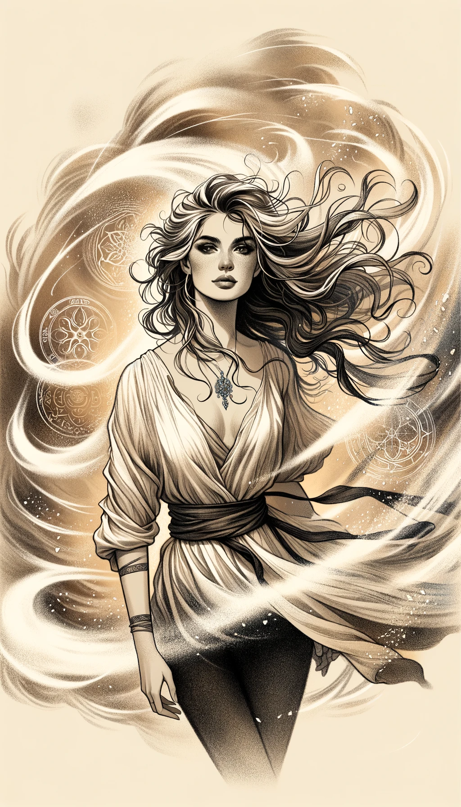
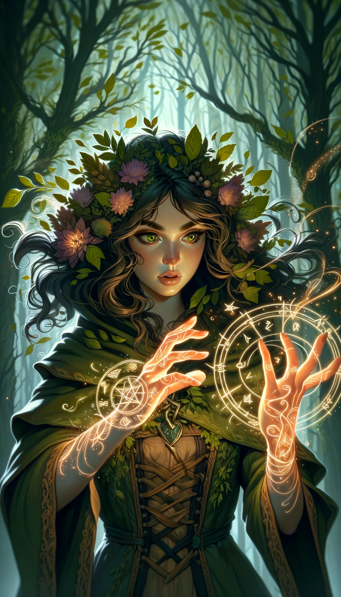
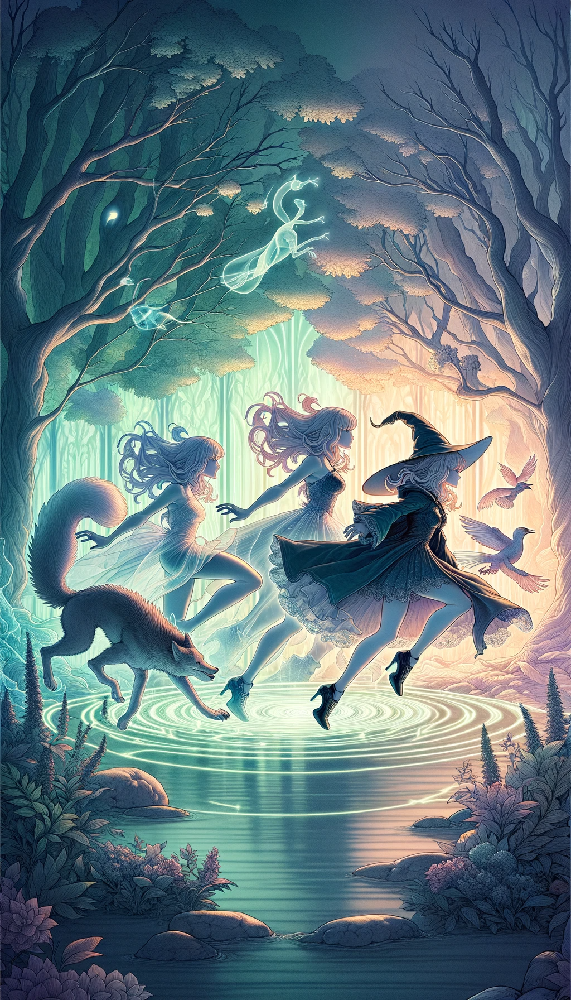
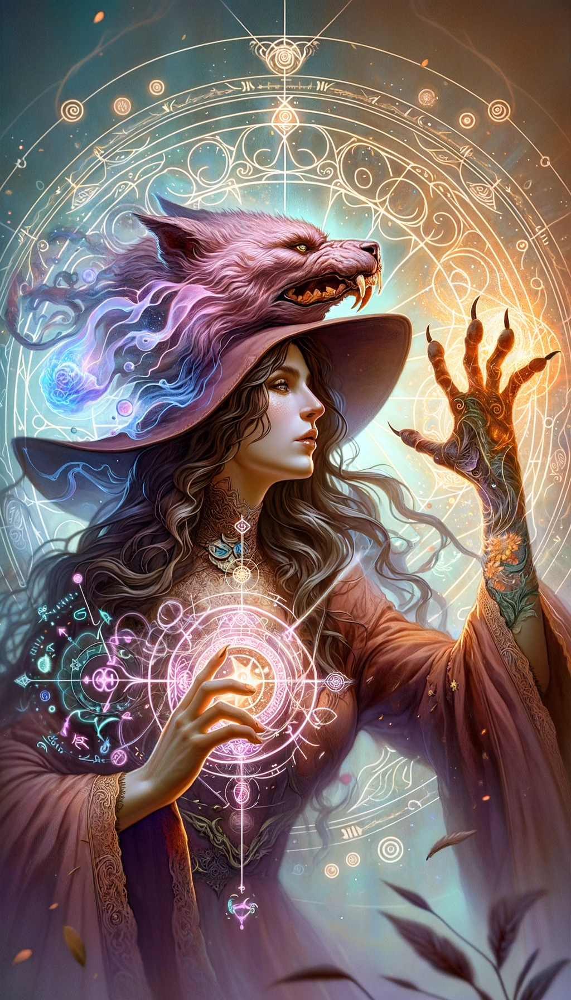
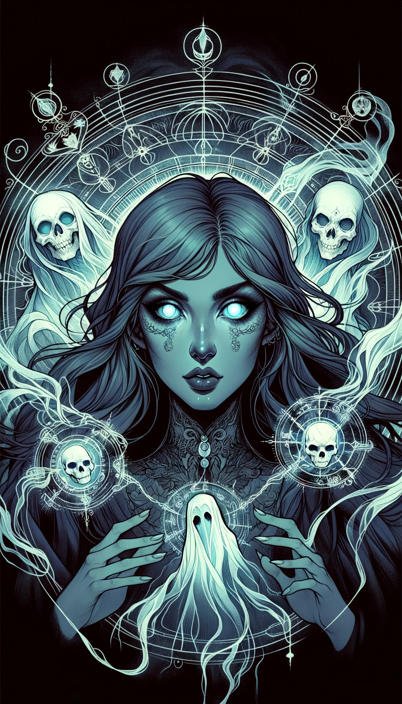
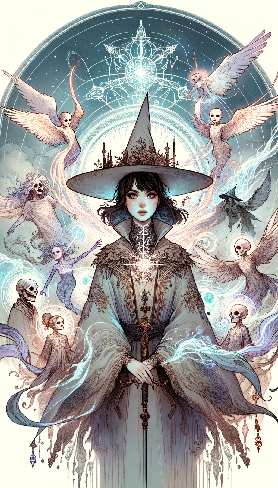
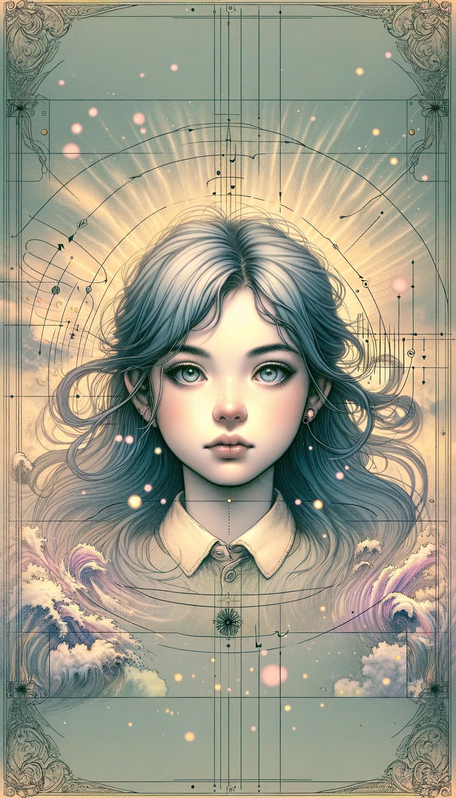
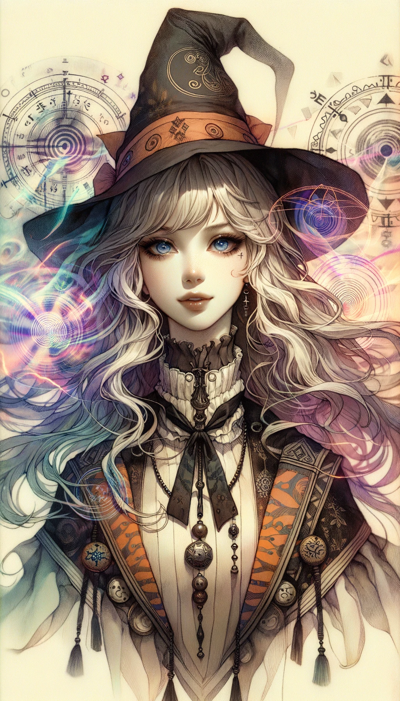

#

## Pyromancy
  

- **Level**: 1
- **Type**: Elemental
- **Composit**: null
- **Attack Power**: 8
- **Defense Power**: 2
- **Health**: 4
- **Mana Cost**: 5
- **Duration**: 1 turn
- **Range**: 3 tiles
- **Strong Against**: Hydromancy
- **Story**: Known as the "Flame Wielder," this girl has mastery over fire. She can cast fireballs, create walls of flame, and even cloak herself in fire. She's hot-headed and passionate, always looking to turn up the heat in battle.

## Hydromancy

- **Level**: 1
- **Type**: Elemental
- **Composit**: null
- **Attack Power**: 3
- **Defense Power**: 7
- **Health**: 5
- **Mana Cost**: 4
- **Duration**: 2 turns
- **Range**: 4 tiles
- **Strong Against**: Aeromancy
- **Story**: Referred to as the "Water Sage," this girl can control water in all its forms. She can summon rain, create tidal waves, and even manipulate ice. She's calm and fluid, adapting easily to changing battle conditions.

## Aeromancy
  

- **Level**: 1
- **Type**: Elemental
- **Composit**: null
- **Attack Power**: 5
- **Defense Power**: 5
- **Health**: 6
- **Mana Cost**: 3
- **Duration**: 3 turns
- **Range**: 5 tiles
- **Strong Against**: Geomancy
- **Story**: Often called the "Wind Whisperer," this girl has the power to control air currents and winds. She can generate powerful gusts, create wind barriers, and even summon storms. She's light on her feet and quick to react, making her a dynamic force on the battlefield.

## Geomancy
  

- **Level**: 1
- **Type**: Elemental
- **Composit**: null
- **Attack Power**: 6
- **Defense Power**: 6
- **Health**: 4
- **Mana Cost**: 2
- **Duration**: 1 turn
- **Range**: 2 tiles
- **Strong Against**: Pyromancy
- **Story**: Known as the "Earthshaker," this girl can manipulate the earth and stone. She can create rock walls, summon earthquakes, and even cause landslides. She's steady and unmovable, a rock-solid ally or foe.

## Steam (Pyromancy + Hydromancy)

- **Level**: 2
- **Type**: Elemental
- **Composit**: Pyromancy, Hydromancy
- **Attack Power**: 11
- **Defense Power**: 9
- **Health**: 9
- **Mana Cost**: 9
- **Duration**: 1 turn
- **Range**: 3 tiles
- **Strong Against**: Aeromancy
- **Story**: Known as the "Mistress of Mist," she combines the fire and water elements to unleash scalding steam on her enemies. The steam not only burns but also provides a defensive mist, disorienting the enemy. Her personality is a mix of fiery passion and fluid adaptability, making her a formidable and unpredictable opponent.

## Fog (Hydromancy + Aeromancy)

- **Level**: 2
- **Type**: Elemental
- **Composit**: Hydromancy, Aeromancy
- **Attack Power**: 8
- **Defense Power**: 12
- **Health**: 11
- **Mana Cost**: 7
- **Duration**: 3 turns
- **Range**: 5 tiles
- **Strong Against**: Geomancy
- **Story**: Dubbed the "Veilweaver," she combines water and air to create dense fog on the battlefield. The fog obscures vision and dampens sound, providing tactical advantages. Her demeanor is calm like water but can be as swiftly changing as the wind, making her a slippery foe.

## Sandstorm (Aeromancy + Geomancy)

- **Level**: 2
- **Type**: Elemental
- **Composit**: Aeromancy, Geomancy
- **Attack Power**: 11
- **Defense Power**: 11
- **Health**: 10
- **Mana Cost**: 5
- **Duration**: 2 turns
- **Range**: 4 tiles
- **Strong Against**: Pyromancy
- **Story**: Known as the "Desert Tempest," she fuses air and earth to summon fierce sandstorms that not only damage but also disrupt the movements of her enemies. She embodies the swiftness of the wind and the resilience of the earth, making her both a relentless and enduring force.

## Volcanic (Geomancy + Pyromancy)

- **Level**: 2
- **Type**: Elemental
- **Composit**: Geomancy, Pyromancy
- **Attack Power**: 14
- **Defense Power**: 8
- **Health**: 8
- **Mana Cost**: 7
- **Duration**: 1 turn
- **Range**: 3 tiles
- **Strong Against**: Hydromancy
- **Story**: Also known as the "Lava Queen," she blends fire and earth to call forth volcanic eruptions, spewing lava and ash. Her temperament is as volatile as a volcano yet as steadfast as a mountain. Her spells can create both offensive and defensive barriers, making her a well-rounded adversary.

## Thermal Mist (Steam + Fog)

- **Level**: 3
- **Type**: Elemental
- **Composit**: Steam, Fog
- **Attack Power**: 13
- **Defense Power**: 15
- **Health**: 13
- **Mana Cost**: 12
- **Duration**: 2 turns
- **Range**: 4 tiles
- **Strong Against**: Aeromancy and Geomancy
- **Story**: Known as the "Mistress of Mirage," she merges steam and fog to produce a thermal mist that's both damaging and obscuring. This fog not only burns but also conceals, making it a nightmare for any opponent. Her personality combines both the volatility of steam and the calmness of fog, making her an unpredictable yet thoughtful strategist.

## Lava Surge (Steam + Volcanic)

- **Level**: 3
- **Type**: Elemental
- **Composit**: Steam, Volcanic
- **Attack Power**: 16
- **Defense Power**: 11
- **Health**: 12
- **Mana Cost**: 11
- **Duration**: 1 turn
- **Range**: 3 tiles
- **Strong Against**: Hydromancy and Aeromancy
- **Story**: Dubbed the "Sultana of Surge," she combines steam and lava to produce superheated bursts that can incinerate almost anything in its path. This powerful fusion of elements makes her an explosive force on the battlefield. She's a fierce combatant, embodying the unrestrained qualities of both fire and water.

## Desert Wind (Fog + Sandstorm)

- **Level**: 3
- **Type**: Elemental
- **Composit**: Fog, Sandstorm
- **Attack Power**: 12
- **Defense Power**: 16
- **Health**: 15
- **Mana Cost**: 10
- **Duration**: 3 turns
- **Range**: 5 tiles
- **Strong Against**: Pyromancy and Geomancy
- **Story**: Known as the "Desert Wind Whisperer," she fuses fog and sandstorm to create a blinding, disorienting wind filled with micro-abrasive particles. Her magic is as elusive as it is relentless, capable of both hiding her team and wearing down the enemy. Her character is as fluid as water and as constant as a desert wind.

## Mountain Fire (Sandstorm + Volcanic)

- **Level**: 3
- **Type**: Elemental
- **Composit**: Sandstorm, Volcanic
- **Attack Power**: 17
- **Defense Power**: 13
- **Health**: 11
- **Mana Cost**: 10
- **Duration**: 1 turn
- **Range**: 4 tiles
- **Strong Against**: Aeromancy and Hydromancy
- **Story**: Also known as the "Mountain's Fury," she marries the elements of sandstorm and volcanic magic to summon cataclysmic eruptions accompanied by gritty, wind-driven sands. Her persona is as enduring as a mountain but as ferocious as wildfire, making her a formidable opponent capable of both offense and defense.

## Celestial Inferno (Thermal Mist + Lava Surge + Mountain Fire)

- **Level**: 4
- **Type**: Elemental
- **Composit**: Thermal Mist, Lava Surge, Mountain Fire
- **Attack Power**: 22
- **Defense Power**: 18
- **Health**: 19
- **Mana Cost**: 20
- **Duration**: 2 turns
- **Range**: 5 tiles
- **Strong Against**: Pyromancy, Aeromancy, Geomancy, and Hydromancy
- **Story**: Known as the "Celestial Blaze," this girl channels the chaotic energies of Thermal Mist, Lava Surge and Mountain Fire to create a heavenly inferno that engulfs the battlefield in fire and magic. This blaze has a divine quality, making it untouchable and catastrophic for her enemies. She embodies the pure, untamed forces of nature and commands them with a celestial authority.

## Terra Firma Cyclone (Thermal Mist + Lava Surge + Desert Wind)

- **Level**: 4
- **Type**: Elemental
- **Composit**: Thermal Mist, Lava Surge, Desert Wind
- **Attack Power**: 21
- **Defense Power**: 20
- **Health**: 18
- **Mana Cost**: 19
- **Duration**: 3 turns
- **Range**: 6 tiles
- **Strong Against**: Aeromancy, Geomancy, Pyromancy, and Hydromancy
- **Story**: Referred to as the "Terraformer," this girl fuses the powerful elements of Thermal Mist, Lava Surge and Desert Wind to create a ground-based storm that is as destructive as it is awe-inspiring. The cyclone not only devastates but also alters the terrain, providing strategic advantages. Her character is a harmonious blend of elemental forces, embodying both destruction and creation.

## Primordial Tempest (Lava Surge + Mountain Fire + Desert Wind)

- **Level**: 4
- **Type**: Elemental
- **Composit**: Lava Surge, Mountain Fire, Desert Wind
- **Attack Power**: 23
- **Defense Power**: 17
- **Health**: 17
- **Mana Cost**: 18
- **Duration**: 2 turns
- **Range**: 5 tiles
- **Strong Against**: Aeromancy, Geomancy, Pyromancy, and Hydromancy
- **Story**: Known as the "Eye of the Storm," she combines Lava Surge, Mountain Fire and Desert Wind to create a primordial tempest. This ancient storm harkens back to the origins of the world, where elemental forces were untamed and boundless. She taps into these raw energies to unleash a storm that disrupts, confuses, and decimates her enemies. Her aura radiates the unfathomable might of the elements.

---

## Phytomancy

- **Level**: 1
- **Type**: Nature
- **Composit**: null
- **Attack Power**: 4
- **Defense Power**: 5
- **Health**: 6
- **Mana Cost**: 3
- **Duration**: 2 turns
- **Range**: 2 tiles
- **Strong Against**: Zoomancy
- **Story**: Known as the "Guardian of the Forest," this girl has the power to control plants. She uses vines and leaves to entrap and defeat her enemies. Her calm demeanor and wisdom make her a formidable protector of nature.

## Zoomancy

- **Level**: 1
- **Type**: Nature
- **Composit**: null
- **Attack Power**: 6
- **Defense Power**: 4
- **Health**: 5
- **Mana Cost**: 4
- **Duration**: 3 turns
- **Range**: 3 tiles
- **Strong Against**: Meteoromancy
- **Story**: Called the "Beast Whisperer," this girl can control animals and use them to her advantage in battle. She is adventurous and untamed, finding kinship in the animal kingdom which she represents.

## Meteoromancy

- **Level**: 1
- **Type**: Nature
- **Composit**: null
- **Attack Power**: 7
- **Defense Power**: 3
- **Health**: 4
- **Mana Cost**: 5
- **Duration**: 1 turn
- **Range**: 4 tiles
- **Strong Against**: Phytomancy
- **Story**: Known as the "Star Sorceress," this girl draws power from celestial bodies to unleash devastating attacks. With a mysterious aura, she embodies the infinite potential and volatility of the cosmos.

## Ecosystem (Phytomancy + Zoomancy)

- **Level**: 2
- **Type**: Nature
- **Composit**: Phytomancy, Zoomancy
- **Attack Power**: 10
- **Defense Power**: 9
- **Health**: 11
- **Mana Cost**: 7
- **Duration**: 3 turns
- **Range**: 3 tiles
- **Strong Against**: Meteoromancy
- **Story**: Dubbed the "Warden of Life," she can control both plants and animals, creating a balanced and harmonious battlefield. Her personality is a blend of calm wisdom and untamed spirit, making her as versatile as the ecosystem she controls.

## Climate Control (Zoomancy + Meteoromancy)

- **Level**: 2
- **Type**: Nature
- **Composit**: Zoomancy, Meteoromancy
- **Attack Power**: 13
- **Defense Power**: 7
- **Health**: 9
- **Mana Cost**: 9
- **Duration**: 2 turns
- **Range**: 4 tiles
- **Strong Against**: Phytomancy
- **Story**: Known as the "Tempest Tamer," she has the power to control both weather and animals. With this dual mastery, she can summon storms while coordinating with animal allies. Her personality is a mixture of adventurousness and cosmic enigma, making her unpredictable and awe-inspiring.

## Seasonal (Meteoromancy + Phytomancy)

- **Level**: 2
- **Type**: Nature
- **Composit**: Meteoromancy, Phytomancy
- **Attack Power**: 11
- **Defense Power**: 8
- **Health**: 10
- **Mana Cost**: 8
- **Duration**: 2 turns
- **Range**: 3 tiles
- **Strong Against**: Zoomancy
- **Story**: Referred to as the "Seasonal Sage," she combines celestial power and plant control to alter the very seasons on the battlefield. Her temperament melds the mysterious aura of the cosmos with the grounded wisdom of the earth, making her a multi-faceted sorceress.

## Bio-Climate (Ecosystem + Climate Control)

- **Level**: 3
- **Type**: Nature
- **Composit**: Ecosystem, Climate Control
- **Attack Power**: 15
- **Defense Power**: 12
- **Health**: 14
- **Mana Cost**: 12
- **Duration**: 2 turns
- **Range**: 4 tiles
- **Strong Against**: Phytomancy and Meteoromancy
- **Story**: Known as the "Guardian of Balance," she masterfully integrates ecosystems and climate to create a dynamic, adaptive battlefield. Her ability to manipulate both flora, fauna, and weather make her an adaptable and strategic force. Her personality fuses the wisdom of an ancient forest with the unpredictability of a storm, making her a complex and challenging adversary.

## Nature's Seasons (Ecosystem + Seasonal)

- **Level**: 3
- **Type**: Nature
- **Composit**: Ecosystem, Seasonal
- **Attack Power**: 13
- **Defense Power**: 13
- **Health**: 16
- **Mana Cost**: 11
- **Duration**: 3 turns
- **Range**: 3 tiles
- **Strong Against**: Zoomancy and Meteoromancy
- **Story**: Dubbed the "Seer of Seasons," she combines the powers of ecosystems and celestial phenomena to create a harmonious yet ever-changing battlefield. Her character combines the nurturing aspects of an ecosystem with the cyclical wisdom of the seasons, making her a guardian of both time and life.

## Climate Seasons (Climate Control + Seasonal)

- **Level**: 3
- **Type**: Nature
- **Composit**: Climate Control, Seasonal
- **Attack Power**: 16
- **Defense Power**: 10
- **Health**: 12
- **Mana Cost**: 10
- **Duration**: 2 turns
- **Range**: 4 tiles
- **Strong Against**: Phytomancy and Zoomancy
- **Story**: Known as the "Tempest of Time," she fuses the control of weather and the changing seasons to manipulate the battlefield in both immediate and long-term ways. Her temperament is a balance between the fickle shifts of weather and the steady change of seasons, making her a mercurial yet reliable ally or foe.

## Gaia's Symphony (Bio-Climate + Nature's Seasons + Climate Seasons)

- **Level**: 4
- **Type**: Nature
- **Composit**: Bio-Climate, Nature's Seasons, Climate Seasons
- **Attack Power**: 24
- **Defense Power**: 21
- **Health**: 20
- **Mana Cost**: 22
- **Duration**: 4 turns
- **Range**: 6 tiles
- **Strong Against**: Phytomancy, Zoomancy, and Meteoromancy
- **Story**: Revered as the "Maestra of the Cosmos," she channels the profound elements of Bio-Climate, Nature's Seasons and Climate Seasons to create an orchestrated masterpiece on the battlefield. Her magic resonates with the very core of the planet, altering not just the climate and seasons but also accelerating or reversing life cycles. She epitomizes the interconnectedness of all things in nature and commands it with unparalleled mastery.

---

## Electromancy

- **Level**: 1
- **Type**: Luminomancy
- **Composit**: null
- **Attack Power**: 8
- **Defense Power**: 2
- **Health**: 4
- **Mana Cost**: 5
- **Duration**: 1 turn
- **Range**: 3 tiles
- **Strong Against**: Photomancy
- **Story**: Known as the "Thunder Mage," this girl wields the raw power of electricity. She can send shockwaves of electrical energy through her foes, making her an excellent disruptor on the battlefield. Quick-witted and electrifying, she lights up any fight she's in.

## Photomancy

- **Level**: 1
- **Type**: Luminomancy
- **Composit**: null
- **Attack Power**: 3
- **Defense Power**: 7
- **Health**: 5
- **Mana Cost**: 3
- **Duration**: 2 turns
- **Range**: 4 tiles
- **Strong Against**: Electromancy
- **Story**: Referred to as the "Lightbringer," this girl has the power to control light itself. She can create illusions, blind enemies, or even focus light into a laser-like beam. With a graceful and radiant presence, she brings hope and clarity to her allies.

## Laser (Electromancy + Photomancy)

- **Level**: 2
- **Type**: Luminomancy
- **Composit**: Electromancy, Photomancy
- **Attack Power**: 11
- **Defense Power**: 9
- **Health**: 9
- **Mana Cost**: 8
- **Duration**: 2 turns
- **Range**: 4 tiles
- **Strong Against**: Both Electromancy and Photomancy
- **Story**: Known as the "Pulse Enchantress," this girl fuses the raw energy of electricity with the precision of light to create powerful laser beams. These lasers can either disrupt enemies or focus into a high-energy beam that can cut through nearly anything. She carries both the electrifying speed of a thunderstorm and the clear focus of pure light, making her a formidable force on the battlefield.

## Hyper Laser (Laser + Laser)

- **Level**: 3
- **Type**: Luminomancy
- **Composit**: Laser
- **Attack Power**: 18
- **Defense Power**: 15
- **Health**: 16
- **Mana Cost**: 14
- **Duration**: 1 turn
- **Range**: 5 tiles
- **Strong Against**: Most other forms of magic due to its intense focus and power
- **Story**: Known as the "Master of Luminal Energy," this girl channels her mastery over Laser to create Hyper Laser beams of unparalleled strength and precision. Capable of slicing through almost any obstacle or enemy, her Hyper Lasers are the epitome of concentrated magical energy. Her personality fuses the unyielding intensity and pinpoint focus of dual laser magic, making her almost unbeatable in the domain of Luminomancy.

---

## Telepathy

- **Level**: 1
- **Type**: Psionics
- **Composit**: null
- **Attack Power**: 2
- **Defense Power**: 5
- **Health**: 6
- **Mana Cost**: 3
- **Duration**: 2 turns
- **Range**: 4 tiles
- **Strong Against**: Divination
- **Story**: Known as the "Mind Whisperer," this girl has the ability to read minds and predict enemy moves. Though she lacks in physical attack, her strategic advantage on the battlefield is second to none. She's perceptive and empathetic, often knowing what others are thinking before they do.

## Divination

- **Level**: 1
- **Type**: Psionics
- **Composit**: null
- **Attack Power**: 6
- **Defense Power**: 4
- **Health**: 5
- **Mana Cost**: 4
- **Duration**: 3 turns
- **Range**: 3 tiles
- **Strong Against**: Mind Control
- **Story**: Dubbed the "Oracle," this girl can foresee future events and manipulate probabilities. Her foresight allows her and her allies to dodge attacks or land critical hits, making her a dangerous foe. She is wise beyond her years and deeply spiritual.

## Mind Control

- **Level**: 1
- **Type**: Psionics
- **Composit**: null
- **Attack Power**: 5
- **Defense Power**: 2
- **Health**: 4
- **Mana Cost**: 5
- **Duration**: 1 turn
- **Range**: 2 tiles
- **Strong Against**: Telepathy
- **Story**: Often called the "Puppeteer," this girl can take control of her enemies, making them turn against each other. Her eerie ability can change the course of a battle, but it requires great concentration. She is cunning and manipulative, always several steps ahead of her enemies.

## Future Prediction (Telepathy + Divination)

- **Level**: 2
- **Type**: Psionics
- **Composit**: Telepathy, Divination
- **Attack Power**: 8
- **Defense Power**: 9
- **Health**: 11
- **Mana Cost**: 7
- **Duration**: 3 turns
- **Range**: 4 tiles
- **Strong Against**: Both Telepathy and Divination
- **Story**: Known as the "Seer of All," this girl combines mind-reading with foresight to not only predict but also influence future events. Her unparalleled strategic advantage makes her almost untouchable on the battlefield. With the ability to read minds and see the future, she can effortlessly avoid threats while setting up advantages for her team.

## Manipulation (Divination + Mind Control)

- **Level**: 2
- **Type**: Psionics
- **Composit**: Divination, Mind Control
- **Attack Power**: 11
- **Defense Power**: 6
- **Health**: 9
- **Mana Cost**: 9
- **Duration**: 2 turns
- **Range**: 3 tiles
- **Strong Against**: Both Divination and Mind Control
- **Story**: Named the "Mastermind," this girl combines foresight with control over her enemies. Not only can she predict their moves, but she can also manipulate them into unfavorable positions. Her skills make her a potent disruptor in battle, sowing chaos and confusion among enemy ranks.

## Group Control (Mind Control + Telepathy)

- **Level**: 2
- **Type**: Psionics
- **Composit**: Mind Control, Telepathy
- **Attack Power**: 7
- **Defense Power**: 7
- **Health**: 10
- **Mana Cost**: 8
- **Duration**: 2 turns
- **Range**: 3 tiles
- **Strong Against**: Both Mind Control and Telepathy
- **Story**: Known as the "Conductor of Will," this girl has the power to control multiple minds simultaneously while reading their thoughts. Her dual abilities make her a formidable leader, capable of orchestrating complex strategies and turning the tide of battle in her favor.

## Futuristic Manipulation (Future Prediction + Manipulation)

- **Level**: 3
- **Type**: Psionics
- **Composit**: Future Prediction, Manipulation
- **Attack Power**: 16
- **Defense Power**: 13
- **Health**: 17
- **Mana Cost**: 14
- **Duration**: 1 turn
- **Range**: 4 tiles
- **Strong Against**: Almost all other forms due to its predictive and manipulative capabilities
- **Story**: Known as the "Oracle of Schemes," this girl wields the power to predict and manipulate the future on an even grander scale. She can force enemies into compromised positions that she foresaw moments before, making her almost impossible to counter. Her cunning intellect and visionary foresight make her one of the most fearsome strategists on the magical battlefield.

## Collective Forecast (Future Prediction + Group Control)

- **Level**: 3
- **Type**: Psionics
- **Composit**: Future Prediction, Group Control
- **Attack Power**: 12
- **Defense Power**: 14
- **Health**: 18
- **Mana Cost**: 13
- **Duration**: 2 turns
- **Range**: 5 tiles
- **Strong Against**: All forms of group attacks and strategies
- **Story**: Known as the "Catalyst of Fate," this girl combines the power of collective mind control with future prediction. She can not only see potential outcomes but can also make her team take the most advantageous actions. Her uncanny ability to synchronize team efforts while predicting future events makes her an unmatched force in team-based conflicts.

## Mass Manipulation (Manipulation + Group Control)

- **Level**: 3
- **Type**: Psionics
- **Composit**: Manipulation, Group Control
- **Attack Power**: 14
- **Defense Power**: 10
- **Health**: 16
- **Mana Cost**: 15
- **Duration**: 1 turn
- **Range**: 4 tiles
- **Strong Against**: Both Mind Control and Telepathy-based magic
- **Story**: Dubbed the "Sovereign of Strings," this girl can manipulate multiple minds while also predicting their actions. Her dual abilities allow her to create complex traps and strategies, making her a psychological terror on the battlefield. Her cunning and mind-bending skills make her an elusive and devastating opponent.

## Quantum Consciousness (Futuristic Manipulation + Collective Forecast + Mass Manipulation)

- **Level**: 4
- **Type**: Psionics
- **Composit**: Futuristic Manipulation, Collective Forecast, Mass Manipulation
- **Attack Power**: 26
- **Defense Power**: 22
- **Health**: 25
- **Mana Cost**: 27
- **Duration**: 4 turns
- **Range**: 7 tiles
- **Strong Against**: All forms of magic due to its transcendent awareness and control
- **Story**: Hailed as the "Mind of the Multiverse," this girl attains a level of awareness and control that is virtually unparalleled. She not only can manipulate individual minds and predict future events but her consciousness extends to a galactic, even cosmic level. This allows her to anticipate and adapt to virtually any magical form or strategy, making her almost a divine entity in the realm of Psionics.

---

## Chronomancy

- **Level**: 1
- **Type**: Chronospace
- **Composit**: null
- **Attack Power**: 4
- **Defense Power**: 7
- **Health**: 6
- **Mana Cost**: 5
- **Duration**: 4 turns
- **Range**: 3 tiles
- **Strong Against**: Teleportation
- **Story**: Known as the "Timekeeper," this girl has the ability to manipulate time. She can slow down or speed up events, giving her team more time to act or causing enemies to act slower. She's highly analytical and thinks multiple steps ahead, ensuring that she's prepared for any situation.

## Teleportation

- **Level**: 1
- **Type**: Chronospace
- **Composit**: null
- **Attack Power**: 7
- **Defense Power**: 3
- **Health**: 4
- **Mana Cost**: 2
- **Duration**: 1 turn
- **Range**: 5 tiles
- **Strong Against**: Chronomancy
- **Story**: Dubbed the "Spacebender," this girl possesses the ability to teleport herself and others across short distances. Her high mobility makes her hard to pin down, but her defensive capabilities are limited. She's adventurous and daring, always looking for the next thrill.

## Spacetime Warp (Chronomancy + Teleportation)

- **Level**: 2
- **Type**: Chronospace
- **Composit**: Chronomancy, Teleportation
- **Attack Power**: 11
- **Defense Power**: 10
- **Health**: 10
- **Mana Cost**: 7
- **Duration**: 3 turns
- **Range**: 4 tiles
- **Strong Against**: Both Chronomancy and Teleportation
- **Story**: Known as the "Dimensional Maestro," this girl merges the powers of time and space manipulation. She can not only control the pace of the battle but can also relocate herself and her allies instantaneously. This combination makes her incredibly versatile and unpredictable, capable of dictating the flow of time while shifting the spatial layout of the battlefield.

## Eternal Warp (Spacetime Warp + Spacetime Warp)

- **Level**: 3
- **Type**: Chronospace
- **Composit**: Spacetime Warp
- **Attack Power**: 18
- **Defense Power**: 16
- **Health**: 18
- **Mana Cost**: 12
- **Duration**: 4 turns
- **Range**: 6 tiles
- **Strong Against**: Almost all forms due to its mastery over time and space
- **Story**: Revered as the "Architect of Eternity," this girl is the epitome of time-space manipulation. With the power to control both dimensions in an even more advanced way, she can stop time for short periods and teleport multiple allies and enemies across vast distances. Her near-omnipotent abilities make her one of the most unpredictable and uncounterable entities on the battlefield.

---

## Cursing

- **Level**: 1
- **Type**: Catalyst
- **Composit**: null
- **Attack Power**: 7
- **Defense Power**: 3
- **Health**: 4
- **Mana Cost**: 6
- **Duration**: 1 turn
- **Range**: 2 tiles
- **Strong Against**: Healing
- **Story**: Known as the "Hexweaver," this girl specializes in casting curses that weaken enemies or inflict continuous damage. Her abilities can turn the tide in a tight situation, but she must be careful as her defense is low. She's cunning and thrives on the despair of her enemies.

## Healing

- **Level**: 1
- **Type**: Catalyst
- **Composit**: null
- **Attack Power**: 2
- **Defense Power**: 5
- **Health**: 7
- **Mana Cost**: 4
- **Duration**: 3 turns
- **Range**: 3 tiles
- **Strong Against**: Warding
- **Story**: Often referred to as the "Lifesaver," this girl is adept at healing spells that restore health to her allies and can even revive those who have fallen. She is a cornerstone in any team's defense, always there to lend a helping hand. She's compassionate and nurturing, the heart of her team.

## Warding

- **Level**: 1
- **Type**: Catalyst
- **Composit**: null
- **Attack Power**: 3
- **Defense Power**: 8
- **Health**: 5
- **Mana Cost**: 5
- **Duration**: 2 turns
- **Range**: 4 tiles
- **Strong Against**: Cursing
- **Story**: Called the "Guardian," this girl specializes in casting wards and shields that protect her team from harm. Her skills make her invaluable in holding the line and sustaining the team's defenses. She's steadfast and dependable, a true shield for her allies.

## Resurrection (Cursing + Healing)

- **Level**: 2
- **Type**: Catalyst
- **Composit**: Cursing, Healing
- **Attack Power**: 4
- **Defense Power**: 4
- **Health**: 8
- **Mana Cost**: 7
- **Duration**: 2 turns
- **Range**: 3 tiles
- **Strong Against**: Both Cursing and Healing
- **Story**: Known as the "Soul Warden," this girl combines the power of curses and healing to manipulate life forces directly. She can not only heal her allies but also revive them with a cursed condition, making them even more potent for a short period. She's a blend of darkness and light, straddling the line between life and death.

## Complete Protection (Healing + Warding)

- **Level**: 12
- **Type**: Catalyst
- **Composit**: Healing, Warding
- **Attack Power**: 2
- **Defense Power**: 9
- **Health**: 9
- **Mana Cost**: 6
- **Duration**: 3 turns
- **Range**: 4 tiles
- **Strong Against**: Both Healing and Warding
- **Story**: Referred to as the "Sanctuary Sentinel," this girl is the epitome of defense, merging healing and warding spells to create an almost impregnable protective zone around her allies. Her compassionate and steadfast nature make her the ultimate guardian, capable of both preventing and undoing harm.

## Sealing (Warding + Cursing)

- **Level**: 2
- **Type**: Catalyst
- **Composit**: Warding, Cursing
- **Attack Power**: 6
- **Defense Power**: 6
- **Health**: 5
- **Mana Cost**: 7
- **Duration**: 2 turns
- **Range**: 3 tiles
- **Strong Against**: Both Warding and Cursing
- **Story**: Known as the "Sealbreaker," this girl combines warding and cursing powers to create magical seals that not only protect but also afflict enemies who dare cross them. These seals can trap enemies, making them easy targets for her allies. She's tactical and cunning, creating labyrinths of danger and safety on the battlefield.

## Sacred Resurrection (Resurrection + Complete Protection)

- **Level**: 3
- **Type**: Catalyst
- **Composit**: Resurrection, Complete Protection
- **Attack Power**: 5
- **Defense Power**: 12
- **Health**: 15
- **Mana Cost**: 11
- **Duration**: 4 turns
- **Range**: 5 tiles
- **Strong Against**: A broad spectrum of offensive and defensive magic
- **Story**: Known as the "Eternal Guardian," this girl is a master of both resurrection and complete protection magic. She can bring allies back to life while surrounding them with near-impenetrable barriers, creating an environment where her team can act with impunity. Her nature is a synthesis of light and darkness, life and death, making her a spiritual beacon on the battlefield.

## Resurrection Seal (Resurrection + Sealing)

- **Level**: 3
- **Type**: Catalyst
- **Composit**: Resurrection, Sealing
- **Attack Power**: 8
- **Defense Power**: 8
- **Health**: 10
- **Mana Cost**: 11
- **Duration**: 3 turns
- **Range**: 4 tiles
- **Strong Against**: Both life-based and affliction-based magic
- **Story**: Referred to as the "Soul Gatekeeper," this girl merges resurrection and sealing powers. She can bring allies back while setting up devastating traps for enemies, creating a battlefield that's advantageous for her team. She holds the keys to life and constriction, making her an enigmatic and unpredictable force.

## Protective Seal (Complete Protection + Sealing)

- **Level**: 3
- **Type**: Catalyst
- **Composit**: Complete Protection, Sealing
- **Attack Power**: 4
- **Defense Power**: 12
- **Health**: 12
- **Mana Cost**: 10
- **Duration**: 3 turns
- **Range**: 5 tiles
- **Strong Against**: Both protective and destructive magic
- **Story**: Known as the "Bastion Alchemist," this girl fuses the arts of warding and cursing into a unique blend of protective seals that can both protect allies and restrict enemies. Her dual abilities make her a fortress of defense and a web of peril, capable of changing the dynamics of the battlefield in an instant.

## Seraphic Covenant (Sacred Resurrection + Resurrection Seal + Protective Seal)

- **Level**: 4
- **Type**: Catalyst
- **Composit**: Sacred Resurrection, Resurrection Seal, Protective Seal
- **Attack Power**: 10
- **Defense Power**: 20
- **Health**: 24
- **Mana Cost**: 30
- **Duration**: 5 turns
- **Range**: 6 tiles
- **Strong Against**: Virtually all forms of magic due to its Sacred Resurrection, Resurrection Seal and Protective Seal
- **Story**: Bestowed with the title of "Celestial Warden," this girl transcends the realms of life and restriction, becoming a nearly divine entity. Her ability to resurrect allies is now elevated to a celestial level, while her protective seals and soul guardianship have become unbreakable and universally effective. She essentially holds the keys to life and fate, making her a quasi-divine force on the battlefield.

---

## Shape-shifting

- **Level**: 1
- **Type**: Transformation
- **Composit**: null
- **Attack Power**: 6
- **Defense Power**: 4
- **Health**: 5
- **Mana Cost**: 4
- **Duration**: 2 turns
- **Range**: 2 tiles
- **Strong Against**: Transmutation
- **Story**: Known as the "Changeling," this girl has the ability to shape-shift into various forms. Whether becoming a ferocious animal or mimicking an enemy, her versatility makes her unpredictable on the battlefield. She's resourceful and adaptive, making the most out of any situation.

## Transmutation

- **Level**: 1
- **Type**: Transformation
- **Composit**: null
- **Attack Power**: 5
- **Defense Power**: 5
- **Health**: 6
- **Mana Cost**: 3
- **Duration**: 3 turns
- **Range**: 3 tiles
- **Strong Against**: Shape-shifting
- **Story**: Referred to as the "Alchemist," this girl can transmute objects and even the environment to suit her needs. She can turn a stone into a weapon or transmute the air into a poisonous gas. Her creative use of her environment makes her a formidable foe. She's inventive and quick-thinking, always up for a challenge.

## Complete Transformation (Shape-shifting + Transmutation)

- **Level**: 2
- **Type**: Transformation
- **Composit**: Shape-shifting, Transmutation
- **Attack Power**: 7
- **Defense Power**: 6
- **Health**: 7
- **Mana Cost**: 6
- **Duration**: 3 turns
- **Range**: 3 tiles
- **Strong Against**: Both Shape-shifting and Transmutation
- **Story**: Known as the "Master of Forms," this girl combines the power of shape-shifting and transmutation, allowing her to change both herself and her surroundings at will. This makes her an exceptionally versatile magician who can adapt to nearly any circumstance. Whether transforming into a powerful creature or altering the battlefield itself, her potential is limitless. She's ingenious and versatile, a true wildcard in any magical conflict.

## Absolute Morphing (Complete Transformation + Complete Transformation)

- **Level**: 3
- **Type**: Transformation
- **Composit**: Complete Transformation
- **Attack Power**: 13
- **Defense Power**: 12
- **Health**: 13
- **Mana Cost**: 10
- **Duration**: 5 turns
- **Range**: 5 tiles
- **Strong Against**: A wide variety of magic types due to extreme adaptability
- **Story**: Known as the "Eclipsing Shapeshifter," this girl is the ultimate embodiment of transformation magic. She can not only change her form but also transmute the environment, even being able to simultaneously adopt multiple transformations. Her adaptability makes her nearly impossible to counter, as she can adjust her abilities on the fly to suit any situation. She embodies the pinnacle of magical versatility, making her a formidable opponent who transcends the boundaries of conventional magic.

---

## Umbramancy

- **Level**: 1
- **Type**: Shadow
- **Composit**: null
- **Attack Power**: 7
- **Defense Power**: 3
- **Health**: 5
- **Mana Cost**: 4
- **Duration**: 2 turns
- **Range**: 3 tiles
- **Strong Against**: Shadow Conjuring
- **Story**: Known as the "Shadowmaster," this girl commands the darkness itself. She can obscure vision, create illusions, or even solidify shadows into physical attacks. Her mysterious and elusive nature makes her a tricky opponent to deal with. She's secretive and cunning, adept at turning the tide of battle in her favor.

## Shadow Conjuring

- **Level**: 1
- **Type**: Shadow
- **Composit**: null
- **Attack Power**: 5
- **Defense Power**: 5
- **Health**: 6
- **Mana Cost**: 3
- **Duration**: 3 turns
- **Range**: 4 tiles
- **Strong Against**: Umbramancy
- **Story**: Often called the "Shadowcrafter," this girl specializes in summoning shadowy creatures and objects. Whether it's a shadow wolf to aid her in battle or shadow chains to bind her enemies, her conjurations are versatile and adaptive. She's imaginative and resourceful, able to think on her feet in any situation.
  
## Dark Creation (Umbramancy + Shadow Conjuring)

- **Level**: 2
- **Type**: Shadow
- **Composit**: Umbramancy, Shadow Conjuring
- **Attack Power**: 8
- **Defense Power**: 6
- **Health**: 7
- **Mana Cost**: 6
- **Duration**: 3 turns
- **Range**: 4 tiles
- **Strong Against**: Both Umbramancy and Shadow Conjuring
- **Story**: Known as the "Dark Creator," this girl wields the powers of both Umbramancy and Shadow Conjuring. She can not only manipulate shadows but also give them form and substance, making her an exceptional force on the battlefield. She can create complex illusions while summoning shadow creatures, making her both a master of deception and a formidable summoner. She is elusive and creative, embodying the ultimate expression of shadow magic.

## Abyssal Shadows (Dark Creation + Dark Creation)

- **Level**: 3
- **Type**: Shadow
- **Composit**: Dark Creation
- **Attack Power**: 14
- **Defense Power**: 12
- **Health**: 13
- **Mana Cost**: 11
- **Duration**: 5 turns
- **Range**: 6 tiles
- **Strong Against**: Most magic types due to intense shadow mastery
- **Story**: Known as the "Abyssal Architect," this girl is the ultimate confluence of Umbramancy and Shadow Conjuring. She doesn't just manipulate or create shadows; she breathes life and purpose into them, forging an abyssal realm on the battlefield itself. Her shadows are not just illusions or creatures; they are extensions of her will, complex and layered, capable of both offense and defense. She epitomizes the dark arts, creating a zone of impenetrable shadow that few dare to challenge.
  
---

## Soul Summoning

- **Level**: 1
- **Type**: Death
- **Composit**: null
- **Attack Power**: 6
- **Defense Power**: 3
- **Health**: 5
- **Mana Cost**: 5
- **Duration**: 3 turns
- **Range**: 2 tiles
- **Strong Against**: Necromancy
- **Story**: Known as the "Soulmancer," this girl wields the forbidden power to summon and command souls. She can call forth spirits to aid her in battle or use them to debilitate her enemies. She is a mysterious figure, seeking to understand the nature of life and death.

## Necromancy

- **Level**: 1
- **Type**: Death
- **Composit**: null
- **Attack Power**: 7
- **Defense Power**: 2
- **Health**: 4
- **Mana Cost**: 6
- **Duration**: 2 turns
- **Range**: 3 tiles
- **Strong Against**: Soul Summoning
- **Story**: Called the "Necromaster," this girl can raise the dead and control them. Zombies, skeletons, and other unholy creatures bow to her command. She uses her minions to overwhelm her enemies, but this comes at a great moral and magical cost.

## Soul Resurrection (Soul Summoning + Necromancy)

- **Level**: 2
- **Type**: Death
- **Composit**: Soul Summoning, Necromancy
- **Attack Power**: 8
- **Defense Power**: 4
- **Health**: 6
- **Mana Cost**: 8
- **Duration**: 3 turns
- **Range**: 3 tiles
- **Strong Against**: Both Soul Summoning and Necromancy
- **Story**: Known as the "Revenant Queen," this girl masters both the art of Soul Summoning and Necromancy. She can not only summon souls but also give them corporeal forms, essentially resurrecting them to serve in her legion. Her mastery over life and death makes her one of the most feared figures on the battlefield. Using her dark magic, she strikes a balance between spiritual and physical manifestations of death, making her an unparalleled force. She is both enigmatic and unsettling, a practitioner of the darkest magics.

## Soul Dominion (Soul Resurrection + Soul Resurrection)

- **Level**: 3
- **Type**: Death
- **Composit**: Soul Resurrection, Soul Resurrection
- **Attack Power**: 14
- **Defense Power**: 8
- **Health**: 10
- **Mana Cost**: 14
- **Duration**: 5 turns
- **Range**: 5 tiles
- **Strong Against**: Most magic types due to mastery over death and soul magic
- **Story**: Known as the "Sovereign of Souls," this girl is the apex of both Soul Summoning and Necromancy. She has transcended the limitations of both magic types to achieve something terrifyingly new. Her Soul Dominion allows her to manipulate souls on a grand scale, weaving them into the very fabric of the battlefield. These souls can take on numerous forms, both corporeal and ethereal, and can perform complex tasks and strategies as directed by their sovereign. She has become a near-deity of death, capable of altering the very essence of life and afterlife.

---

## Illusion

- **Level**: 1
- **Type**: Mystic
- **Composit**: null
- **Attack Power**: 5
- **Defense Power**: 4
- **Health**: 6
- **Mana Cost**: 4
- **Duration**: 3 turns
- **Range**: 3 tiles
- **Strong Against**: Gravimancy
- **Story**: Known as the "Illusionist," this girl can manipulate what others perceive, creating false realities or making herself invisible. She uses her skills to deceive enemies and create opportunities for her allies. Her nature is as elusive as her magic.

## Gravimancy

- **Level**: 1
- **Type**: Mystic
- **Composit**: null
- **Attack Power**: 3
- **Defense Power**: 6
- **Health**: 5
- **Mana Cost**: 5
- **Duration**: 2 turns
- **Range**: 4 tiles
- **Strong Against**: Sonimancy
- **Story**: The "Gravimancer" witch girl manipulates gravitational forces, making it difficult for enemies to move or attack. She can also lighten the force around her allies, aiding their mobility. She is a ponderous thinker, always contemplating the weight of her actions.

## Sonimancy

- **Level**: 1
- **Type**: Mystic
- **Composit**: null
- **Attack Power**: 6
- **Defense Power**: 3
- **Health**: 4
- **Mana Cost**: 3
- **Duration**: 1 turn
- **Range**: 5 tiles
- **Strong Against**: Illusion
- **Story**: The "Sonimancer" witch girl can manipulate sound waves, disorienting enemies and shattering obstacles. Her magic is as versatile as it is disarming, capable of both healing and harm. She is a vivacious and energetic individual, never missing a beat in battle or life.

## Reality Distortion (Illusion + Gravimancy)

- **Level**: 2
- **Type**: Mystic
- **Composit**: Illusion, Gravimancy
- **Attack Power**: 6
- **Defense Power**: 6
- **Health**: 7
- **Mana Cost**: 7
- **Duration**: 3 turns
- **Range**: 4 tiles
- **Strong Against**: Both Illusion and Gravimancy
- **Story**: Known as the "Reality Bender," this girl is a master of both Illusion and Gravimancy. She can simultaneously manipulate perception and gravity, making her enemies question both what they see and feel. It's nearly impossible to gain a tactical advantage over her, as she can quickly alter the rules of engagement. Calculative and strategic, she is an expert at control.

## Vibration (Gravimancy + Sonimancy)

- **Level**: 2
- **Type**: Mystic
- **Composit**: Gravimancy, Sonimancy
- **Attack Power**: 5
- **Defense Power**: 5
- **Health**: 6
- **Mana Cost**: 6
- **Duration**: 2 turns
- **Range**: 5 tiles
- **Strong Against**: Both Gravimancy and Sonimancy
- **Story**: Referred to as the "Vibromancer," this girl can manipulate both gravitational and sound waves to create powerful vibrations. Whether it's shaking the earth beneath enemies or emitting a resonating frequency that disorients them, she can control the battlefield in various ways. Energetic and intellectual, she understands the pulse of any situation.

## Hallucination (Sonimancy + Illusion)

- **Level**: 2
- **Type**: Mystic
- **Composit**: Sonimancy, Illusion
- **Attack Power**: 7
- **Defense Power**: 4
- **Health**: 5
- **Mana Cost**: 5
- **Duration**: 2 turns
- **Range**: 4 tiles
- **Strong Against**: Both Sonimancy and Illusion
- **Story**: Known as the "Dreamweaver," this girl excels in both Sonimancy and Illusion. She can create complex auditory and visual hallucinations that are almost indistinguishable from reality. Her opponents often find themselves ensnared in a web of deception before they even realize what's happening. Mysterious and imaginative, she's a natural-born storyteller, albeit one that can turn stories into nightmares.

## Distorted Vibration (Reality Distortion + Vibration)

- **Level**: 3
- **Type**: Mystic
- **Composit**: Reality Distortion, Vibration
- **Attack Power**: 11
- **Defense Power**: 11
- **Health**: 12
- **Mana Cost**: 12
- **Duration**: 4 turns
- **Range**: 6 tiles
- **Strong Against**: Multiple magic types due to mastering the manipulation of gravity, perception, and sound
- **Story**: Known as the "Master of Dissonance," this girl has achieved the pinnacle of Reality Distortion and Vibration. She can manipulate both perception and gravitational and sound waves simultaneously, leading to disorienting, chaotic battlefields where enemies can't trust their senses or even the ground beneath their feet. She is the epitome of control and confusion.

## Sonic Illusion (Vibration + Hallucination)

- **Level**: 3
- **Type**: Mystic
- **Composit**: Vibration, Hallucination
- **Attack Power**: 10
- **Defense Power**: 7
- **Health**: 9
- **Mana Cost**: 10
- **Duration**: 3 turns
- **Range**: 6 tiles
- **Strong Against**: Various forms of magic due to the combined mastery of sound and illusion
- **Story**: Referred to as the "Harmony Illusionist," this girl fuses the arts of Vibration and Hallucination to produce mesmerizing and disorienting sonic illusions. She can create complex auditory and visual scenarios that are not only deceptive but also physically disruptive, making her opponents susceptible to errors and miscalculations.

## Distorted Hallucination (Reality Distortion + Hallucination)

- **Level**: 3
- **Type**: Mystic
- **Composit**: Reality Distortion, Hallucination
- **Attack Power**: 12
- **Defense Power**: 9
- **Health**: 10
- **Mana Cost**: 11
- **Duration**: 4 turns
- **Range**: 5 tiles
- **Strong Against**: Many types of magic due to the combination of altering reality and crafting hallucinations
- **Story**: Known as the "Dreamshaper," this girl is the zenith of both Reality Distortion and Hallucination. She creates surreal experiences that combine altered perception with genuine sensory illusions, making it nearly impossible to discern truth from deception. With this level of mastery, she turns the battlefield into a dreamscape where she reigns supreme.

#### Cosmic Illusion (Distorted Vibration + Sonic Illusion + Distorted Hallucination)

- **Level**: 4
- **Type**: Mystic
- **Composit**: Distorted Vibration, Sonic Illusion, Distorted Hallucination
- **Attack Power**: 18
- **Defense Power**: 17
- **Health**: 20
- **Mana Cost**: 35
- **Duration**: 6 turns
- **Range**: 8 tiles
- **Strong Against**: Virtually all forms of magic due to its mastery over Distorted Vibration, Sonic Illusion and Distorted Hallucination
- **Story**: Given the title of "Cosmic Enchantress," this girl is the ultimate form of Mystic. She can manipulate quantum reality, erase sensory experiences, and induce cataclysmic vibrations, all at once. This combination makes her not just a master of illusions but a weaver of reality itself. Enemies facing her don't just question their senses; they question the very fabric of their existence. She is the apex of mystical power, rendering almost all strategies and magics ineffective against her.

---

## Celestial Singularity (Celestial Inferno + Quantum Consciousness + Seraphic Covenant + Cosmic Illusion)

- **Level**: 5
- **Type**: Composite
- **Composit**: Celestial Inferno, Quantum Consciousness, Seraphic Covenant, Cosmic Illusion
- **Attack Power**: 40
- **Defense Power**: 40
- **Health**: 50
- **Mana Cost**: 50
- **Duration**: 7 turns
- **Range**: 10 tiles
- **Strong Against**: Virtually all forms of magic due to its unparalleled synthesis of elemental, mental, divine, and mystic energies
- **Story**: Bearing the esteemed title of "The Universal Nexus," this girl is a confluence of all conceivable forms of magic and reality. By merging the powers of Celestial Inferno, Quantum Consciousness, Seraphic Covenant, and Cosmic Illusion, she has created a singularity of unmatched capability. This reality-bending magic turns the battlefield into a vortex where elemental forces, mental projections, divine will, and cosmic illusion swirl into one indescribable point of power. Opponents facing her are not just defeated; they are subsumed into a new layer of reality where she holds omnipotent control. Her presence on the battlefield is not just a game-changer; it is a reality-changer.

## Ethereal Genesis (Gaia's Symphony + Terra Firma Cyclone + Primordial Tempest + Cosmic Illusion)

- **Level**: 5
- **Type**: Composite
- **Composit**: Gaia's Symphony, Terra Firma Cyclone, Primordial Tempest, Cosmic Illusion
- **Attack Power**: 42
- **Defense Power**: 40
- **Health**: 45
- **Mana Cost**: 50
- **Duration**: 8 turns
- **Range**: 12 tiles
- **Strong Against**: Virtually all forms of magic due to its transcendent mastery over life, nature, elements, and reality
- **Story**: With the awe-inspiring title of "Genesis Architect," this girl unifies the extraordinary powers of Gaia's Symphony, Terra Firma Cyclone, Primordial Tempest, and Cosmic Illusion into a single breathtaking magic. The Ethereal Genesis allows her to manipulate not just the elements but also the very fabric of life and reality. This is not merely a spell but an act of creation on a cosmological scale. The battlefield transforms into an ever-shifting landscape, where new forms of life spontaneously appear, seasons accelerate or reverse, and even the nature of reality itself is in flux. Enemies are not only defeated; they are fundamentally altered, pulled into an ethereal vortex where the Genesis Architect reigns supreme.

## Chrono-Mystical Nexus (Celestial Inferno + Quantum Consciousness + Primordial Tempest + Gaia's Symphony)

- **Level**: 5
- **Type**: Composite
- **Composit**: Celestial Inferno, Quantum Consciousness, Primordial Tempest, Gaia's Symphony
- **Attack Power**: 45
- **Defense Power**: 42
- **Health**: 50
- **Mana Cost**: 55
- **Duration**: 10 turns
- **Range**: 14 tiles
- **Strong Against**: Virtually all forms of magic due to its unparalleled command over elements, time, thought, and nature
- **Story**: Bearing the grandiose title of "Harbinger of Epochs," this girl weaves the intricate tapestry of Celestial Inferno, Quantum Consciousness, Primordial Tempest, and Gaia's Symphony into a singular, omnipotent magic. The Chrono-Mystical Nexus allows her to manipulate elemental forces, bend the rules of time, control minds on a cosmic scale, and even reshape the natural world at her whim. The battlefield transforms into a chaotic nexus where the lines between past, present, and future blur, and the very laws of nature seem to bow to her mastery. Enemies are not merely defeated; they are lost in a bewildering labyrinth of realities, each more terrifying than the last. Her control over this Chrono-Mystical Nexus makes her virtually omnipotent, rewriting the rules of magic and strategy.
  
## Divine Apocalypse (Seraphic Covenant + Celestial Inferno + Quantum Consciousness + Gaia's Symphony)

- **Level**: 5
- **Type**: Composite
- **Composit**: Seraphic Covenant, Celestial Inferno, Quantum Consciousness, Gaia's Symphony
- **Attack Power**: 46
- **Defense Power**: 44
- **Health**: 55
- **Mana Cost**: 60
- **Duration**: 11 turns
- **Range**: 15 tiles
- **Strong Against**: Virtually all forms of magic due to its mastery over divine protection, elemental chaos, cosmic awareness, and the essence of nature.
- **Story**: Bearing the awe-inspiring title of "Architect of Heaven and Earth," this girl transcends conventional magical bounds. Melding Seraphic Covenant, Celestial Inferno, Quantum Consciousness, and Gaia's Symphony into one miraculous force, the Divine Apocalypse takes form. She becomes the ultimate arbiter of destiny, unleashing untold devastation while protecting the very fabric of existence. This amalgamation of diverse magical arts creates an apocalyptic force that can rewrite reality, bend time, and hold dominion over the elemental and spiritual realms. The battlefield is transformed into a cosmic stage, upon which plays out the final act of a celestial drama. Here, every decision and action reverberate with the weight of divine judgment, offering both destruction and redemption. Virtually no magic can withstand the staggering breadth of her abilities, making her the closest thing to a deity in the magical realm.

## Omnipotent Convergence (Cosmic Illusion + Quantum Consciousness + Seraphic Covenant + Terra Firma Cyclone)

- **Level**: 5
- **Type**: Composite
- **Composit**: Cosmic Illusion, Quantum Consciousness, Seraphic Covenant, Terra Firma Cyclone
- **Attack Power**: 50
- **Defense Power**: 48
- **Health**: 57
- **Mana Cost**: 65
- **Duration**: 12 turns
- **Range**: 18 tiles
- **Strong Against**: Virtually all forms of magic due to its unparalleled mastery over illusion, mind control, divine protection, and elemental forces.
- **Story**: Known as the "Master of All Realms," this girl defies categorization. Her magic converges the illusionary realms of Cosmic Illusion, the psionic power of Quantum Consciousness, the divine protection of Seraphic Covenant, and the elemental ferocity of Terra Firma Cyclone into a singular, unfathomable entity. She wields the power to deceive reality, dominate minds, protect souls, and reshape the earth, all while maintaining an intricate balance among these diverse powers. The Omnipotent Convergence is the pinnacle of magical arts, an all-encompassing force that can simultaneously destroy and create, deceive and reveal, dominate and protect. It's a paradoxical magic that brings together the quintessence of each magical discipline into a unified whole. This card not only challenges the boundaries of what is considered possible in magic but also redefines the very concept of omnipotence in the magical realm. Each move in her presence becomes a cosmic choice between reality and illusion, life and death, freedom and control.

## Cosmic Nexus of Omnipotence (Celestial Singularity + Ethereal Genesis + Chrono-Mystical Nexus + Divine Apocalypse + Omnipotent Convergence)

- **Level**: 6
- **Type**: Composite
- **Composit**: Celestial Singularity, Ethereal Genesis, Chrono-Mystical Nexus, Divine Apocalypse, Omnipotent Convergence
- **Attack Power**: 100
- **Defense Power**: 100
- **Health**: 100
- **Mana Cost**: 100
- **Duration**: 15 turns
- **Range**: 20 tiles
- **Strong Against**: Absolutely all forms of magic due to its unparalleled mastery over every magical domain
- **Story**: Known as the "Harbinger of the Cosmos," this girl is the embodiment of magical omniscience and omnipotence. With Cosmic Nexus of Omnipotence, she fuses every potent form of magic: elemental chaos, cosmic awareness, divine intervention, time manipulation, and reality alteration. This card is not merely a representation of magic; it is the essence of all magic and reality coalesced into one singular, transcendent entity. The battlefield morphs into a cosmic theater where the very fabric of existence can be woven, torn, and restructured at her will. Enemies don't merely lose; they are absorbed into the ever-expanding tapestry of her dominion, forever a part of a new, reshaped reality. Her presence doesn't change the game.