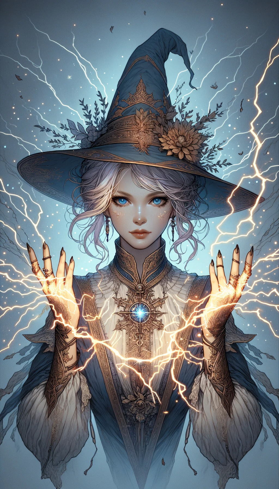

### 레벨 1 빛의 마법 카드

#### 1. 일렉트로맨시 카드 (전기 마법)

- **공격력**: 8
- **방어력**: 8 2
- **체력**: 4
- **마나 비용**: 5
- **지속 시간**: 1 턴
- **범위**: 타일 3개
- **강력한 상대**: 포토맨시
- **스토리**: "천둥의 마법사"로 알려진 이 소녀는 원초적인 전기의 힘을 휘두릅니다. 적에게 전기 에너지의 충격파를 보낼 수 있어 전장에서 탁월한 교란자로 활약합니다. 재치 있고 짜릿한 전기 에너지로 전투에 활기를 불어넣습니다.

#### 2. 포토맨시 카드 (빛 마법)

- **공격력**: 3
- **방어력**: 7 7
- **체력**: 5
- **마나 비용**: 3
- **지속 시간**: 2턴
- **범위**: 타일 4개
- **강력한 상대**: 전기 마법
- **스토리**: "라이트브링어"라고 불리는 이 소녀는 빛 자체를 제어할 수 있는 힘을 가지고 있습니다. 환영을 만들어 적의 눈을 멀게 하거나 레이저와 같은 광선으로 빛을 집중시킬 수 있습니다. 우아하고 빛나는 존재감으로 아군에게 희망과 명료함을 선사합니다.

---

### 레벨 2 빛의 합성 마법 카드

---

#### 1. 레이저 마법 (전기마법 + 광학마법)

- **공격력**: 11
- **방어력**: 9
- **체력**: 9
- **마나 비용**: 8
- **지속 시간**: 2 턴
- **범위**: 4 타일
- **강점**: 전기마법과 광학마법에 모두 강함
- **스토리**: "펄스 마법사"로 알려진 이 소녀는 전기의 원시 에너지와 빛의 정밀함을 결합하여 강력한 레이저 광선을 만들어냅니다. 이 레이저는 적을 혼란시키거나 고에너지 빔으로 집중하여 거의 모든 것을 관통할 수 있습니다. 그녀는 번개폭풍의 전기적 속도와 순수한 빛의 명확한 집중력을 모두 가지고 있어 전장에서 강력한 힘을 발휘합니다.

---

### 3레벨 빛의 합성 마법 카드

---

#### 1. 하이퍼 레이저 (레이저 마법 + 레이저 마법)

- **공격력**: 18
- **방어력**: 15
- **체력**: 16 16
- **마나 비용**: 14
- **지속 시간**: 1턴
- **범위**: 5 타일
- **강력한 상대**: 집중력과 위력이 강하기 때문에 대부분의 다른 마법 형태에 강함
- **스토리**: '루미날 에너지의 마스터'로 알려진 이 소녀는 레이저 마법에 대한 숙달을 통해 비교할 수 없는 강도와 정밀도의 하이퍼 레이저 빔을 생성합니다. 거의 모든 장애물이나 적을 뚫을 수 있는 하이퍼 레이저는 집중된 마법 에너지의 전형입니다. 그녀의 성격은 듀얼 레이저 마법의 불굴의 강렬함과 정확한 집중력을 융합하여 루미노맨시 영역에서 거의 타의 추종을 불허합니다.
