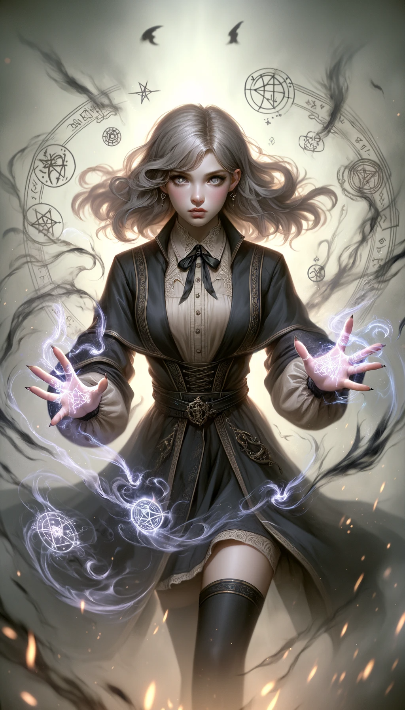

### 레벨 1 촉매 마법 카드 ###

#### 1. 저주 카드

- **공격력**: 7
- **방어력**: 3
- **건강**: 4
- **마나 비용**: 6
- **지속 시간**: 1 턴
- **범위**: 타일 2개
- **강력한 상대**: 치유
- **스토리**: "헥스위버"로 알려진 이 소녀는 적을 약화시키거나 지속적인 피해를 입히는 저주를 시전하는 데 특화되어 있습니다. 그녀의 능력은 긴박한 상황에서 전세를 역전시킬 수 있지만, 방어력이 낮기 때문에 주의해야 합니다. 교활하고 적의 절망감을 잘 이용합니다.

#### 2. 치유 카드

- **공격력**: 2
- **방어력**: 5
- **건강**: 7
- **마나 비용**: 4
- **지속 시간**: 3 턴
- **범위**: 타일 3개
- **강력한 상대**: 보호
- **스토리**: "생명의 은인"이라고도 불리는 이 소녀는 아군의 체력을 회복하는 치유 주문에 능숙하며, 쓰러진 아군도 되살릴 수 있습니다. 모든 팀 방어의 초석이 되어 언제나 도움의 손길을 내밀어 줍니다. 동정심이 많고 아군을 보살피며 팀의 중심입니다.

#### 3. 와딩 카드

- **공격력**: 3
- **방어력**: 8
- **건강**: 5
- **마나 비용**: 5
- **지속 시간**: 2턴
- **범위**: 타일 4개
- **강력한 상대**: 저주
- **스토리**: "수호자"라고 불리는 이 소녀는 팀을 위험으로부터 보호하는 마법과 보호막을 시전하는 데 특화되어 있습니다. 그녀의 기술은 전선을 지키고 팀의 방어를 유지하는 데 매우 중요합니다. 굳건하고 믿음직스러우며 아군을 위한 진정한 방패가 되어줍니다.

---

### 레벨 2 촉매 컴포지트 매직 카드

---

#### 1. 부활 마법 (저주 + 치유)

- **공격력**: 4
- **방어력**: 4
- **체력**: 8
- **마나 비용**: 7
- **지속 시간**: 2 턴
- **범위**: 3 타일
- **강점**: 저주와 치유 모두에 강함
- **스토리**: "영혼의 감시자"로 알려진 이 소녀는 저주와 치유의 힘을 결합하여 생명력을 직접 조작합니다. 동맹을 치유할 뿐만 아니라 저주받은 상태로 부활시켜 짧은 기간 동안 더욱 강력하게 만듭니다. 그녀는 어둠과 빛의 혼합체로, 생명과 죽음 사이의 경계를 걷습니다.

#### 2. 완전 보호 마법 (치유 + 보호)

- **공격력**: 2
- **방어력**: 9
- **체력**: 9
- **마나 비용**: 6
- **지속 시간**: 3 턴
- **범위**: 4 타일
- **강점**: 치유와 보호 모두에 강함
- **스토리**: "성역의 파수꾼"이라 불리는 이 소녀는 방어의 극치를 나타내며, 치유와 보호 마법을 결합하여 동맹 주변에 거의 뚫을 수 없는 보호 구역을 만듭니다. 그녀의 연민과 굳건함은 해를 예방하고 되돌릴 수 있는 최고의 수호자로 만듭니다.

#### 3. 봉인 마법 (보호 + 저주)

- **공격력**: 6
- **방어력**: 6
- **체력**: 5
- **마나 비용**: 7
- **지속 시간**: 2 턴
- **범위**: 3 타일
- **강점**: 보호와 저주 모두에 강함
- **스토리**: "봉인 파괴자"로 알려진 이 소녀는 보호와 저주의 힘을 결합하여 적들을 공격할 뿐만 아니라 적이 넘나들면 고통을 주는 마법의 봉인을 만듭니다. 이 봉인은 적들을 함정에 빠뜨려 동맹들이 쉽게 타격할 수 있게 합니다. 그녀는 전술적이고 교활하며, 전장에 위험과 안전의 미로를 만들어냅니다.

---

### 레벨 3 촉매 합성 마법 카드

---

#### 1. 신성한 부활 (부활 마법 + 완전한 보호 마법)

- **공격력**: 5
- **방어력**: 12
- **체력**: 15
- **마나 비용**: 11
- **지속 시간**: 4 턴
- **범위**: 5 타일
- **강력한 상대**: 광범위한 공격 및 방어 마법 스펙트럼
- **스토리**: "영원한 수호자"로 알려진 이 소녀는 부활 마법과 완벽한 보호 마법의 대가입니다. 아군을 부활시키는 동시에 거의 뚫을 수 없는 방어막으로 둘러싸서 아군이 마음 놓고 활동할 수 있는 환경을 조성할 수 있습니다. 빛과 어둠, 삶과 죽음의 합성체인 그녀의 본성은 전장의 정신적 지주가 되어줍니다.

---

#### 2. 부활 봉인 (부활 마법 + 봉인 마법)

- **공격력**: 8
- **방어력**: 8
- **체력**: 10
- **마나 비용**: 11
- **지속 시간**: 3 턴
- **범위**: 타일 4개
- **강력한 상대**: 생명력 기반 마법과 고통 기반 마법 모두
- **스토리**: "영혼의 문지기"라고 불리는 이 소녀는 부활과 봉인의 힘을 합쳤습니다. 아군을 되살리는 동시에 적에게 치명적인 함정을 설치하여 아군에게 유리한 전장을 만들 수 있습니다. 생명과 수축의 열쇠를 쥐고 있어 예측할 수 없는 수수께끼의 힘을 지니고 있습니다.

---

#### 3. 보호 봉인 (완전 보호 마법 + 봉인 마법)

- **공격력**: 4
- **방어력**: 12
- **체력**: 12
- **마나 비용**: 10
- **지속 시간**: 3 턴
- **범위**: 5 타일
- **강력한 상대**: 보호 마법과 파괴 마법 모두
- **스토리**: "요새의 연금술사"로 알려진 이 소녀는 보호와 저주의 기술을 융합하여 아군을 보호하고 적을 제한할 수 있는 독특한 보호 인장을 만들어냅니다. 이중적인 능력으로 방어의 요새이자 위험의 거미줄이 되어 전장의 역학 관계를 순식간에 바꿀 수 있습니다.

---

### 레벨 4 촉매 복합 마법 카드

---

#### 세라픽 커버넌트 (디바인 리버스 + 언브레이커블 실 + 가디언 오브 소울즈)

- **공격력**: 10
- **방어력**: 20
- **체력**: 24
- **마나 비용**: 30
- **지속 시간**: 5턴
- **범위**: 6 타일
- **강함**: 신적 보호, 되돌릴 수 없는 봉인, 그리고 영혼 보호로 인해 거의 모든 형태의 마법에 강함
- **이야기**: "천상의 수호자"라는 칭호를 받은 이 소녀는 생명과 제약의 영역을 초월하여 거의 신적인 존재가 된다. 동료들을 부활시키는 능력이 이제는 천상적 수준으로 높아졌으며, 그녀의 보호 봉인과 영혼의 보호는 무적이자 보편적으로 효과적이다. 그녀는 사실상 생명과 운명의 열쇠를 쥐고 있어 전장에서 준신적인 힘을 발휘한다.
