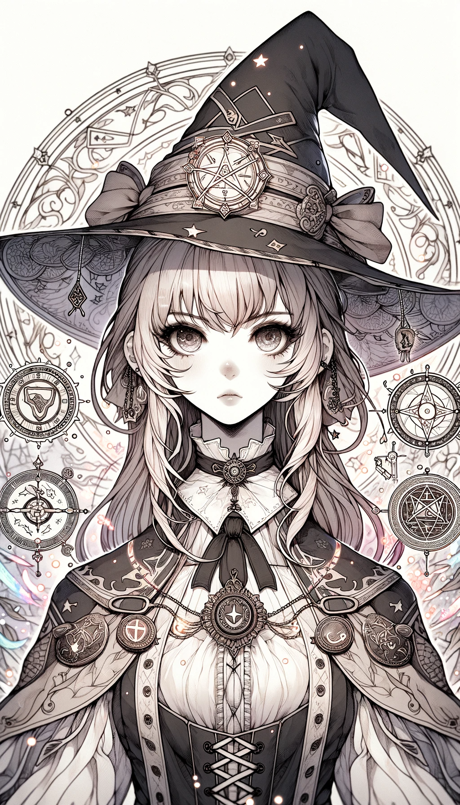

### Catalyst Magic Cards

#### 1. Cursing Card

- **Attack Power**: 7
- **Defense Power**: 3
- **Health**: 4
- **Mana Cost**: 6
- **Duration**: 1 turn
- **Range**: 2 tiles
- **Strong Against**: Healing
- **Story**: Known as the "Hexweaver," this girl specializes in casting curses that weaken enemies or inflict continuous damage. Her abilities can turn the tide in a tight situation, but she must be careful as her defense is low. She's cunning and thrives on the despair of her enemies.

#### 2. Healing Card

- **Attack Power**: 2
- **Defense Power**: 5
- **Health**: 7
- **Mana Cost**: 4
- **Duration**: 3 turns
- **Range**: 3 tiles
- **Strong Against**: Warding
- **Story**: Often referred to as the "Lifesaver," this girl is adept at healing spells that restore health to her allies and can even revive those who have fallen. She is a cornerstone in any team's defense, always there to lend a helping hand. She's compassionate and nurturing, the heart of her team.

#### 3. Warding Card

- **Attack Power**: 3
- **Defense Power**: 8
- **Health**: 5
- **Mana Cost**: 5
- **Duration**: 2 turns
- **Range**: 4 tiles
- **Strong Against**: Cursing
- **Story**: Called the "Guardian," this girl specializes in casting wards and shields that protect her team from harm. Her skills make her invaluable in holding the line and sustaining the team's defenses. She's steadfast and dependable, a true shield for her allies.

---

### Level 2 Catalyst Composite Magic Cards

---

#### 1. Resurrection Magic (Cursing + Healing)

- **Attack Power**: 4
- **Defense Power**: 4
- **Health**: 8
- **Mana Cost**: 7
- **Duration**: 2 turns
- **Range**: 3 tiles
- **Strong Against**: Both Cursing and Healing
- **Story**: Known as the "Soul Warden," this girl combines the power of curses and healing to manipulate life forces directly. She can not only heal her allies but also revive them with a cursed condition, making them even more potent for a short period. She's a blend of darkness and light, straddling the line between life and death.

#### 2. Complete Protection Magic (Healing + Warding)

- **Attack Power**: 2
- **Defense Power**: 9
- **Health**: 9
- **Mana Cost**: 6
- **Duration**: 3 turns
- **Range**: 4 tiles
- **Strong Against**: Both Healing and Warding
- **Story**: Referred to as the "Sanctuary Sentinel," this girl is the epitome of defense, merging healing and warding spells to create an almost impregnable protective zone around her allies. Her compassionate and steadfast nature make her the ultimate guardian, capable of both preventing and undoing harm.

#### 3. Sealing Magic (Warding + Cursing)

- **Attack Power**: 6
- **Defense Power**: 6
- **Health**: 5
- **Mana Cost**: 7
- **Duration**: 2 turns
- **Range**: 3 tiles
- **Strong Against**: Both Warding and Cursing
- **Story**: Known as the "Sealbreaker," this girl combines warding and cursing powers to create magical seals that not only protect but also afflict enemies who dare cross them. These seals can trap enemies, making them easy targets for her allies. She's tactical and cunning, creating labyrinths of danger and safety on the battlefield.

---

### Level 3 Catalyst Composite Magic Cards

---

#### 1. Sacred Resurrection (Resurrection Magic + Complete Protection Magic)

- **Attack Power**: 5
- **Defense Power**: 12
- **Health**: 15
- **Mana Cost**: 11
- **Duration**: 4 turns
- **Range**: 5 tiles
- **Strong Against**: A broad spectrum of offensive and defensive magic
- **Story**: Known as the "Eternal Guardian," this girl is a master of both resurrection and complete protection magic. She can bring allies back to life while surrounding them with near-impenetrable barriers, creating an environment where her team can act with impunity. Her nature is a synthesis of light and darkness, life and death, making her a spiritual beacon on the battlefield.

---

#### 2. Resurrection Seal (Resurrection Magic + Sealing Magic)

- **Attack Power**: 8
- **Defense Power**: 8
- **Health**: 10
- **Mana Cost**: 11
- **Duration**: 3 turns
- **Range**: 4 tiles
- **Strong Against**: Both life-based and affliction-based magic
- **Story**: Referred to as the "Soul Gatekeeper," this girl merges resurrection and sealing powers. She can bring allies back while setting up devastating traps for enemies, creating a battlefield that's advantageous for her team. She holds the keys to life and constriction, making her an enigmatic and unpredictable force.

---

#### 3. Protective Seal (Complete Protection Magic + Sealing Magic)

- **Attack Power**: 4
- **Defense Power**: 12
- **Health**: 12
- **Mana Cost**: 10
- **Duration**: 3 turns
- **Range**: 5 tiles
- **Strong Against**: Both protective and destructive magic
- **Story**: Known as the "Bastion Alchemist," this girl fuses the arts of warding and cursing into a unique blend of protective seals that can both protect allies and restrict enemies. Her dual abilities make her a fortress of defense and a web of peril, capable of changing the dynamics of the battlefield in an instant.

---

### Level 4 Catalyst Composite Magic Cards

---

#### Seraphic Covenant (Divine Rebirth + Unbreakable Seal + Guardian of Souls)

- **Attack Power**: 10
- **Defense Power**: 20
- **Health**: 24
- **Mana Cost**: 30
- **Duration**: 5 turns
- **Range**: 6 tiles
- **Strong Against**: Virtually all forms of magic due to its divine protection, irreversible seals, and soul guardianship
- **Story**: Bestowed with the title of "Celestial Warden," this girl transcends the realms of life and restriction, becoming a nearly divine entity. Her ability to resurrect allies is now elevated to a celestial level, while her protective seals and soul guardianship have become unbreakable and universally effective. She essentially holds the keys to life and fate, making her a quasi-divine force on the battlefield.
