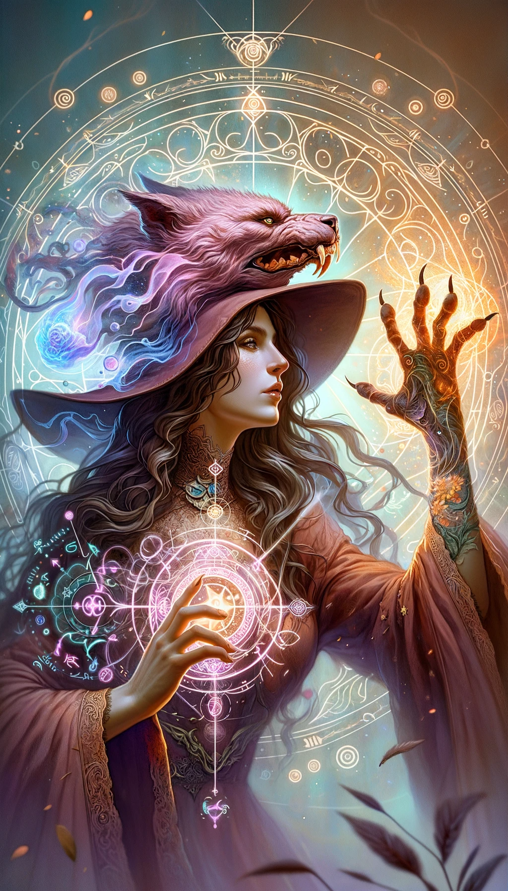

### Transformation Magic Cards

#### 1. Shape-shifting Card

- **Attack Power**: 6
- **Defense Power**: 4
- **Health**: 5
- **Mana Cost**: 4
- **Duration**: 2 turns
- **Range**: 2 tiles
- **Strong Against**: Transmutation
- **Story**: Known as the "Changeling," this girl has the ability to shape-shift into various forms. Whether becoming a ferocious animal or mimicking an enemy, her versatility makes her unpredictable on the battlefield. She's resourceful and adaptive, making the most out of any situation.

#### 2. Transmutation Card

- **Attack Power**: 5
- **Defense Power**: 5
- **Health**: 6
- **Mana Cost**: 3
- **Duration**: 3 turns
- **Range**: 3 tiles
- **Strong Against**: Shape-shifting
- **Story**: Referred to as the "Alchemist," this girl can transmute objects and even the environment to suit her needs. She can turn a stone into a weapon or transmute the air into a poisonous gas. Her creative use of her environment makes her a formidable foe. She's inventive and quick-thinking, always up for a challenge.

---

### Level 2 Transformation Composite Magic Cards

---

#### 1. Complete Transformation Magic (Shape-shifting + Transmutation)

- **Attack Power**: 7
- **Defense Power**: 6
- **Health**: 7
- **Mana Cost**: 6
- **Duration**: 3 turns
- **Range**: 3 tiles
- **Strong Against**: Both Shape-shifting and Transmutation
- **Story**: Known as the "Master of Forms," this girl combines the power of shape-shifting and transmutation, allowing her to change both herself and her surroundings at will. This makes her an exceptionally versatile magician who can adapt to nearly any circumstance. Whether transforming into a powerful creature or altering the battlefield itself, her potential is limitless. She's ingenious and versatile, a true wildcard in any magical conflict.

---

### Level 3 Transformation Composite Magic Cards

---

#### 1. Absolute Morphing (Complete Transformation Magic + Complete Transformation Magic)

- **Attack Power**: 13
- **Defense Power**: 12
- **Health**: 13
- **Mana Cost**: 10
- **Duration**: 5 turns
- **Range**: 5 tiles
- **Strong Against**: A wide variety of magic types due to extreme adaptability
- **Story**: Known as the "Eclipsing Shapeshifter," this girl is the ultimate embodiment of transformation magic. She can not only change her form but also transmute the environment, even being able to simultaneously adopt multiple transformations. Her adaptability makes her nearly impossible to counter, as she can adjust her abilities on the fly to suit any situation. She embodies the pinnacle of magical versatility, making her a formidable opponent who transcends the boundaries of conventional magic.
