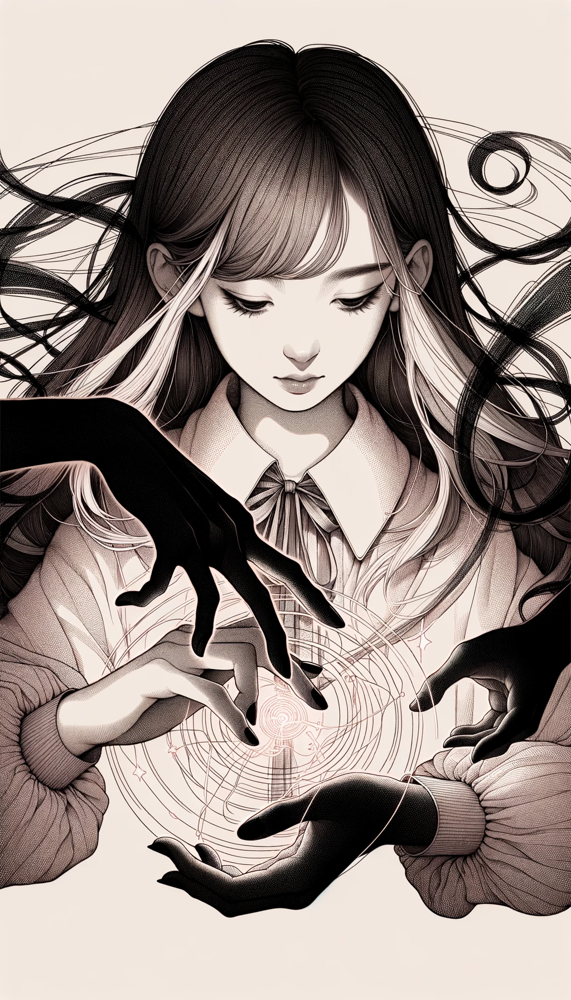

### 레벨 1 그림자 마법 카드 ###

#### 1. 엄브래맨시 카드

- **공격력**: 7
- **방어력**: 3
- **체력**: 5
- **마나 비용**: 4
- **지속 시간**: 2턴
- **범위**: 타일 3개
- **강력한 상대**: 그림자 요술
- **스토리**: "섀도우마스터"로 알려진 이 소녀는 어둠 자체를 지배합니다. 그녀는 시야를 가리고 환상을 만들거나 그림자를 굳혀 물리적인 공격으로 바꿀 수 있습니다. 신비롭고 파악하기 어려운 특성 때문에 상대하기 까다로운 상대입니다. 비밀스럽고 교활하며 전투의 흐름을 자신에게 유리하게 바꾸는 데 능숙합니다.

#### 2. 그림자 요술 카드

- **공격력**: 5
- **방어력**: 5
- **건강**: 6
- **마나 비용**: 3
- **지속 시간**: 3 턴
- **범위**: 타일 4개
- **강력한 상대**: 엄브람시
- **스토리**: "그림자 제작자"라고도 불리는 이 소녀는 그림자 생명체와 물체를 소환하는 데 특화되어 있습니다. 전투에서 그녀를 돕는 그림자 늑대나 적을 묶는 그림자 사슬 등, 그녀의 주문은 다재다능하고 적응력이 뛰어납니다. 상상력이 풍부하고 지략이 뛰어나며, 어떤 상황에서도 재빠르게 대처할 수 있습니다.

---

### 레벨 2 그림자 합성 마법 카드

---

#### 1. 어둠 창조 마법 (엄브래머시 + 그림자 마법)

- **공격력**: 8
- **방어력**: 6 6
- **체력**: 7 7
- **마나 비용**: 6
- **지속 시간**: 3 턴
- **범위**: 타일 4개
- **강력한 상대**: 엄브래맨시 및 그림자 요술 모두
- **스토리**: "어둠의 창조자"로 알려진 이 소녀는 엄브래맨시와 그림자 요술의 힘을 모두 사용합니다. 그림자를 조작할 수 있을 뿐만 아니라 그림자에 형태와 실체를 부여할 수 있어 전장에서 탁월한 힘을 발휘합니다. 그림자 생물을 소환하면서 복잡한 환영을 만들 수 있어 속임수의 달인이자 강력한 소환수입니다. 그녀는 그림자 마법의 궁극적인 표현을 구현하는 애매하고 창의적인 존재입니다.

---

### 레벨 3 그림자 합성 마법 카드

---

#### 1. 심연의 그림자 (어둠의 창조 마법 + 어둠의 창조 마법)

- **공격력**: 14
- **방어력**: 12
- **체력**: 13
- **마나 비용**: 11
- **지속 시간**: 5 턴
- **범위**: 6 타일
- **강력한 상대**: 강력한 그림자 숙달로 인해 대부분의 마법 유형에 강함
- **스토리**: '심연의 설계자'로 알려진 이 소녀는 엄브래머시와 그림자 요술의 궁극의 융합체입니다. 그녀는 단순히 그림자를 조작하거나 생성하는 데 그치지 않고, 그림자에 생명과 목적을 불어넣어 전장에 심연의 영역을 구축합니다. 그녀의 그림자는 단순한 환영이나 괴물이 아니라 공격과 방어가 모두 가능한 복잡하고 다층적인 의지의 연장선입니다. 그녀는 어둠의 예술의 전형으로, 감히 도전할 수 없는 그림자의 영역을 만들어냅니다.