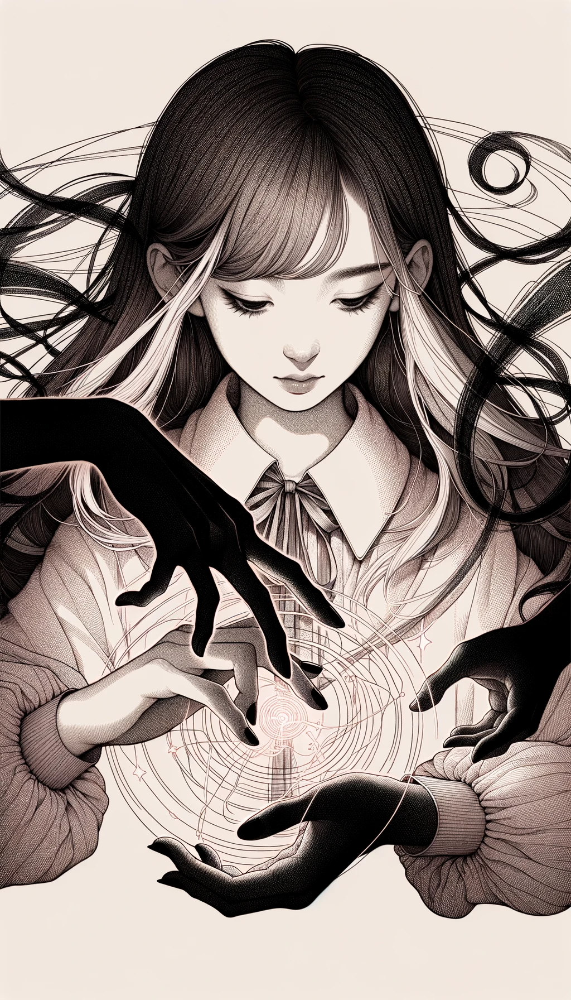

### Level 1 Shadow Magic Cards

#### 1. Umbramancy Card

- **Attack Power**: 7
- **Defense Power**: 3
- **Health**: 5
- **Mana Cost**: 4
- **Duration**: 2 turns
- **Range**: 3 tiles
- **Strong Against**: Shadow Conjuring
- **Story**: Known as the "Shadowmaster," this girl commands the darkness itself. She can obscure vision, create illusions, or even solidify shadows into physical attacks. Her mysterious and elusive nature makes her a tricky opponent to deal with. She's secretive and cunning, adept at turning the tide of battle in her favor.

#### 2. Shadow Conjuring Card

- **Attack Power**: 5
- **Defense Power**: 5
- **Health**: 6
- **Mana Cost**: 3
- **Duration**: 3 turns
- **Range**: 4 tiles
- **Strong Against**: Umbramancy
- **Story**: Often called the "Shadowcrafter," this girl specializes in summoning shadowy creatures and objects. Whether it's a shadow wolf to aid her in battle or shadow chains to bind her enemies, her conjurations are versatile and adaptive. She's imaginative and resourceful, able to think on her feet in any situation.

---

### Level 2 Shadow Composite Magic Cards

---

#### 1. Dark Creation Magic (Umbramancy + Shadow Conjuring)

- **Attack Power**: 8
- **Defense Power**: 6
- **Health**: 7
- **Mana Cost**: 6
- **Duration**: 3 turns
- **Range**: 4 tiles
- **Strong Against**: Both Umbramancy and Shadow Conjuring
- **Story**: Known as the "Dark Creator," this girl wields the powers of both Umbramancy and Shadow Conjuring. She can not only manipulate shadows but also give them form and substance, making her an exceptional force on the battlefield. She can create complex illusions while summoning shadow creatures, making her both a master of deception and a formidable summoner. She is elusive and creative, embodying the ultimate expression of shadow magic.

---

### Level 3 Shadow Composite Magic Cards

---

#### 1. Abyssal Shadows (Dark Creation Magic + Dark Creation Magic)

- **Attack Power**: 14
- **Defense Power**: 12
- **Health**: 13
- **Mana Cost**: 11
- **Duration**: 5 turns
- **Range**: 6 tiles
- **Strong Against**: Most magic types due to intense shadow mastery
- **Story**: Known as the "Abyssal Architect," this girl is the ultimate confluence of Umbramancy and Shadow Conjuring. She doesn't just manipulate or create shadows; she breathes life and purpose into them, forging an abyssal realm on the battlefield itself. Her shadows are not just illusions or creatures; they are extensions of her will, complex and layered, capable of both offense and defense. She epitomizes the dark arts, creating a zone of impenetrable shadow that few dare to challenge.