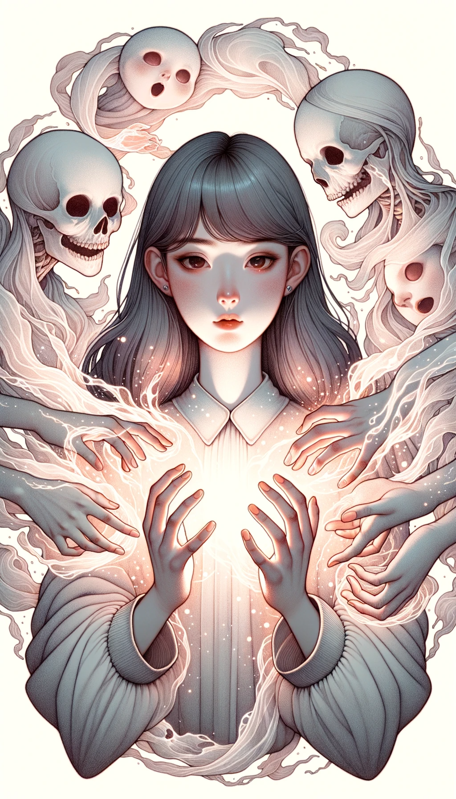
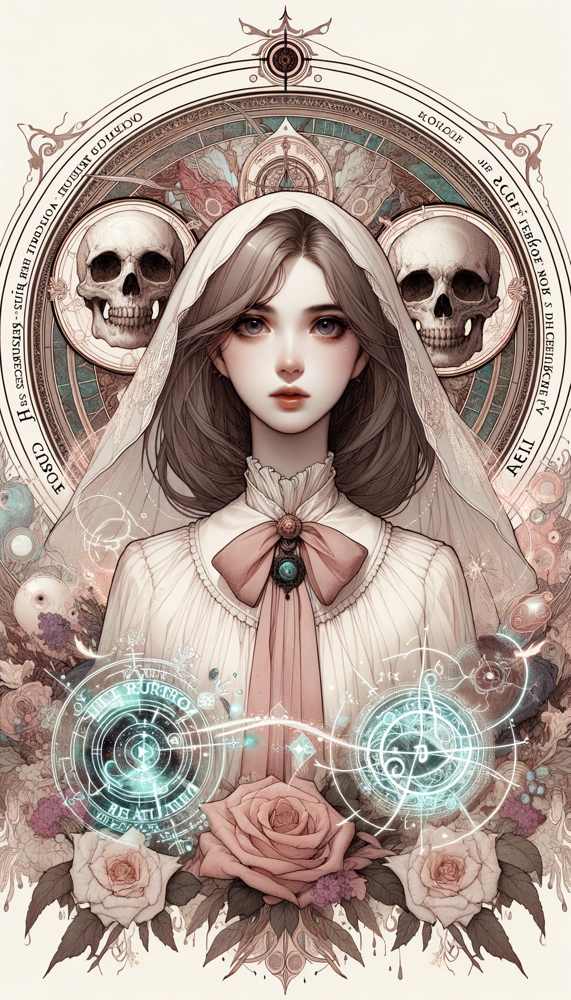

### Level 1 Deaths

## Soul Summoning

- **Level**: 1
- **Type**: Death
- **Composit**: null
- **Attack Power**: 6
- **Defense Power**: 3
- **Health**: 5
- **Mana Cost**: 5
- **Duration**: 3 turns
- **Range**: 2 tiles
- **Strong Against**: Necromancy
- **Story**: Known as the "Soulmancer," this girl wields the forbidden power to summon and command souls. She can call forth spirits to aid her in battle or use them to debilitate her enemies. She is a mysterious figure, seeking to understand the nature of life and death.

## Necromancy

- **Level**: 1
- **Type**: Death
- **Composit**: null
- **Attack Power**: 7
- **Defense Power**: 2
- **Health**: 4
- **Mana Cost**: 6
- **Duration**: 2 turns
- **Range**: 3 tiles
- **Strong Against**: Soul Summoning
- **Story**: Called the "Necromaster," this girl can raise the dead and control them. Zombies, skeletons, and other unholy creatures bow to her command. She uses her minions to overwhelm her enemies, but this comes at a great moral and magical cost. 

### Level 2 Death Composites

## Soul Resurrection (Soul Summoning + Necromancy)

- **Level**: 2
- **Type**: Death
- **Composit**: null
- **Attack Power**: 8
- **Defense Power**: 4
- **Health**: 6
- **Mana Cost**: 8
- **Duration**: 3 turns
- **Range**: 3 tiles
- **Strong Against**: Both Soul Summoning and Necromancy
- **Story**: Known as the "Revenant Queen," this girl masters both the art of Soul Summoning and Necromancy. She can not only summon souls but also give them corporeal forms, essentially resurrecting them to serve in her legion. Her mastery over life and death makes her one of the most feared figures on the battlefield. Using her dark magic, she strikes a balance between spiritual and physical manifestations of death, making her an unparalleled force. She is both enigmatic and unsettling, a practitioner of the darkest magics.

### Level 3 Death Composites

## Soul Dominion (Soul Resurrection + Soul Resurrection)

- **Level**: 3
- **Type**: Death
- **Composit**: null
- **Attack Power**: 14
- **Defense Power**: 8
- **Health**: 10
- **Mana Cost**: 14
- **Duration**: 5 turns
- **Range**: 5 tiles
- **Strong Against**: Most magic types due to mastery over death and soul magic
- **Story**: Known as the "Sovereign of Souls," this girl is the apex of both Soul Summoning and Necromancy. She has transcended the limitations of both magic types to achieve something terrifyingly new. Her Soul Dominion allows her to manipulate souls on a grand scale, weaving them into the very fabric of the battlefield. These souls can take on numerous forms, both corporeal and ethereal, and can perform complex tasks and strategies as directed by their sovereign. She has become a near-deity of death, capable of altering the very essence of life and afterlife.
