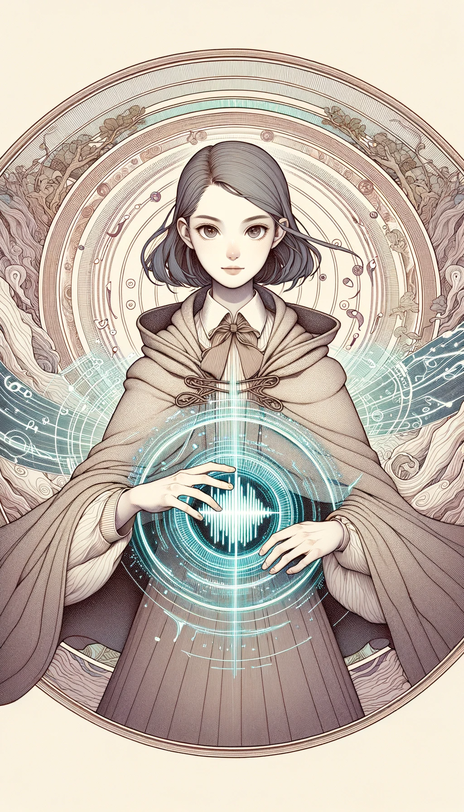
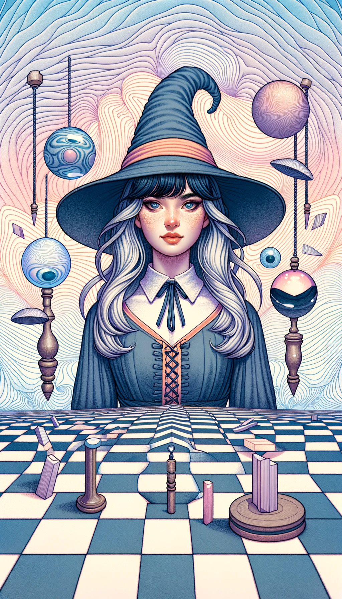
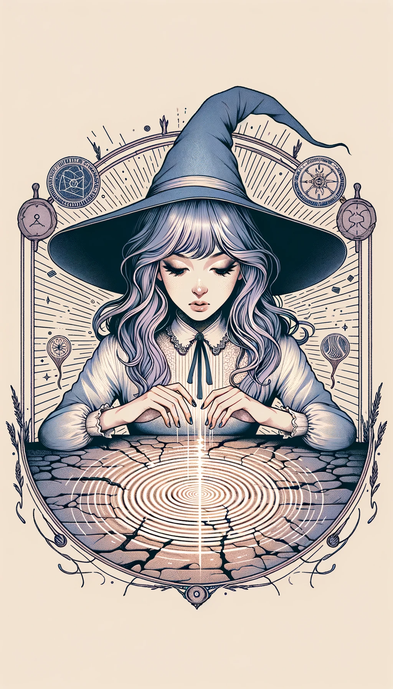
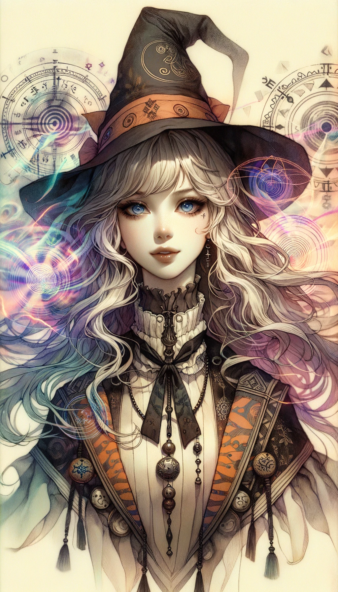

### 레벨 1 신비한 마법 카드

#### 1. 환상 마법 카드

- **공격력**: 5
- **방어력**: 4
- **체력**: 6
- **마나 비용**: 4
- **지속 시간**: 3턴
- **범위**: 3 타일
- **강력한 상대**: 중력 마법
- **스토리**: "환상술사"라고 알려진 이 소녀는 다른 사람들이 인지하는 것을 조작하여 거짓 현실을 만들거나 자신을 보이지 않게 할 수 있다. 적을 속이고 동료들에게 기회를 만들어 주는데 그녀의 기술을 사용한다. 그녀의 성격은 그녀의 마법처럼 알 수 없다.

#### 2. 중력 마법 카드

- **공격력**: 3
- **방어력**: 6
- **체력**: 5
- **마나 비용**: 5
- **지속 시간**: 2턴
- **범위**: 4 타일
- **강력한 상대**: 음향 마법
- **스토리**: "중력술사" 마녀 소녀는 중력을 조작하여 적들이 움직이거나 공격하기 어렵게 만든다. 또한 그녀는 동료들 주변의 힘을 가볍게 해 그들의 기동성을 돕는다. 그녀는 항상 자신의 행동의 무게를 생각하는 심오한 사고를 가진다.

#### 3. 음향 마법 카드

- **공격력**: 6
- **방어력**: 3
- **체력**: 4
- **마나 비용**: 3
- **지속 시간**: 1턴
- **범위**: 5 타일
- **강력한 상대**: 환상 마법
- **스토리**: "음향술사" 마녀 소녀는 사운드 웨이브를 조작하여 적을 혼란시키고 장애물을 파괴한다. 그녀의 마법은 다양하며 무장해제가 가능하다. 치유와 해를 둘 다 할 수 있다. 그녀는 생기발랄하고 에너지가 넘치며 전투나 삶에서 결코 박자를 놓치지 않는다.

---

### 레벨 2 신비한 합성 마법 카드

---

#### 1. 현실 왜곡 마법 (일루전 + 중력)

- **공격력**: 6
- **방어력**: 6 6
- **체력**: 7
- **마나 비용**: 7
- **지속 시간**: 3 턴
- **범위**: 타일 4개
- **강력한 상대**: 환영과 중력 모두
- **스토리**: "현실을 구부리는 자"로 알려진 이 소녀는 환영과 중력을 모두 다루는 마스터입니다. 지각과 중력을 동시에 조작할 수 있어 적들이 보고 느끼는 것에 의문을 품게 만듭니다. 교전 규칙을 순식간에 바꿀 수 있기 때문에 전술적 우위를 점하는 것은 거의 불가능에 가깝습니다. 계산적이고 전략적인 그녀는 통제에 능숙한 전문가입니다.

#### 2. 진동 마법(중력 + 음파 마법)

- **공격력**: 5
- **방어력**: 5
- **체력**: 6
- **마나 비용**: 6
- **지속 시간**: 2턴
- **범위**: 5 타일
- **강력한 상대**: 중력 및 음력 모두
- **스토리**: '바이브로맨서'라고 불리는 이 소녀는 중력과 음파를 모두 조작하여 강력한 진동을 만들어낼 수 있습니다. 대지를 흔들거나 공명 주파수를 방출하여 적의 방향을 잃게 하는 등 다양한 방식으로 전장을 제어할 수 있습니다. 활기차고 지적인 그녀는 모든 상황의 흐름을 파악합니다.

#### 3. 환각 마법 (음파 + 환영)

- **공격력**: 7
- **방어력**: 4
- **체력**: 5
- **마나 비용**: 5
- **지속 시간**: 2턴
- **범위**: 타일 4개
- **강력한 상대**: 음유와 환영 모두
- **스토리**: "드림위버"로 알려진 이 소녀는 심령술과 환영술에 모두 능숙합니다. 현실과 거의 구분할 수 없는 복잡한 청각 및 시각 환각을 만들어낼 수 있습니다. 그녀의 상대는 종종 무슨 일이 일어나고 있는지 깨닫기도 전에 속임수의 그물에 걸려들게 됩니다. 신비하고 상상력이 풍부한 그녀는 타고난 이야기꾼이지만, 이야기를 악몽으로 바꿀 수도 있습니다.

---

### 레벨 3 신비한 합성 마법 카드

---

#### 1. 왜곡된 진동 (현실 왜곡 마법 + 진동 마법)

- **공격력**: 11
- **방어력**: 11
- **체력**: 12 12
- **마나 비용**: 12
- **지속 시간**: 4 턴
- **범위**: 6 타일
- **강력한 상대**: 중력, 지각, 소리의 조작을 마스터하여 여러 마법 유형 사용 가능
- **스토리**: '불협화음의 달인'으로 알려진 이 소녀는 현실 왜곡과 진동 마법의 정점에 도달했습니다. 지각과 중력, 음파를 동시에 조작할 수 있어 적들이 자신의 감각은 물론 발밑의 지반조차 믿을 수 없는 혼란스러운 전장을 만들 수 있습니다. 그녀는 통제와 혼란의 전형입니다.

#### 2. 소닉 일루전 (진동 마법 + 환각 마법)

- **공격력**: 10
- **방어력**: 7
- **체력**: 9
- **마나 비용**: 10
- **지속 시간**: 3 턴
- **범위**: 6 타일
- **강력한 상대**: 소리와 환영의 결합으로 다양한 형태의 마법을 구사할 수 있습니다.
- **스토리**: '하모니 일루셔니스트'라고 불리는 이 소녀는 진동 마술과 환각 마술을 융합하여 매혹적이고 혼란스러운 음파 환영을 만들어냅니다. 그녀는 기만적일 뿐만 아니라 물리적으로 혼란스러운 복잡한 청각 및 시각 시나리오를 만들어 상대방이 오류와 오산에 빠지기 쉽도록 만들 수 있습니다.

#### 3. 왜곡된 환각 (현실 왜곡 마법 + 환각 마법)

- **공격력**: 12
- **방어력**: 9
- **체력**: 10
- **마나 비용**: 11
- **지속 시간**: 4 턴
- **범위**: 5 타일
- **강력한 상대**: 현실을 바꾸고 환각을 만들어내는 다양한 종류의 마법을 사용할 수 있습니다.
- **스토리**: '드림쉐이퍼'로 알려진 이 소녀는 현실 왜곡 마법과 환각 마법의 정점에 있는 마법사입니다. 그녀는 왜곡된 지각과 실제 감각적 환상을 결합한 초현실적인 경험을 만들어내어 진실과 거짓을 구분하는 것을 거의 불가능하게 만듭니다. 이 정도의 숙련도로 전장을 꿈속 같은 공간으로 바꿔버리고 자신이 최고로 군림합니다.

---

### 레벨 4 신비한 합성 마법 카드

---

#### 우주 환영 (양자 현실 + 감각 공허 + 환상의 지진)

- **공격력**: 18
- **방어력**: 17 17
- **체력**: 20
- **마나 비용**: 35
- **지속 시간**: 6 턴
- **범위**: 8 타일
- **강력한 상대**: 양자 현실, 감각 조작, 진동에 능숙하여 거의 모든 형태의 마법을 다룰 수 있습니다.
- **스토리**: "우주 요술사"라는 칭호를 가진 이 소녀는 미스틱 마법의 궁극적인 형태입니다. 양자 현실을 조작하고, 감각 경험을 지우고, 대격변의 진동을 유도할 수 있는 능력을 한꺼번에 발휘합니다. 이 조합을 통해 그녀는 환상의 대가가 아니라 현실 자체를 짜는 자로 거듭납니다. 그녀와 맞서는 적들은 단순히 감각에 의문을 제기하는 것이 아니라 존재의 구조 자체를 의심하게 됩니다. 신비로운 힘의 정점인 그녀 앞에서는 거의 모든 전략과 마법이 무력화됩니다.
