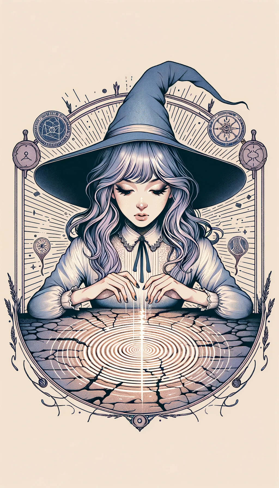

### Level 1 Mystics

## Illusion

- **Level**: 1
- **Type**: Mystic
- **Composit**: null
- **Attack Power**: 5
- **Defense Power**: 4
- **Health**: 6
- **Mana Cost**: 4
- **Duration**: 3 turns
- **Range**: 3 tiles
- **Strong Against**: Gravimancy
- **Story**: Known as the "Illusionist," this girl can manipulate what others perceive, creating false realities or making herself invisible. She uses her skills to deceive enemies and create opportunities for her allies. Her nature is as elusive as her magic.

## Gravimancy

- **Level**: 1
- **Type**: Mystic
- **Composit**: null
- **Attack Power**: 3
- **Defense Power**: 6
- **Health**: 5
- **Mana Cost**: 5
- **Duration**: 2 turns
- **Range**: 4 tiles
- **Strong Against**: Sonimancy
- **Story**: The "Gravimancer" witch girl manipulates gravitational forces, making it difficult for enemies to move or attack. She can also lighten the force around her allies, aiding their mobility. She is a ponderous thinker, always contemplating the weight of her actions.

## Sonimancy

- **Level**: 1
- **Type**: Mystic
- **Composit**: null
- **Attack Power**: 6
- **Defense Power**: 3
- **Health**: 4
- **Mana Cost**: 3
- **Duration**: 1 turn
- **Range**: 5 tiles
- **Strong Against**: Illusion
- **Story**: The "Sonimancer" witch girl can manipulate sound waves, disorienting enemies and shattering obstacles. Her magic is as versatile as it is disarming, capable of both healing and harm. She is a vivacious and energetic individual, never missing a beat in battle or life.

### Level 2 Mystic Composites

## Reality Distortion (Illusion + Gravimancy)

- **Level**: 2
- **Type**: Mystic
- **Composit**: null
- **Attack Power**: 6
- **Defense Power**: 6
- **Health**: 7
- **Mana Cost**: 7
- **Duration**: 3 turns
- **Range**: 4 tiles
- **Strong Against**: Both Illusion and Gravimancy
- **Story**: Known as the "Reality Bender," this girl is a master of both Illusion and Gravimancy. She can simultaneously manipulate perception and gravity, making her enemies question both what they see and feel. It's nearly impossible to gain a tactical advantage over her, as she can quickly alter the rules of engagement. Calculative and strategic, she is an expert at control.

## Vibration (Gravimancy + Sonimancy)

- **Level**: 2
- **Type**: Mystic
- **Composit**: null
- **Attack Power**: 5
- **Defense Power**: 5
- **Health**: 6
- **Mana Cost**: 6
- **Duration**: 2 turns
- **Range**: 5 tiles
- **Strong Against**: Both Gravimancy and Sonimancy
- **Story**: Referred to as the "Vibromancer," this girl can manipulate both gravitational and sound waves to create powerful vibrations. Whether it's shaking the earth beneath enemies or emitting a resonating frequency that disorients them, she can control the battlefield in various ways. Energetic and intellectual, she understands the pulse of any situation.

## Hallucination (Sonimancy + Illusion)

- **Level**: 2
- **Type**: Mystic
- **Composit**: null
- **Attack Power**: 7
- **Defense Power**: 4
- **Health**: 5
- **Mana Cost**: 5
- **Duration**: 2 turns
- **Range**: 4 tiles
- **Strong Against**: Both Sonimancy and Illusion
- **Story**: Known as the "Dreamweaver," this girl excels in both Sonimancy and Illusion. She can create complex auditory and visual hallucinations that are almost indistinguishable from reality. Her opponents often find themselves ensnared in a web of deception before they even realize what's happening. Mysterious and imaginative, she's a natural-born storyteller, albeit one that can turn stories into nightmares.

### Level 3 Mystic Composites

## Distorted Vibration (Reality Distortion + Vibration)

- **Level**: 3
- **Type**: Mystic
- **Composit**: null
- **Attack Power**: 11
- **Defense Power**: 11
- **Health**: 12
- **Mana Cost**: 12
- **Duration**: 4 turns
- **Range**: 6 tiles
- **Strong Against**: Multiple magic types due to mastering the manipulation of gravity, perception, and sound
- **Story**: Known as the "Master of Dissonance," this girl has achieved the pinnacle of Reality Distortion and Vibration. She can manipulate both perception and gravitational and sound waves simultaneously, leading to disorienting, chaotic battlefields where enemies can't trust their senses or even the ground beneath their feet. She is the epitome of control and confusion.

## Sonic Illusion (Vibration + Hallucination)

- **Level**: 3
- **Type**: Mystic
- **Composit**: null
- **Attack Power**: 10
- **Defense Power**: 7
- **Health**: 9
- **Mana Cost**: 10
- **Duration**: 3 turns
- **Range**: 6 tiles
- **Strong Against**: Various forms of magic due to the combined mastery of sound and illusion
- **Story**: Referred to as the "Harmony Illusionist," this girl fuses the arts of Vibration and Hallucination to produce mesmerizing and disorienting sonic illusions. She can create complex auditory and visual scenarios that are not only deceptive but also physically disruptive, making her opponents susceptible to errors and miscalculations.

## Distorted Hallucination (Reality Distortion + Hallucination)

- **Level**: 3
- **Type**: Mystic
- **Composit**: null
- **Attack Power**: 12
- **Defense Power**: 9
- **Health**: 10
- **Mana Cost**: 11
- **Duration**: 4 turns
- **Range**: 5 tiles
- **Strong Against**: Many types of magic due to the combination of altering reality and crafting hallucinations
- **Story**: Known as the "Dreamshaper," this girl is the zenith of both Reality Distortion and Hallucination. She creates surreal experiences that combine altered perception with genuine sensory illusions, making it nearly impossible to discern truth from deception. With this level of mastery, she turns the battlefield into a dreamscape where she reigns supreme.

### Level 4 Mystic Composites

#### Cosmic Illusion (Quantum Reality + Sensory Void + Phantasmal Quake)

- **Level**: 4
- **Type**: Mystic
- **Composit**: null
- **Attack Power**: 18
- **Defense Power**: 17
- **Health**: 20
- **Mana Cost**: 35
- **Duration**: 6 turns
- **Range**: 8 tiles
- **Strong Against**: Virtually all forms of magic due to its mastery over quantum reality, sensory manipulation, and vibration
- **Story**: Given the title of "Cosmic Enchantress," this girl is the ultimate form of Mystic. She can manipulate quantum reality, erase sensory experiences, and induce cataclysmic vibrations, all at once. This combination makes her not just a master of illusions but a weaver of reality itself. Enemies facing her don't just question their senses; they question the very fabric of their existence. She is the apex of mystical power, rendering almost all strategies and magics ineffective against her.
